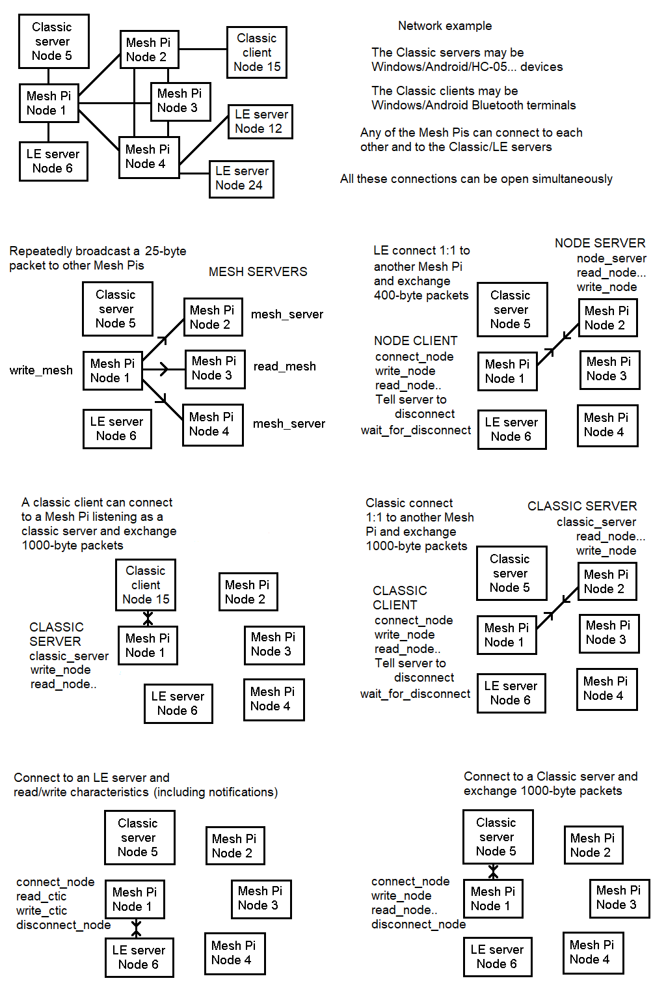
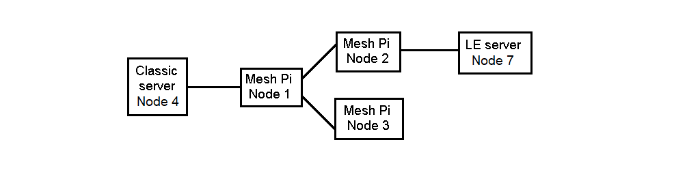

btferret/btlib Bluetooth Interface
==================================

*Version 13*

## Contents
- [1 Introduction](#1-introduction)
- [2 File list. Compile. Hello world](#2-file-list-compile-hello-world)
- [3 Interface](#3-interface)
    - [3.1 Bluetooth Connections](#3-1-bluetooth-connections)
    - [3.2 btferret](#3-2-btferret)
    - [3.3 devices.txt file](#3-3-devices-file)
    - [3.4 Windows-Android-HC-05 Classic servers](#3-4-windows-android-hc-05-classic-servers) 
    - [3.5 Windows-Android Classic clients](#3-5-windows-android-classic-clients)        
    - [3.6 LE client](#3-6-le-client) 
    - [3.7 LE server](#3-7-le-server) 
    - [3.8 Pi-Pi client-server connection](#3-8-pi-pi-client-server-connection) 
    - [3.9 Broadcast to all mesh servers](#3-9-broadcast-to-all-mesh-servers) 
    - [3.10 sample.c](#3-10-sample)
    - [3.11 HID Devices](#3-11-HID-Devices)
    - [3.12 Blue Dot server](#3-12-blue-dot-server)
    - [3.13 File transfer](#3-13-file-transfer)
- [4 btlib Library](#4-btlib-library) 
    - [4.1 Function list](#4-1-function-list)
    - [4.2 Functions](#4-2-functions)    
        - [4.2.1 classic\_scan](#4-2-1-classic\_scan)
        - [4.2.2 classic\_server](#4-2-2-classic\_server)
        - [4.2.3 close\_all](#4-2-3-close\_all)
        - [4.2.4 connect\_node](#4-2-4-connect\_node)
        - [4.2.5 ctic\_name](#4-2-5-ctic\_name)
        - [4.2.6 ctic\_ok](#4-2-6-ctic\_ok)      
        - [4.2.7 device\_connected](#4-2-7-device\_connected)
        - [4.2.8 device\_info](#4-2-8-device\_info)
        - [4.2.9 device\_name](#4-2-9-device\_name)
        - [4.2.10 device\_type](#4-2-10-device\_type)
        - [4.2.11 disconnect\_node](#4-2-11-disconnect\_node)
        - [4.2.12 find\_channel](#4-2-12-find\_channel)
        - [4.2.13 find\_ctics](#4-2-13-find\_ctics)
        - [4.2.14 find\_ctic\_index](#4-2-14-find\_ctic\_index)
        - [4.2.15 hid\_key\_code](#4-2-15-hid\_key\_code)
        - [4.2.16 init\_blue](#4-2-16-init\_blue)
        - [4.2.17 keys\_to\_callback](#4-2-17-keys\_to\_callback)
        - [4.2.18 le\_scan](#4-2-18-le\_scan)
        - [4.2.19 le\_server](#4-2-19-le\_server)       
        - [4.2.20 list\_channels](#4-2-20-list\_channels)
        - [4.2.21 list\_ctics](#4-2-21-list\_ctics)
        - [4.2.22 list\_uuid](#4-2-22-list\_uuid)       
        - [4.2.23 localnode](#4-2-23-localnode)
        - [4.2.24 mesh\_on](#4-2-24-mesh\_on)
        - [4.2.25 mesh\_off](#4-2-25-mesh\_off)
        - [4.2.26 mesh\_server](#4-2-26-mesh\_server)
        - [4.2.27 node\_server](#4-2-27-node\_server)
        - [4.2.28 notify\_ctic](#4-2-28-notify\_ctic)
        - [4.2.29 output\_file](#4-2-29-output\_file)
        - [4.2.30 read\_ctic](#4-2-30-read\_ctic)
        - [4.2.31 read\_error](#4-2-31-read\_error)
        - [4.2.32 read\_mesh](#4-2-32-read\_mesh)
        - [4.2.33 read\_node\_count](#4-2-33-read\_node\_count)
        - [4.2.34 read\_node-all\_endchar](#4-2-34-read\_node-all\_endchar)
        - [4.2.35 read\_node-all\_clear](#4-2-35-read\_node-all\_clear)
        - [4.2.36 read\_notify](#4-2-36-read\_notify)
        - [4.2.37 register\_serial](#4-2-37-register\_serial)
        - [4.2.38 scroll\_back-forward](#4-2-38-scroll\_back-forward)
        - [4.2.39 set\_flags](#4-2-39-set\_flags)     
        - [4.2.40 set\_le\_interval](#4-2-40-set\_le\_interval)  
        - [4.2.41 set\_le\_random\_address](#4-2-41-set\_le\_random\_address)      
        - [4.2.42 set\_le\_wait](#4-2-42-set\_le\_wait)
        - [4.2.43 set\_print\_flag](#4-2-43-set\_print\_flag)
        - [4.2.44 strtohex](#4-2-44-strtohex)
        - [4.2.45 wait\_for\_disconnect](#4-2-45-wait\_for\_disconnect)
        - [4.2.46 write\_ctic](#4-2-46-write\_ctic)
        - [4.2.47 write\_mesh](#4-2-47-write\_mesh)
        - [4.2.48 write\_node](#4-2-48-write\_node) 
- [5 Reference](#5-reference)
    - [5.1 What gives with UUIDs?](#5-1-what-gives-with-uuids)
    - [5.2 Packet formats](#5-2-packet-formats)
        - [5.2.1 Starting 01 HCI Commands](#5-2-1-starting-01-hci-commands)
        - [5.2.2 Starting 04 HCI Events](#5-2-2-starting-04-hci-events)
        - [5.2.3 Starting 02 Channel 0001](#5-2-3-starting-02-channel-0001)
        - [5.2.4 Starting 02 Channel 0004](#5-2-4-starting-02-channel-0004)
        - [5.2.5 Starting 02 Channel 0040+](#5-2-5-starting-02-channel-0040-plus)
    - [5.3 Procedures](#5-3-procedures)
        - [5.3.1 HCI socket read/write packets](#5-3-1-hci-socket-read-write-packets)
        - [5.3.2 Classic procedures](#5-3-2-classic-procedures) 
        - [5.3.3 Classic connect with PIN code](#5-3-3-classic-connect-with-pin-code)
        - [5.3.4 Classic disconnect initiated by server](#5-3-4-classic-disconnect-initiated-by-server)
        - [5.3.5 Classic scan](#5-3-5-classic-scan)
        - [5.3.6 Classic server simple](#5-3-6-classic-server-simple)       
        - [5.3.7 Classic server pair and link key](#5-3-7-classic-server-pair-and-link-key)      
        - [5.3.8 SDP database operations](#5-3-8-sdp-database-operations)
        - [5.3.9 LE Procedures](#5-3-9-le-procedures)
        - [5.3.10 Read LE services](#5-3-10-read-le-services)
        - [5.3.11 LE scan](#5-3-11-le-scan)
    - [5.4 Server Code](#5-4-server-code)
        - [5.4.1 Windows COM port](#5-4-1-windows-com-port)
        - [5.4.2 Windows Sockets](#5-4-2-windows-sockets)
        - [5.4.3 Android](#5-4-3-android)
        - [5.4.4 Python](#5-4-4-python)
    - [5.5 Client Code](#5-5-client-code)
        - [5.5.1 Windows COM port](#5-5-1-windows-com-port)
        - [5.5.2 Windows Sockets](#5-5-2-windows-sockets)
        - [5.5.3 Android](#5-5-3-android)        
        - [5.5.4 Python](#5-5-4-python)        
        
- [6 Documentation References](#6-documentation-references)

## 1 Introduction

This is a C Bluetooth interface that has been developed for Raspberry Pis (but has also had some
testing on Ubuntu, and may well work on other linux systems).

A Pi running this interface can connect simultaneously to multiple Classic and LE devices,
and also to a mesh network of other Pis running the same software.

There is a library of functions ([btlib](#4-btlib-library)) and a sample program
([btferret](#3-2-btferret)) that implements most of
the interface features such as connecting to other devices, operating as a client or server,
exchanging data (including a file
transfer routine) and display of information - it is a bit like bluetoothctl. Many Bluetooth
operations can
be run from the btferret command line, and this document describes how the same thing (and more) can
then be done via your own C code.  

Also included is the code for a simple [mesh network example](#3-10-sample), and
a [Blue Dot server](#3-12-blue-dot-server) that is another way of controlling a Pi from a phone.
The [HID Devices](#3-11-HID-Devices) section describes how to program a Human Input Device such as
a Bluetooth keyboard.

In the [reference](#5-reference) section there is a detailed description
of the HCI Bluetooth interface, the packet formats and how they are constructed,
and the sequence of instructions
needed to establish connections and exchange data. This information
is difficult to extract in a coherent form from the Bluetooth specification documents.
The library functions have a verbose print mode that displays the HCI Bluetooth traffic with details of
the packets that are exchanged.

There are [server code](#5-4-server-code) and [client code](#5-5-client-code) sections
that are brief guides to writing code
for other machines to act as servers/clients for btferret/btlib.

This interface is programmed at the HCI level and bypasses higher-level bluez functions,
so it does not use the Pi's Bluetooth service, which can be stopped.

## 2 File list Compile Hello world

### DOWNLOAD

```
btferret.c
btlib.c
btlib.h
devices.txt
```

### COMPILE

```
gcc btferret.c btlib.c -o btferret

btferret must be run with root permissions
from the root account or via sudo as follows:

sudo ./btferret

Run with devices.txt in the same directory
```

No additional libraries or installs are required, the code is self-contained.
To customise btferret.c for your devices, an essential first step is to
edit the devices.txt file to list all the devices in the
network (see the [devices file](#3-3-devices-file) documentation).

It does not use higher-level bluez functions, so if desired the Pi's Bluetooth service can be
stopped as follows:

```
service bluetooth stop

Check result via:

service bluetooth status
```

When btferret/btlib code is running, it monopolises the adapter, so Bluetooth devices
such as keyboards and audio will not work.


### HELLO WORLD

This is how to send the message "Hello world" from one Pi to another - firstly via btferret operations,
and then via C code.

```
Using btferret on both devices:

1. Edit client and server Pi devices.txt files to list both devices and their addresses.
2. On server, s to start server, choose NODE SERVER, choose node of client.
3. On client, c to connect, choose node of server, choose NODE SERVER.
4. On client, t to send string, enter Hello world, enter 10 as terminate char.
5. Hello world appears on server - it will complain that it is an unknown command.
6. On client, D to disconnect both devices.
```

To write your own code using the [btlib](#4-btlib-library)
functions, start from scratch or modify the btferret.c or sample.c examples.
Here is a minimum starting C program, mycode.c.

```c
#include <stdio.h>
#include <stdlib.h>
#include "btlib.h"

int main()
  {
  if(init_blue("devices.txt") == 0)
    return(0);
  
  // your code here
  
  close_all();
  return(0);
  }

```

Compile and link to the library functions in btlib.c.

```
gcc mycode.c btlib.c -o mycode

Run via:

sudo ./mycode
```

The following codes send "Hello world" from a Pi client to a Pi server. Compile and 
run the client and server codes as follows.


```

gcc client.c btlib.c -o client
gcc server.c btlib.c -o server

Edit hellodev.txt with the addresses of client and server.

Run server
sudo ./server

Run client
sudo ./client

Hello
world

  should appear on the server's display

```

This is the device info file hellodev.txt. Edit to specify the
addresses of the client and server.

```
DEVICE= Client Pi  TYPE=MESH NODE=1 ADDRESS=11:11:11:11:11:11
DEVICE= Server Pi  TYPE=MESH NODE=2 ADDRESS=22:22:22:22:22:22
```

This is the client code client.c

```c
#include <stdio.h>
#include <stdlib.h>
#include <string.h>
#include "btlib.h"

int main()
  {
  char *s;
  
  if(init_blue("hellodev.txt") == 0)
    return(0);
  
  connect_node(2,CHANNEL_NODE,0);
  s = "Hello\n";
  write_node(2,(unsigned char*)s,strlen(s));
  s = "world\n";
  write_node(2,(unsigned char*)s,strlen(s));
     // sending "world" causes server to initiate disconnect
  wait_for_disconnect(2,5000);  // time out 5000ms
  
  close_all();
  return(0);
  }
```

This is the server code server.c

```c
#include <stdio.h>
#include <stdlib.h>
#include "btlib.h"

int callback(int clientnode,unsigned char *dat,int count);

int main()
  {
  if(init_blue("hellodev.txt") == 0)
    return(0);
  
  node_server(1,callback,10);  // 10 = \n termination char
  
  close_all();
  return(0);
  }


int callback(int clientnode,unsigned char *dat,int count)
  {
  printf("%s",dat);  
  if(dat[0] == 'w')         // "world" triggers server exit
    return(SERVER_EXIT);    // initiates disconnection 
  return(SERVER_CONTINUE);  // waits for another write_node
  }

```

## 3 Interface  
   

## 3-1 Bluetooth Connections

There are two flavours of Bluetooth - Classic and LE (low energy). In the Classic case, a client
connects to a listening server and the two can then exchange large amounts of serial data. A Pi running btferret/btlib
can act as a Classic client or server. The connecting server/client can be another Pi running btferret or any Bluetooth-capable
device such as a PC or Android running a Blueooth app such as a serial terminal.
The [Blue Dot app](#3-12-blue-dot-server) uses a classic connection to control a Pi from a phone.  

The original idea behind LE is that the server is a measurement device such as a temperature monitor. An LE client connects
to the server, reads a value, and then disconnects. The data transferred is just a few bytes.
The values are called characteristics, and the client can interrogate the server to find what
services (characteristics) are available. They can
be readable, writeable or both. A Pi running btferret/btlib can act as an LE client or server.
LE characteristics can also have a notify property whereby the value is transmitted when it changes - without being asked
by the client. The client must enable the characteristic's notification process for this to work.


The use of LE goes beyond this simple read operation and there are
LE server devices such as the Microchip RN4020 that has digital I/O pins and PWM capabilities
that can be contolled by writing to its characteristics for remote control applications.
This separate document [RN4020.md](RN4020.md)
describes the use of btlib functions and an RN4020 for motor speed control. There is a special
type of LE server called a Human Interface Device (HID) which acts as an input device such as a 
keyboard, mouse or joystick. The [HID Devices](#3-11-HID-Devices) section describes how to program
an HID device, with fully working code for a Bluetooth keyboard.

In addition to the above standard funtionality, btferret has two custom types of connection: mesh and node. These 
connections can only be made between two Pis running btferret/btlib.
The mesh functions use Bluetooth advertising data to repeatedly send a small number of bytes to all other Mesh Pis.
The node client/server
functions use an LE connection to exchange large amounts of data, but more slowly than a Classic connection,
and only between two Pis.
The advantage of a node connection over Classic is that it connects more easily and quicker.
Other devices will not recognise a btferret node client/server.
Multiple connections of all the above types can be open simultaneously. When acting as a client, connections can
be made to multiple node/classic/LE servers. The node and classic servers can only be connected by
one specified client, but can also act a client for multiple connections at the same time.
An LE server can be connected by multiple clients simultaneously. A mesh
transmission sends to all listening mesh servers.

Don't expect too much of the speeds here. The mesh packet repeat rate may only be around once per
second, btferret's file transfer speed is about 20,000 bytes/s for a NODE
connection and about 50,000 bytes/s for a CLASSIC connection.

The following diagram shows these connections
with the principal btlib functions that apply in each case.



## 3-2 btferret

The btferret.c program implements the basic interface functions: scan for active
devices, operate as
a client or a server, connect to Classic/LE/Mesh Pis, exchange data, file
transfer, broadcast mesh packets,
read/write LE characteristics, read service information from Classic and LE servers,
and print detailed information about the HCI Bluetooth traffic.

```
a - Scan for Classic Bluetooth devices
b - Scan for LE and Mesh Pi Bluetooth devices
i - Print device information
v - Read services (Classic serial channels or LE characteristics)
c - Connect to a classic/LE/mesh/node server (can be multiple)
d - Disconnect a node (use D instead for btferret servers)
t - Transmit ascii string to a connected node
T - Transmit (broadcast) ascii string to mesh
r - Read characteristic from LE device
w - Write characteristic to LE device
j - Enable/disable LE characteristic notifications
R - Read LE characteristic notifications
k - Settings (inc. verbose print option to print HCI traffic)
[] - Scroll screen output back/forward
o - Save all recent screen output to a text file
s - Become a mesh/node/classic/LE server and listen for remote client
y - Find services that contain a specified UUID
g - Register a custom UUID serial service
h - Print help

```

The following commands only work when connected to another Mesh Pi running
btferret set up as a node or classic server (via s).

```
p - Ping a server for OK reply
f - Send a file to a server, or get a file from a server
D - Tell a server (or all mesh servers) to disconnect
```

File transfer (f) will also work when connected to a device running filetransfer.py.
The following sections describe how to use these commands to 
establish connections and exchange data. They also show how to do the
same thing with your own C code rather than via btferret.c.


## 3-3 Devices file

The devices.txt file supplies information about devices in the network, and must include the 
local device. The file name
(which can be something other than devices.txt) is passed to init\_blue.
Additional devices can be found and added to the device information 
via [classic\_scan](#4-2-1-classic\_scan)
or [le\_scan](#4-2-18-le\_scan). Additional
characteristics are found via [find\_ctics](#4-2-13-find\_ctics).
One tricky point is that some LE servers have a random address which changes,
so it is not possible to list the address in the devices file. In this case, use
MATCH_NAME - see description below.


```
if(init_blue("devices.txt") == 0)
  return(0);
```
  
Devices file example:

```
  ; semi colon is comment character - everything beyond ignored
  ; This file must list the local device, and all Pis should be type=MESH
  ; Text can be upper or lower case

DEVICE = My Pi        TYPE=MESH NODE=1 ADDRESS=B6:15:EB:F5:50:53

DEVICE = Windows PC  TYPE=classic node=10 address=00:1A:7D:DA:71:13

DEVICE = HC-05 TYPE=CLASSIC NODE=7 PIN=1234 CHANNEL=1 ADDRESS = 98:D3:32:31:59:84

DEVICE = Android phone TYPE=CLASSIC NODE=4 ADDRESS = 4C:4E:03:83:CE:B9

DEVICE = My Other Pi   TYPE=mesh NODE=2  ADDRESS = DC:A6:32:04:DB:56
  ; LE characteristics when acting as an LE server
  ; Specify UUIDs and let system allocate handles
  PRIMARY_SERVICE = 1800
    LECHAR = Device Name  PERMIT=02 SIZE=16 UUID=2A00   ; index 0 
    LECHAR = Appearance   PERMIT=02 SIZE=2  UUID=2A01   ; index 1 
  PRIMARY_SERVICE = 1801
    LECHAR = Service changed PERMIT=20 SIZE=4 UUID=2A05 ; index 2  
  PRIMARY_SERVICE = 180A
    LECHAR = PnP ID          PERMIT=02 SIZE=7 UUID=2A50 ; index 3 
  PRIMARY_SERVICE = 112233445566778899AABBCCDDEEFF00 
    LECHAR = Control  PERMIT=06 SIZE=8 UUID=ABCD        ; index 4
    LECHAR = Info     PERMIT=06 SIZE=1 UUID=CDEF        ; index 5
    
DEVICE = Pictail  TYPE=LE NODE=5 ADDRESS = 00:1E:C0:2D:17:7C    ; Fixed address
  ; Specify UUID, but find_ctics() must be called to find handle  
  LECHAR=Name    UUID=2A00                      ; index 0  
  ; If handles are known and specifed, find_ctics() is not needed
  LECHAR=Alert   HANDLE=000B PERMIT=06 size=1   ; index 1
  LECHAR=Control handle=000E PERMIT=06 SIZE=1   ; index 2
  LECHAR=Test    HANDLE=0014 PERMIT=0A SIZE=2   ; index 3                                           


DEVICE = My Android  TYPE=LE NODE=5 ADDRESS = MATCH_NAME  
  LECHAR=Test    HANDLE=0014 PERMIT=0A SIZE=2   
                               ; use MATCH_NAME for devices with random address
                               ; that changes, and run an le_scan to find the current address
                                                                              
DEVICE = nRF52840  TYPE=LE NODE=8  ADDRESS=CD:01:87:91:DF:39  RANDOM=UNCHANGED  
  LECHAR=Test    HANDLE=0014 PERMIT=0A SIZE=2                                           
                               ; use RANDOM=UNCHANGED for random address devices that
                               ; do not change their address (no scan required)
```

These are the parameters that can be set for each device.

```
DEVICE = Device name of your choice (don't use any of the key words
                  such as TYPE/NODE/ADDRESS.. or chaos will follow) 
                  
TYPE   = MESH     all Pis running btferret/btlib which can then
                  act as CLASSIC/NODE/LE servers and clients
         CLASSIC  classic servers such as Windows/Android/HC05
         LE       LE servers
 
NODE = 4          Node number in decimal - you choose this

ADDRESS = 00:1E:C0:2D:17:7C   6-byte Bluetooth address
  or
ADDRESS = MATCH_NAME          To find address during a scan by matching name - 
                                 CLASSIC and LE type only (see further discussion below)
RANDOM = UNCHANGED            For LE random address that does not change  

CHANNEL = 4                   RFCOMM channel for CLASSIC servers (optional)
PIN = 1234                    PIN code for CLASSIC servers (optional)
```

LE device entries can be followed by primary service and characteristic entries.
For an LE server, primary service UUIDs can be specified as follows.
These entries should be on a separate line, with
no other entries on the same line.

```
PRIMARY_SERVICE = 11223344-5566-7788-99AA-BBCCDDEEFF00 
```

Characteristic information is as follows, each LECHAR and its specification on one line:

```
LECHAR = Characteristic name of your choice
HANDLE = 000B  2-byte handle in hex
PERMIT = 06    Permissions in hex
SIZE = 1       Number of bytes in decimal. Range = 1 to 244
UUID = 2A00    2-byte UUID
UUID = 11223344-5566-7788-99AA-BBCCDDEEFF00    16-byte UUID
```

PERMIT permissions should be one of the following bit combinations:

```
02 = r   Read only
04 = w   Write no acknowledge
08 = wa  Write with acknowledge
06 = rw  Read/Write no ack
0A = rwa Read/Write ack
10 = n   Notify capable
16 = rwn Read/Write no ack/Notify capable
20 = i   Indicate capable
```

The following LE client and LE server sections describe what information is required in each case:

### LE client

If the Pi is an LE client, and the devices.txt information describes the characteristics of an LE server
that it will connect to, the following information should be provided.
To read/write a characteristic, the client only needs to know the handle, and does not need the UUID.
So if the handle is known, the following information allows the client to read/write characteristics
immediately on connection.

```
  LECHAR=Test HANDLE=000B PERMIT=06 size=8   
```

The characteristic will have a UUID, but the client does not need to know it.
If the handles are not known, they must be found by first calling find\_ctics which reads the information from
the server. In this case, the UUID must be known and the following information is the minimum needed.


```
LECHAR=Test  UUID=11223344-5566-7788-99AABBCCDDEEFF00
```

The remaining information (handle/permit/size) is found by find\_ctics and read\_ctic. For an LE client, primary service UUIDs are
irrelevant and are not needed.


### LE server

If the Pi is an LE server, and the devices.txt information describes its own characteristics, the following
information should be provided.
Primary service UUIDs can be specified, but they are optional. If not specified,
a single primary service UUID will be allocated automatically. 

```
DEVICE = LE server Pi  TYPE=MESH NODE=1 ADDRESS = 00:1E:C0:2D:17:7C 
  ; no PRIMARY_SERVICE defined
  LECHAR=Control PERMIT=06 SIZE=1  UUID=ABCD  ; you choose characteristic UUID
```
      
The characteristic UUID is a 2 or 16-byte number that you choose. The characteristic handles will be
allocated automatically. If no primary service UUIDs are specified, it
is possible to specify the characteristic handles yourself - see [DIY handles](#diy-handles).


Primary service UUIDs can be
2 or 16-byte. Some 2-byte UUIDs have standard meanings, and are common to all LE servers. See 
[16-bit UUID Numbers](https://www.bluetooth.com/specifications/assigned-numbers/).

```
DEVICE = My Other Pi   TYPE=mesh NODE=2  ADDRESS = DC:A6:32:04:DB:56
  ; LE characteristics when acting as an LE server
  ; Specify UUIDs and let system allocate handles
  PRIMARY_SERVICE = 1800                                ; 1800=Generic access
    LECHAR = Device Name  PERMIT=02 SIZE=16 UUID=2A00   ; 2A00=Device name 
    LECHAR = Appearance   PERMIT=02 SIZE=2  UUID=2A01   ; 2A01=Appearance
  PRIMARY_SERVICE = 1801                                ; 1801=Generic attributes
    LECHAR = Service changed PERMIT=20 SIZE=4 UUID=2A05 ; 2A05=Service changed
  PRIMARY_SERVICE = 180A                                ; 180A=Device information
    LECHAR = PnP ID          PERMIT=02 SIZE=7 UUID=2A50 ; 2A50=PnP ID 
  PRIMARY_SERVICE = 112233445566778899AABBCCDDEEFF00    ; private service, you choose UUID
    LECHAR = Control  PERMIT=06 SIZE=8 UUID=ABCD        ; private characteristic, you choose UUID
    LECHAR = Info     PERMIT=06 SIZE=1 UUID=CDEF        ; private characteristic, you choose UUID
```    

If multiple primary services are defined like this, it is not possible to specify the handles yourself -
the system will set the handles. You must specify permit and size.

 
### DIY handles

For LE servers where the devices.txt file describes the Pi's own characteristics, and no primary services
are specified, the handles can be specified.
(Normally, specify UUIDs and let the system set the handles).
The advantage of choosing the handles is that they can be listed in all
mesh Pi devices.txt files
and connecting Pis do not need to read the services via find\_ctics to find the handles.
Connecting Android/Windows devices
will always read the services to find the handles.
If the handles are specified, the first available one is 0005, and
each characteristic also uses one other handle, or two others if notification is enabled.
So if handle=0005 is chosen,
it also uses the previous handle 0004, and if it has notify enabled it also uses the following
handle 0006. So for a sequence of characteristics
without notify capability, use:

```
0005   (also uses 0004)
0007   (also uses 0006)
0009   (also uses 0008)
000B   (also uses 000A)

```

For a sequence, all with notify capability, use

```
0005  (also uses 0004 and 0006)
0008  (also uses 0007 and 0009)
000B  (also uses 000A and 000C)

```

The characteristic UUIDs can be specified or not. If not, the system will allocate them automatically and 
the last four bytes will be the handle and the characteristic index. The UUID can be one of the
standard defined [16-bit UUID Numbers](https://www.bluetooth.com/specifications/assigned-numbers/), and the
connecting device will recognise it as such. 

Here is a sample devices.txt entry for a mesh Pi that will act as an LE server.

```
DEVICE = My Pi  TYPE=Mesh  NODE=1   ADDRESS = 00:1E:C0:2D:17:7C
  LECHAR=Test     HANDLE=0005  PERMIT=06  SIZE=2   ; index 0 read/write no ack  2 bytes 
  LECHAR=Detector HANDLE=0007  PERMIT=16  SIZE=2   ; index 1 read/write/notify capable (uses 3 handles)
  LECHAR=Status   HANDLE=000A  PERMIT=02  SIZE=1   ; index 2 read only  1 byte         (uses 2 handles)
  LECHAR=Message  HANDLE=000C  PERMIT=06  SIZE=8 UUID=00112233445566778899AABBCCDDEEFF   ; r/w 8 bytes
```

In the above case there will be one automatically allocated primary service UUID, and UUIDs will be
automatically allocated for the first three characteristics.


### Match Name

For LE and Classic devices there is an ADDRESS = MATCH\_NAME option. In this case, the address is
found by running a scan - [classic\_scan](#4-2-1-classic\_scan)
or [le\_scan](#4-2-18-le\_scan). When a device is found by the scan, its name is compared with
the name specified by the DEVICE=Name entry. If the names match, the device's address is assigned to that
entry and it will be reported as a known device with the node number you chose. (If no match is found, it will
be reported as a new device with a node number of 1000 or higher). The advertised name of each found device
is compared up to the number of characters in the DEVICE= name.
So if the name of the remote device is "Galaxy A7 tablet", then setting DEVICE=Galaxy in the
devices file will find a good match. The comparison is case sensitive.

LE devices can have a fixed or random address. A fixed address can be listed in the devices file.
But some LE devices set a new random address every time they are started as a server (e.g. An
Android LE device sets a new random address approximately every ten minutes), so it is not possible to
know what the address will be, and the MATCH\_NAME method must be used.
You can find the name that the
remote device is advertising with an LE scan. It will report "Name = Galaxy A7 tablet (Use this for MATCH\_NAME)".
See second code example in
[LE client](#3-6-le-client). 

Some LE devices (e.g. nRF52840) have a random address, but do not change it. In this case, the address can be
listed in the devices file, but it must be flagged as random by adding RANDOM=UNCHANGED.
A scan is then not required. So the two options for an LE device with a random address are as follows:

```
   If the LE server has a random address that changes, and you know its name is "Galaxy...":

DEVICE = Galaxy  TYPE=LE  NODE=7   ADDRESS = MATCH_NAME

   And an LE scan is then needed to find the address.

   But if you are sure that the random address does not change:

DEVICE = nRF52840  TYPE=LE NODE=8  ADDRESS=CD:01:87:91:DF:39  RANDOM=UNCHANGED  
```


### SERVICES CHANGED

There is a special characteristic that signals to the client that the characteristic services have changed
(not the characteristic values, but the handles, permissions, UUIDs, sizes). This should prompt the client
to re-read all the characteristic info. However, many systems don't respond in this way, and sending a
Service Changed message is a fool's errand.

One situation where this might be needed is when the client is an Android or Apple device. When an Android
first connects to a Bluetooth LE server, it reads the characteristics (like find\_ctics) and stores the
information in a cache. Next time it connects, it assumes that the characteristics are still the same, and
instead of reading the characteristics again it gets the information from its cache. So, if your Pi LE server
has a new set of characteristics, the Android will not see them. Sending a Service Changed message should fix
this, but it often doesn't. Clearing the Android's cache fixes it, but it's messy to code, and turning the Android's
Bluetooth off and on may be the only method. The problem seems to have been fixed with Android 12.


For what it's worth, send a Service Changed message to the client as follows: 
  
```
In the devices.txt file, define a Service Changed characteristic
with a UUID of 2A05, permission 20 and size 4

DEVICE = My Pi  TYPE=Mesh  node=1  ADDRESS=11:22:33:44:55:66
  LECHAR=Serv change   permit=20  size=4  UUID=2A05    ; index 0
  
 
Somewhere in your le_callback code, write to the local characteristic
(index 0) to signal that all handles from 0x0001 to 0xFFFF have changed. 
An indication (permission 20) will be sent to the client.


unsigned char dat[4];

dat[0] = 1;   // start handle
dat[1] = 0;
dat[2] = 0xFF;  // end handle
dat[3] = 0xFF;
write_ctic(localnode(),0,dat,0);

```


## 3-4 Windows-Android-HC-05 Classic servers

The btferret/btlib code can connect to a Windows/Android/HC-05 Classic server. This might be a
Bluetooth terminal program set up as a server (via a "Make discoverable" option for example).
Guidance on writing server code for other machines is in the [server code](#5-4-server-code) section.
With the server waiting for a connection, btferret must first find
the [RFCOMM channel](#5-1-what-gives-with-uuids) on which
the server is listening. The remote server may require that the two devices are paired first. The
Pi cannot do this - it must be done from the remote device before connection is attempted, with
the Pi listening as a server, as described in the next 
section [Windows-Android Classic clients](#3-5-windows-android-classic-clients).   

```
devices.txt 
DEVICE=Windows PC  type=classic node=4 address=00:1A:7D:DA:71:13
DEVICE = HC-05 TYPE=CLASSIC NODE=6 PIN=1234 CHANNEL=1 ADDRESS=98:D3:32:31:59:84


btferret commands

    Does the remote device insist on pairing first?
    If so, see next section 3.4 for instructions

i - Print device info. If server is already in device info via devices.txt
    the following step is not necessary
a - Scan for classic devices if not already set in devices.txt.
    This should find the listening server device.
c - Connect. Enter the node number of the listening device.
    Select the "Read services" option. The server's serial channels will be
    displayed, and the appropriate one will probably have one of the two
    following UUIDs, or may be described as something like "rfcomm serial port".    
       1101
       00001101-0000-1000-8000-00805F9B34FB
    Enter the RFCOMM channel number. The device should connect.
t - Send string. Enter the node number of the device.
    Enter a string, for example: hello
    Enter the termination character - almost certainly line feed 10.
    The hello message should appear on the Bluetooth terminal screen.
    Because the terminal program is not set up to reply, btferret will
    report "No reply".
d - Disconnect. Enter the device node number.
```

The same procedure is programmed via btlib functions as follows. For an example of binary data
transfer see the second example in [Pi-Pi client-server connection](#3-8-pi-pi-client-server-connection). 

```c
/* devices.txt
DEVICE=Windows PC  type=classic node=4 address=00:1A:7D:DA:71:13
DEVICE = HC-05 TYPE=CLASSIC NODE=6 PIN=1234 CHANNEL=1 ADDRESS=98:D3:32:31:59:84
*/

int channel;
unsigned char buf[16],inbuf[64];

   // The serial channel might be known. For example an HC-05 has just one
   // channel which can be specified in devices.txt via CHANNEL=1 as above
connect_node(6,CHANNEL_STORED,0);

   // find the serial channel of node 4 if not known  
channel = find_channel(4,UUID_2,strtohex("1101",NULL));
// OR
channel = find_channel(4,UUID_16,strtohex("00001101-0000-1000-8000-00805F9B34FB",NULL));
   // if channel > 0 then the serial channel has been found 
connect_node(4,CHANNEL_NEW,channel);
   
strcpy((char*)buf,"hello\n");          // must have termination char expected by server \n = 10
write_node(4,buf,strlen((char*)buf));  // send 6 chars to node 4

   // if the server is expected to reply:
   // wait for 1 second for a reply with a 10 termination char
read_node_endchar(4,inbuf,sizeof(inbuf),10,EXIT_TIMEOUT,1000);

disconnect_node(4);
    // OR if the server is programmed to initiate disconnection
    // see the discussion in disconnect_node() section 4.2.10 
```

## 3-5 Windows-Android Classic clients

A Mesh Pi can be set up as a classic server and receive pairing requests or
connections from remote
clients (running a Bluetooth terminal program for example).
(See [Pi-Pi client-server connection](#3-8-pi-pi-client-server-connection) for 
classic connections between two Mesh Pis).
The client will have security requirements - usually a passkey to pair initially,
and then a link key for subsequent connections.
Some experimentation is required to find which link key and passkey options to use. Normally
the "use link key, print passkey locally here" option will work for pairing and connection.
Some terminal programs
require the server to be paired before attempting to connect, some will pair during 
connection, and some do not need to be paired, or may even have to be unpaired. To pair from
the remote device, first start the Pi as a classic server with the "use link key/passkey here" option.
Sometimes
the remote device will ask to confirm that the Pi has displayed a passkey, and you have ten seconds
to respond before the Pi gives up on the connection. If the remote client asks for a PIN number, enter
0000 - it will not be used because btferret will not ask the client for a PIN (not the same as a passkey).
If a device has been previously paired using software other than btferret, unpair it first
because the pairing information is not inherited from bluez.
If pairing is required, the Pi server must be waiting for a connection when the remote client attempts to
pair.
Trial and error will determine what combination of un-pairing, pairing and link/pass key 
will work - the ways of Bluetooth pairing are many and wondrous. In Windows pre-pair via
Settings/Devices/Add Bluetooth or other device,
in Android: Settings/Bluetooth. A brief guide to writing [Client Code](#5-5-client-code)
for Windows/Android devices is in the Reference section.
 
```
devices.txt 
DEVICE=Windows PC  type=classic node=4 address=00:1A:7D:DA:71:13


btferret commands

i - Print device info. If client is already in device info via devices.txt
    the following step is not necessary
a - Scan for classic devices if not already set in devices.txt.
    This should find the client device. 
s - Become a server. Select Classic server. Enter node of client that will connect.
    Choose link key and passkey options. The Pi will then wait for a pairing 
    request or a connection. For connections it will listen on channel 1 via two 
    standard serial UUID services called Serial2 and Serial16 and a custom UUID.
    The server can be terminated with the x key.

Initiate connection from the client. If there is an option for line ending, choose
line feed (char 10). Sending a single character p + line feed will ping the server
for an "OK" reply. Sending D + line feed will terminate the connection and the
server function.
 
```

The same procedure is programmed via btlib functions as follows. For an example of binary data
transfer see the second example in [Pi-Pi client-server connection](#3-8-pi-pi-client-server-connection). 

```c
/* devices.txt
DEVICE=Windows PC  type=classic node=4 address=00:1A:7D:DA:71:13
*/

// CLASSIC SERVER code
// Wait for connection (and/or pairing) from node 4
// Termination char for packets = 10 (line feed)
// Use a link key and print passkey on the screen

classic_server(4,classic_callback,10,KEY_ON | PASSKEY_LOCAL);

  // or to allow any device to connect rather than a specified node
  
classic_server(ANY_DEVICE,classic_callback,10,KEY_ON | PASSKEY_LOCAL);  
  
// This classic_callback routine receives packets sent by the client.
// It works the same way for NODE and CLASSIC connections so the 
// same code can be used for both.

int classic_callback(int clientnode,unsigned char *data,int datlen)
  {
  unsigned char buf[4];
  
  // data[] has datlen bytes from clientnode
  
  printf("Packet from %s\n",device_name(clientnode));
  if(data[0] == 'p')
    {   // pinged - send OK reply
    buf[0] = 'O';
    buf[1] = 'K';
    buf[2] = 10;   // end char expected by client
    write_node(clientnode,buf,3);  // send 3-byte reply
    }
  else if(data[0] == 'D')  // 'D' programmed as exit command   
    return(SERVER_EXIT);   // server initiates disconnection
                           // client may or may not see the disconnect 
  
  return(SERVER_CONTINUE);  // wait for another packet
  }  


```


## 3-6 LE client

Connect to an LE server and read/write characteristics. Sometimes a device will have
a fixed Bluetooth address for Classic connections, but a random changeable address for LE connections
(Android devices running [nRF](https://www.nordicsemi.com/Products/Development-tools/nRF-Connect-for-mobile)
as an advertiser for example). In this case, the ADDRESS=MATCH_NAME method should be used in devices.txt.
There are some random address devices that do not change their address, in which case the address can
be listed in the devices file, but it must be flagged as random by adding RANDOM=UNCHANGED. See
second code example below and [devices file](#3-3-devices-file) for more details.
A device with a random address can be found from btferret via an LE scan (b) and a service read (v).
Some LE servers need to be given time to complete the
connection, or they will connect, but then disconnect soon after. When using the btferret connect command, you will
be prompted for this completion time. When writing code, the [set\_le\_wait](#4-2-42-set\_le\_wait) function
sets this time. Zero may work, otherwise find the shortest time that prevents disconnection.

```
btferret commands

i - Print device info. If the LE device is already in device info via
    devices.txt, the following step is not necessary.
b - Scan for LE devices if not already set in devices.txt or if the LE device
    uses random addresses.
c - Connect. Enter node number of LE device, and connection wait time.
    If the device's characteristics are already known by device info
    the following step is not necessary.
v - Read services. The characteristic info will be read from the device
r - Read a characteristic - enter its characteristic index from the list
w - Write a characteristic
j - Enable/disable characteristic notifications
R - Read notifications
d - Disconnect

```

LE read/writes are programmed via btlib funtions as follows in
these three cases, which depend on the information that is provided in devices.txt.


### 1. Handles known and specified in devices.txt

```c
/* devices.txt file
DEVICE = Pictail  TYPE=LE  NODE=7   ADDRESS = 00:1E:C0:2D:17:7C
  LECHAR=Test    PERMIT=06 SIZE=2 HANDLE=000B   ; index 0
  LECHAR=Control PERMIT=06 SIZE=2 HANDLE=000D   ; index 1
*/

unsigned char buf[8];

connect_node(7,CHANNEL_LE,0);
read_ctic(7,0,buf,sizeof(buf));   // read Test (index 0)
read_ctic(7,1,buf,sizeof(buf));   // read Control (index 1)
disconnect_node(7);
```

### 2. UUIDs known and specified in devices.txt

```c
/* devices.txt file
DEVICE = Pictail  TYPE=LE  NODE=7   ADDRESS = 00:1E:C0:2D:17:7C
  LECHAR=Test    PERMIT=06 SIZE=2 UUID=112233445566778899AABBCCDDEEFF03 ; index 0
  LECHAR=Control PERMIT=06 SIZE=2 UUID=AABB                             ; index 1
*/
unsigned char buf[8];

connect_node(7,CHANNEL_LE,0);    
find_ctics(7);                   // read services to find handles
read_ctic(7,0,buf,sizeof(buf));   // read Test (index 0)
read_ctic(7,1,buf,sizeof(buf));   // read Control (index 1)
disconnect_node(7);
```

### 3. UUIDs known but not specified in devices.txt

```c
/* devices.txt file
DEVICE = Pictail  TYPE=LE  NODE=7   ADDRESS = 00:1E:C0:2D:17:7C
   ; no characteristic specified so index not known
*/

unsigned char buf[8];
int index,numbytes;

connect_node(7,CHANNEL_LE,0);    
find_ctics(7);     // read services to find UUIDs/handles
                   // find index from 16-byte UUID
index = find_ctic_index(7,UUID_16,strtohex("112233445566778899AABBCCDDEEFF03",&numbytes));
read_ctic(7,index,buf,sizeof(buf));   // read  
                   // find index from 2-byte UUID 
index = find_ctic_index(7,UUID_2,strtohex("AABB",&numbytes));
read_ctic(7,index,buf,sizeof(buf));   // read 
disconnect_node(7);
```


Here are some more examples of reading/writing characteristics, and notifications.

```c
/* devices.txt for an LE device that has a fixed address
DEVICE = Pictail  TYPE=LE  NODE=7   ADDRESS = 00:1E:C0:2D:17:7C
  LECHAR=Name    UUID=2A00                        ; index 0
  LECHAR=Test    HANDLE=001C PERMIT=06 SIZE=2     ; index 1
  LECHAR=Detector  HANDLE=001E PERMIT=16 SIZE=2   ; index 2 notify capable
*/ 


unsigned char buf[32];

set_le_wait(750);              // LE connection completion time 750ms
connect_node(7,CHANNEL_LE,0);  // 3rd parameter 0 not needed for LE devices

read_ctic(7,1,buf,sizeof(buf));   // read Test (index 1) from node 7
                                  // buf[0] and buf[1] will have the data
read_ctic(7,0,buf,sizeof(buf));   // read Name (index 0)
printf("Name = %s\n",buf);

         // write 12 34 to Test (index 1)
buf[0] = 0x12;
buf[1] = 0x34;
write_ctic(7,1,buf,0);  // device info knows the size of Test is 2
                        // so can set the last parameter count=0

     // Enable notifications sent when Detector value (index 2) changes
     // Call notify_callback when a notification is received
notify_ctic(7,2,NOTIFY_ENABLE,notify_callback);

read_notify(30*1000);  // read notifications for 30 seconds

disconnect_node(7);


int notify_callback(int lenode,int cticn,unsigned char *buf,int nread)
  { 
  // LE device lenode has sent notification of characteristic index cticn
  // data in buf[0] to buf[nread-1]
    
  printf("%s has sent %s\n",device_name(lenode),ctic_name(lenode,cticn));
  
  return(0);
  }  

```

This is code for connection to LE servers with a random address - one that
changes, and one that does not.

```c
/* devices.txt for an LE device that has a random address that changes
   The name (Galaxy) must match the start of the LE device's advertised name
   Find the advertised name with an LE scan - it will report:
   Name = Galaxy A7 tablet (Use this for MATCH_NAME)
   
DEVICE = Galaxy  TYPE=LE  NODE=7   ADDRESS = MATCH_NAME
  LECHAR=Test    HANDLE=001C PERMIT=06 SIZE=2  

   But if you are sure that the random address does not change, use this:

DEVICE = nRF52840  TYPE=LE NODE=8  ADDRESS=CD:01:87:91:DF:39  RANDOM=UNCHANGED  
  LECHAR=Test    HANDLE=0014 PERMIT=0A SIZE=2       
*/ 

unsigned char buf[32];

     // for RANDOM=UNCHANGED address - no scan needed
set_le_wait(750);              // LE connection completion time 750ms
connect_node(8,CHANNEL_LE,0);  // 3rd parameter 0 not needed for LE devices
disconnect_node(8);


    // for ADDRESS=MATCH_NAME - must run a scan first 

le_scan();       // Find listening LE devices and address by matching name
                 // If the scan has not found a device with a
                 // name starting "Galaxy", then the connect will fail

set_le_wait(750);              // LE connection completion time 750ms
connect_node(7,CHANNEL_LE,0);  // 3rd parameter 0 not needed for LE devices

read_ctic(7,0,buf,sizeof(buf));   // read Test (index 0) from node 7
                                  // buf[0] and buf[1] will have the data

         // write 12 34 to Test (index 0)
buf[0] = 0x12;
buf[1] = 0x34;
write_ctic(7,0,buf,0);  // device info knows the size of Test is 2
                        // so can set the last parameter count=0

disconnect_node(7);

```


## 3-7 LE server


Become an LE server and wait for connections from LE clients. The client may be another
Pi acting as an LE client, or a phone app such
as [nRF](https://www.nordicsemi.com/Products/Development-tools/nRF-Connect-for-mobile).
The other types of server (CLASSIC and NODE) can only connect to one client at a time, but an LE
server can connect to multiple clients simultaneously.

```

btferret commands

i - Print device info. The local device should list
    the characteristics defined in the devices.txt file.
v - Read services. The characteristic info will be listed
r - Read a characteristic - enter its characteristic index from the list
w - Write a characteristic
s - Become a server and wait for clients to connect, select LE server option.
d - Disconnect

```

The server's characteristics are defined in the devices.txt file, full details
in [devices file](#3-3-devices-file).

A callback function must be specified. When the connecting client performs an operation such as connect or
characteristic write, the callback function is called. There are also two methods of triggering a call
to the callback funtion and hence some action locally on the server: a timer and a key press.
Starting the server and reading/writing the local characteristics are programmed via btlib funtions as follows.
These are the devices.txt and C files for a working LE server example.

Devices.txt file:

```
 ; devices.txt file. Set ADDRESS = address of Pi
 ; semicolon is comment char
 
DEVICE = My Pi  TYPE=Mesh  NODE=1   ADDRESS = 00:1E:C0:2D:17:7C
  ; LE characteristics when acting as an LE server
  ; Specify UUIDs and let system allocate handles  
  PRIMARY_SERVICE = 1800
    LECHAR = Device Name  PERMIT=02 SIZE=16 UUID=2A00   ; index 0 
    LECHAR = Appearance   PERMIT=02 SIZE=2  UUID=2A01   ; index 1 
  PRIMARY_SERVICE = 1801
    LECHAR = Service changed PERMIT=20 SIZE=4 UUID=2A05 ; index 2  
  PRIMARY_SERVICE = 180A
    LECHAR = PnP ID          PERMIT=02 SIZE=7 UUID=2A50 ; index 3 
  PRIMARY_SERVICE = 112233445566778899AABBCCDDEEFF00 
    LECHAR = Control  PERMIT=06 SIZE=2 UUID=ABCD        ; index 4
    LECHAR = Info     PERMIT=06 SIZE=1 UUID=CDEF        ; index 5
    LECHAR = Data     PERMIT=12 SIZE=1 UUID=DEAF        ; index 6 notify capable
```

C code file:

```c
#include <stdio.h>
#include <stdlib.h>
#include "btlib.h"

int le_callback(int clientnode,int operation,int cticn);

int main()
  {
  int index;
  unsigned char buf[32],uuid[2];
  
  if(init_blue("devices.txt") == 0)
    return(0);
                     // write 56 to Info (index 5 in devices.txt)
                     // or find index from UUID
  uuid[0] = 0xCD;
  uuid[1] = 0xEF;
  index = find_ctic_index(localnode(),UUID_2,uuid);  // should be 5                                  
                                    
  buf[0] = 0x56;
  write_ctic(localnode(),5,buf,0);  // local device is allowed to write to its own
                                    // characteristic Info
                                    // Size is known from devices.txt, so last
                                    // parameter (count) can be 0           

                    // write 12 34 to Control (index 4)
  buf[0] = 0x12;
  buf[1] = 0x34;
  write_ctic(localnode(),4,buf,0);  

  keys_to_callback(KEY_ON,0); // OPTIONAL - key presses are sent to le_callback
                              // with operation=LE_KEYPRESS and cticn=key code 
                              // The key that stops the server changes from x to ESC
  le_server(le_callback,100);
                   // Become an LE server and wait for clients to connect.   
                   // when a client performs an operation such as connect, or
                   // write a characteristic, call the function le_callback()
                   // Call LE_TIMER in le_callback every 100 deci-seconds (10 seconds)
  close_all();
  return(0);
  }


int le_callback(int clientnode,int operation,int cticn)
  {
  unsigned char buf[32];
  
  if(operation == LE_CONNECT)
    {
    // clientnode has just connected
    }
  else if(operation == LE_READ)
    {
    // clientnode has just read local characteristic cticn
    }
  else if(operation == LE_WRITE)
    { 
    // clientnode has just written local characteristic cticn
    read_ctic(localnode(),cticn,buf,sizeof(buf));   // read characteristic to buf 
    } 
  else if(operation == LE_DISCONNECT)
    {
    // clientnode has just disconnected
    // uncomment next line to stop LE server when client disconnects
    // return(SERVER_EXIT);
    // otherwise LE server will continue and wait for another connection
    // or operation from other clients that are still connected
    }
  else if(operation == LE_TIMER)
    {
    // The server timer calls here every timerds deci-seconds     
    // Data (index 6) is notify capable
    // so if the client has enabled notifications for this characteristic
    // the following write will send the data as a notification to the client
    buf[0] = 0x67;
    write_ctic(localnode(),6,buf,0);  
    }
  else if(operation == LE_KEYPRESS)
    {
    // Only active if keys_to_callback(KEY_ON,0) has been called before le_server()
    // cticn = key code
    //       = ASCII code of key (e.g. a=97)  OR
    //         btferret custom code for other keys such as Enter, Home,
    //         PgUp. Full list in keys_to_callback() section             
    }
  
  return(SERVER_CONTINUE);
  }

```


Here is client and server code that illustrates the use of notifications. The server
reads the time and sends a notification to the client every ten seconds. The client
then displays the time. Add the following code to the [base C code](#hello-world). Run the server
to start it listening, then run the client. 

```c
/* devices.txt file for both Pis:

DEVICE= Client Pi  TYPE=MESH NODE=1 ADDRESS=11:11:11:11:11:11
DEVICE= Server Pi  TYPE=MESH NODE=2 ADDRESS=22:22:22:22:22:22
  LECHAR=Min/Sec PERMIT=16 UUID=ABCD SIZE=2
*/

// C code for Server Pi:
  
#include <time.h>   

   // wait for client to connect and then
   // call LE_TIMER twice per second (5 deci-seconds)
le_server(le_callback,5);  


int le_callback(int clientnode,int operation,int cticn)
  {
  struct tm tm; 
  time_t tim;
  static unsigned char minsec[2] = {0,0};
      
  if(operation == LE_TIMER)
    {  // every timerds deci-seconds (from le_server(callback,timerds)) 
       // read the system time and convert to local time
    time(&tim);
    localtime_r(&tim,&tm);
    minsec[0] = tm.tm_min;
    minsec[1] = tm.tm_sec;
    
    if((minsec[1] % 10) == 0)
      {   // every 10 seconds of local time
          // write two-byte minsec to local characteristic index 0 (Min/Sec)
      write_ctic(localnode(),0,minsec,2);
          // if the client has enabled notifications
          // via notify_ctic() this write will also trigger
          // a notification that will be sent to the client.
          // It will appear on the client's screen if it is
          // running read_notify() or any other read operation
      }
    }
  else if(operation == LE_DISCONNECT)
    return(SERVER_EXIT);
    
  return(SERVER_CONTINUE);
  }  

  
// C code for Client Pi:

    // connect to Server Pi node 2 which must be listening via le_server() 
connect_node(2,CHANNEL_LE,0);  

    // enable notifications for node=2 device, characteristic index 0
notify_ctic(2,0,NOTIFY_ENABLE,notify_callback);

    // read notifications for 2 minutes (or stop via x key press)
    // when a notification is received, the notify_callback function is called
    // and so prints Min/Sec every 10 seconds
read_notify(2*60*1000);

    // disconnect and trigger LE_DISCONNECT operation in server
disconnect_node(2);


int notify_callback(int lenode,int cticn,unsigned char *buf,int nread)
  { 
  // LE device lenode has sent notification of characteristic index cticn
    
  printf("%s %s Min=%d  Sec=%d\n",device_name(lenode),ctic_name(lenode,cticn),buf[0],buf[1]);
  
  return(0);
  }  
  
  
```


## 3-8 Pi-Pi client-server connection

Two Mesh Pis connected as a client/server pair. There must be two Pis
listed as MESH type in devices.txt. The connection can be NODE or CLASSIC.
The NODE type connects quickly but has slow transfer speeds (20,000 bytes/s), 
while the CLASSIC type has a more convoluted connection procedure, but much
faster speeds (50,000 bytes/s). The first example exchanges ASCII strings, and
the second shows how to send binary data.

```
devices.txt
DEVICE = Mesh Pi 1  TYPE=mesh node=1 ADDRESS = B8:27:EB:F1:50:C3
DEVICE = Mesh Pi 2  TYPE=mesh node=2 ADDRESS = DC:A6:32:04:DB:56

btferret commands

NODE/CLASSIC SERVER
Set up one Pi as a node or classic server:

i - Print device info. The client that will connect must be listed.
    If not, add it to the devices.txt info.
s - Select node or classic server. Enter node number of client that will connect.
    The device will now report that it is waiting for a connection
    from the specified client node.
    At any time, pressing the x key will stop the server.
    
NODE/CLASSIC CLIENT
On another Pi, connect as a client

i - Print device info. The server Pi must be listed.
c - Connect. Enter type of listening server (node or classic).
    Enter node number of the listening server Pi.
    The devices should both report a connection
p - Ping. Enter server node number. It should reply "OK" as 
    programmed in btferret's node_callback routine.
t - Send string. Enter string which will appear on the server.
f - Send file to server.
D - Disconnect. A 'D' command that the server has been programmed
    via node_callback in btferret to initiate disconnection.
```

The same procedure is programmed via btlib functions as follows:

```c
/* devices.txt
DEVICE = Mesh Pi 1  TYPE=mesh node=1 ADDRESS = B8:27:EB:F1:50:C3
DEVICE = Mesh Pi 2  TYPE=mesh node=2 ADDRESS = DC:A6:32:04:DB:56
*/

// SERVER code

// NODE SERVER - node 1
// Set up node 1 as a node server listening for node 2 to connect
// Specify 10 as end char for packets sent by client

node_server(2,node_callback,10);
   
// *** OR ***

// CLASSIC SERVER - node 1
// Set up node 1 as a classic server listening for node 2 to connect
// Specify 10 as end char for packets sent by client
// Pi-Pi connections do not require a link key or passkey

classic_server(2,node_callback,10,KEY_OFF | PASSKEY_OFF);


// This node_callback routine receives packets sent by the client.
// It works the same way for NODE and CLASSIC connections so the 
// same code can be used for both.

int node_callback(int clientnode,unsigned char *data,int datlen)
  {
  unsigned char buf[4];
  
  // data[] has datlen bytes from clientnode
  
  printf("Packet from %s\n",device_name(clientnode));
  if(data[0] == 'p')
    {   // pinged - send OK reply
    buf[0] = 'O';
    buf[1] = 'K';
    buf[2] = 10;   // end char expected by client
    write_node(clientnode,buf,3);  // send 3-byte reply
    }
  else if(data[0] == 'D')  // 'D' programmed as exit command   
    return(SERVER_EXIT);   // server initiates disconnection
                           // client should be running wait_for_disconnect()
                             
  return(SERVER_CONTINUE);  // wait for another packet
  }  


// CLIENT code

unsigned char outbuf[4],inbuf[64];

// NODE CLIENT - node 2
// Connect as a node client to the node 1 node server
connect_node(1,CHANNEL_NODE,0); // NODE CLIENT connect to node 1 NODE SERVER

// *** OR ***

// CLASSIC CLIENT - node 2
// Connect as a classic client to the node 1 classic server
connect_node(1,CHANNEL_NEW,1);  // CLASSIC CLIENT connect to node 1 CLASSIC SERVER
                                // Mesh Pis listen on channel 1

   // Ping node 1 server
outbuf[0] = 'p';
outbuf[1] = 10;           // end char expected by server
write_node(1,outbuf,2);   // send 2-byte packet to node 1
   // wait for reply from node 1 with end char 10. Time out = 2 seconds
read_node_endchar(1,inbuf,sizeof(inbuf),10,EXIT_TIMEOUT,2000);
printf("Reply %s\n",inbuf);
    // Tell server to initiate disconnection
outbuf[0] = 'D';
outbuf[1] = 10;
write_node(1,outbuf,2);
    // no reply programmed, so nothing to read  
    // Wait for disconnection procedure initiated by server
    // because it returned SERVER_EXIT from its callback
wait_for_disconnect();

```

### BINARY DATA

When a server is set up, a termination character is specified. Usually this will be a 
line feed (10). So when an ASCII string terminated by 10 is sent, the server
knows when all the data has been received and it is sent to the callback function.
But this will not work for binary data because
it might contain the termination character. One solution is to send an initial ASCII string
telling the receiving device how many bytes of binary data to expect, followed by the data.
The receiver callback code then uses
read\_node\_count to read that many bytes. This is client/server code to implement this procedure
that will work for NODE or CLASSIC connections. The file transfer code in btferret.c is an expanded
version of this method that slices the binary data into a series of transfers and adds a CRC check.

```

CLIENT CODE

int n;
unsigned char buf[64];

buf[0] = '#';   // you choose a code to indicate a binary transfer (# in this example)
buf[1] = '3';   // followed by ascii 32 = number of bytes that will be sent
buf[2] = '2';
buf[3] = 10;    // termination character

write_node(1,buf,4);    // send ASCII #32 + termination character 10 to node 1
                        // tells server to expect 32 bytes
                        // set up 32 bytes of binary data
for(n = 0 ; n < 32 ; ++n)
  buf[n] = n;
  
write_node(1,buf,32);   // send 32 bytes of binary data


SERVER CODE (classic or node callback)

int clasic_callback(int clientnode,unsigned char *data,int datlen)
  {
  int numbytes;
  unsigned char buf[64];
  
  // data[] should be #32 ascii
     
  if(data[0] == '#')
    {   // # = your code for binary transfer
    numbytes = atoi(data+1);   // Convert ASCII number of bytes to int
                               // Read that many bytes with 3s time out
    read_node_count(clientnode,buf,numbytes,EXIT_TIMEOUT,3000); 
    }
                            
  return(SERVER_CONTINUE);  // wait for another packet
  }  

```


## 3-9 Broadcast to all mesh servers

There must be at least two Pis listed as MESH type in devices.txt. 

```
devices.txt
DEVICE = Mesh Pi 1  TYPE=MESH node=1 ADDRESS = B8:27:EB:F1:50:C3
DEVICE = Mesh Pi 2  TYPE=MESH node=2 ADDRESS = DC:A6:32:04:DB:56

btferret commands

MESH SERVERS
Set up one or more mesh devices as mesh servers to receive all broadcast packets.

i - Print device info. Any broadcasting device must be on the list
    or its packets will be ignored as a security risk.
    If not on the list - add to the devices.txt info.
s - Select mesh server. The device will report that it is waiting for packets.
    At any time, pressing the x key will stop the server.     

MESH BROADCASTER
On another mesh device, send a mesh packet

T - Enter string. It will appear on all listening mesh servers
D - Disconnect. Tell all mesh servers to stop.
```

The same procedure is programmed via btlib funtions as follows:

```c
/* devices.txt
DEVICE = Mesh Pi 1  TYPE=mesh node=1 ADDRESS = B8:27:EB:F1:50:C3
DEVICE = Mesh Pi 2  TYPE=mesh node=2 ADDRESS = DC:A6:32:04:DB:56
*/

// MESH SERVER

mesh_server(mesh_callback);

// This mesh callback routine receives all broadcast packets from
// devices on the devices.txt list.

int mesh_callback(int clientnode,unsigned char *data,int datlen)
  {
  int n;
    
  printf("Mesh packet from %s\n",device_name(clientnode));
    // print mesh packet in hex format
  for(n = 0 ; n < datlen ; ++n)
    printf(" %02X",data[n]);
  printf("\n");
  if(data[0] == 'D')   // 'D' programmed as exit command
    return(SERVER_EXIT);
  return(SERVER_CONTINUE);  // wait for another packet
  } 
 

// MESH BROADCASTER

unsigned char buf[4];

buf[0] = 0x12;
buf[1] = 0x34;

   // broadcast two-byte mesh packet
write_mesh(buf,2);
sleep(1);  // 1 second delay to allow packet to be sent

   // broadcast D disconnect command
write_mesh((unsigned char*)"D",1);
sleep(1);  // 1 second delay to allow packet to be sent

     // A write_mesh packet is not sent immediately because
     // the repeat rate is about 3 per second.
     // Always allow for this possible delay when using write_mesh     
     // The sleep delays are necessary if another
     // mesh packet is going to be sent immediately,
     // or if the program is going to terminate
     // and shut down Bluetooth.


```

## 3-10 sample

The sample.c code is an illustration of a procedure using mesh, node and
Classic connections on the following mesh network.



The Classic server might be a Windows PC with a Bluetooth terminal set up as an
incoming server listening on the standard 16-byte UUID. (The Windows
[COM port](#5-4-1-windows-com-port) listens on the standard 2-byte UUID=1101).
All three mesh Pis run the same sample.c code that executes the following sequence:

```
sampledev.txt:
DEVICE = Pictail  TYPE=LE  NODE=7   ADDRESS = 00:1E:C0:2D:17:7C
  LECHAR=Test    HANDLE=001C PERMIT=0A SIZE=2     ; index 0
  LECHAR=Name    UUID=2A00                        ; index 1
DEVICE = Windows PC  type=classic  node=4  address=00:1A:7D:DA:71:13
DEVICE = Mesh Pi 1  TYPE=mesh node=1 ADDRESS = B8:27:EB:F1:50:C3
DEVICE = Mesh Pi 2  TYPE=mesh node=2 ADDRESS = DC:A6:32:04:DB:56
DEVICE = Mesh Pi 3  TYPE=mesh node=3 ADDRESS = 00:15:83:EF:24:3D

1. Nodes 2 and 3 set up as mesh servers
2. Node 1 broadcasts a mesh packet telling 2 to become a node server
3. Node 3 receives and ignores the command
4. Node 2 receives and becomes a node server waiting for 1 to connect
5. Node 1 connects to node 2
6. Node 1 sends a node packet to 2 requesting the name of node 7
7. Node 2 connects to the LE server node 7 and reads its name
8. Node 2 sends the name to node 1
9. Node 2 disconnects node 7
10. Node 1 reads the classic server node 4 info to find the channel
11. Node 1 connects to the classic server node 4 on the channel
12. Node 1 sends the name to node 4
13. Node 1 disconnects node 4
14. Node 1 sends node packet to node 2 telling it disconnect as a 
           node server and revert to a mesh server
15. Node 1 broadcasts a mesh packet telling all mesh servers (2,3) to close
16. Nodes 2 and 3 mesh servers close and exit their programs
17. Node 1 exits
```

None of these mesh and node packet commands are part of the btlib interface - they are all
custom programmed in the sample.c callback functions.
The sample.c code is extensively commented and no further description will be
given here.

```
DOWNLOAD

sample.c
sampledev.txt

COMPILE

gcc sample.c btlib.c -o sample

sample must be run with root permissions
from the root account or via sudo as follows:

sudo ./sample

Run with sampledev.txt in the same directory
```


## 3-11 HID Devices

The LE server can act as a Human Interface Device (HID) such as a keyboard, mouse or joystick.
(Sometimes called HOGP - HID Over GATT Profile). So the Pi can be a Bluetooth keyboard for a phone/tablet/PC.
These files are available.

```
keyboard.c/keyboard.txt - The Pi acts as a Bluetooth keyboard
```

This is the keyboard.txt devices file that specifies an HID device:

```
DEVICE = My Pi   TYPE=Mesh  node=1  ADDRESS = DC:A6:32:04:DB:56
  PRIMARY_SERVICE = 1800
    LECHAR=Device Name   SIZE=4   Permit=02 UUID=2A00
    LECHAR=Appearance    SIZE=2   Permit=02 UUID=2A01
  PRIMARY_SERVICE = 180A
    LECHAR= PnP ID           SIZE=7 Permit=02   UUID=2A50
  PRIMARY_SERVICE = 1812
    LECHAR=Protocol Mode   SIZE=1  Permit=06  UUID=2A4E
    LECHAR=HID Info        SIZE=4  Permit=02  UUID=2A4A
    LECHAR=HID Ctl Point   SIZE=8  Permit=04  UUID=2A4C
    LECHAR=Report Map      SIZE=47 Permit=02  UUID=2A4B
    LECHAR=Report1         SIZE=8  Permit=92  UUID=2A4D
                    ; Report1 must have Report ID = 1
                    ;     0x85, 0x01 in Report Map
                    ; find index of Report1 for writing key data:                   
                    ; unsigned char uuid[2]={0x2A,0x4D};
                    ; index = find_ctic_index(localnode(),UUID_2,uuid);
                    ; Send key data: write_ctic(localnode(),index,data,0); 
```

The 1812 primary service identifies an HID device, and btferret adopts special protocols when it 
is present, and advertises with name "HID". The HID identity is specified by the Report Map, and
the key data is written to Report1, which then sends it as a
notification to the connecting device. For security, only one device can connect.
The sample file keyboard.c contains the necessary code
that defines and sets up the Report Map and the other characteristic values,
and shows how to write data to Report1.

```
gcc keyboard.c btlib.c -o keyboard

sudo ./keyboard

  It will wait for a remote device to connect

```

Run keyboard on the HID device, then connect from the remote device - it should recognise
the HID device as a keyboard. If the remote device is
another Pi, it can be connected from the command line via bluetoothctl as follows:

```
Run keyboard on the HID device - it waits for a connection.
On the remote device, from the command line:
Run bluetoothctl as follows:
  bluetoothctl --agent NoInputNoOutput
Inside bluetoothctl
  menu scan
  transport le
  back
  scan on
When the HID device appears, connect to its address
  connect 11:22:33:44:55:66
When connected (may be slow)
  scan off
  quit
    
The HID device is now a keyboard for the remote device

For headless operation, these commands can be handled
automatically by expect (apt-get install expect) and a
script as follows:

#!/bin/expect -f
spawn bluetoothctl --agent NoInputNoOutput
expect "Agent registered"
sleep 1
send -- "menu scan\r"
expect "Menu scan:"
sleep 2
send -- "transport le\r"
sleep 1
send -- "back\r"
expect "Menu main:"
sleep 2
send -- "scan on\r"
expect "Discovery started"
sleep 10
send -- "connect DC:A6:32:04:DB:56\r"
expect "Connection successful"
send -- "scan off\r"
sleep 5
send -- "quit\r"
```

The btferret custom codes that are passed to
the LE server callback routine (operation=LE\_KEYPRESS) as cticn are listed in the
[keys\_to\_callback](#4-2-17-keys\_to\_callback) section.

### Non-GB KEYBOARDS

At the moment, only one keyboard layout type (0=GB) is supported, and is specified
by [keys\_to\_callback](#4-2-17-keys\_to\_callback).

```
keys_to_callback(KEY_ON,0);   // 0=GB
```

However, it will still work if the keyboard is non-GB and the remote device expects
a non-GB keyboard - but only if the HID device specifies a GB keyboard in its boot
information as follows: 

```
You must do this on the HID device running the keyboard code.
Edit /etc/default/keyboard to include the line:

XKBLAYOUT="gb"
```

So if the keyboard of the HID device is French, it must be defined as "gb". If the connecting
device expects a French keyboard, it works OK. The keystrokes produce the correct 
characters on the remote device, as if the keyboard is French.
To sum up, the sending device must think it has a GB keyboard (even if it hasn't),
and it is the receiving device that decides which characters correspond to which keys.

If you want to hack the code for different keyboard layouts, the
btlib.c functions readkey() and hid\_key\_code() have look-up tables that convert linux keystroke codes
to btferret custom codes and then to HID codes.


### OTHER HID DEVICES

To program other HID devices,
use keyboard.c/txt as a starting point. The characteristics that need to
be modified are Report Map, and possibly the size of Report1. Leave everything else the same.  


Full information is available here, but some of it applies to a Classic HID device, rather
than an HOGP LE device which btferret supports:

Device Class Definition for HID, Report Maps:

www.usb.org/sites/default/files/documents/hid1_11.pdf

HID Usage Tables for USB. Details of all possible HID devices: 10 HID Key codes (for keyboard.c):

www.usb.org/document-library/hid-usage-tables-14

HOGP - HID over GATT profile:

www.bluetooth.com/specifications/specs/hid-over-gatt-profile-1-0/


### MULTIPLE REPORTS

Some Report Maps specify multiple Reports which all have the same UUID (2A4D). They must
have Report IDs 1,2,3...in the Report Map. Because they all have the same UUID, find\_ctic\_index will
only find the first one for Report1, but as long as they are contiguous, the index of
Report2 will be (Report1 index)+1, Report3 will be +2, etc. as below:

```
  PRIMARY_SERVICE = 1812
    LECHAR=Protocol Mode   SIZE=1  Permit=06  UUID=2A4E
    LECHAR=HID Info        SIZE=4  Permit=02  UUID=2A4A
    LECHAR=HID Ctl Point   SIZE=8  Permit=04  UUID=2A4C
    LECHAR=Report Map      SIZE=66 Permit=02  UUID=2A4B

    LECHAR=Report1         SIZE=8  Permit=92  UUID=2A4D
            ; Report1 must have Report ID = 1
            ;     0x85, 0x01 in Report Map
            ; unsigned char uuid[2]={0x2A,0x4D};
            ; index = find_ctic_index(localnode(),UUID_2,uuid);

    LECHAR=Report2         SIZE=2  Permit=92  UUID=2A4D
            ; Report2 must have Report ID = 2
            ;     0x85, 0x02 in Report Map
            ; unsigned char uuid[2]={0x2A,0x4D};
            ; index = find_ctic_index(localnode(),UUID_2,uuid) + 1;

    LECHAR=Report3         SIZE=4  Permit=92  UUID=2A4D
            ; Report3 must have Report ID = 3
            ;     0x85, 0x03 in Report Map
            ; unsigned char uuid[2]={0x2A,0x4D};
            ; index = find_ctic_index(localnode(),UUID_2,uuid) + 2;

```

### PROBLEMS CAUSED BY CONNECTING DEVICE

There is a common reason for failure caused by the connecting device. Many devices (Windows, Android..) have a
cache where they store advertised identity information about Bluetooth devices (e.g. its name).
When they see the same Bluetooth address again, they do not read the new advertised information, but assume
that the identity is still the same, and use the cached info. A Pi running btferret can have multiple identities:

1. Bluez identity before btferret runs. The name will be the linux account name.
2. Btferret code identity. The name will be as set in the devices.txt file.
3. Btferret HID identity. The name will be "HID".

So when the connecting device is scanning for devices, it will often show one of the first two names from
the cache rather than HID which is currently being advertised. The first two identities
advertise that they will accept Classic connections, but the HID identity will
only accept LE connections. So if the connecting device uses an old identity from the cache, it will 
attempt a Classic connection, and generate an "Attempting Classic Connection" or "MIC failure" error.
The solution would be to clear the connecting device's cache, but this is problematic or impossible.
To fix this, the HID device uses a random address (rather than the normal fixed address) by default.
To ensure that the address is always the same, set it via
[set\_le\_random\_address](#4-2-41-set\_le\_random\_address). It may be necessary to let
the connecting device attempt connection to one
of the old identities and trigger a failure before it will see the HID identity when scanning. If repeated
"Attempting Classic Connection" errors start showing up, change the chosen random address to
generate a new identity that is LE-only.
The connection procedure can take some time, so it may be necessary to experiment with the LE wait time.


```
unsigned char randadd[6];

 // hard-code 6 chosen numbers (so address is always the same)
randadd[0] = 0xD3;  // 2 hi bits must be 1
randadd[1] = 0x56;
randadd[2] = 0xDB;
randadd[3] = 0x04;
randadd[4] = 0x32;
randadd[5] = 0xA6;
set_le_random_address(randadd);

set_le_wait(2000);  // 2 second wait for connection to complete

le_server(lecallback,0);

```


## 3-12 Blue Dot Server

A simple way to control a Pi from an Android device is
the [Blue Dot app](https://bluedot.readthedocs.io). It connects as a
classic client to a Pi listening as a classic server, and displays a pattern of dots. Tapping
the dots sends command messages to the Pi. No programming is needed at the Android end. There is
sample code for a dedicated Blue Dot server that is compiled as follows:


```
DOWNLOAD

bluedot.c
bluedot.txt
btlib.c
btlib.h

COMPILE

gcc bluedot.c btlib.c -o bluedot

RUN (with bluedot.txt in the same directory)

sudo ./bluedot

```

The bluedot.txt file must be edited first to set the Pi and Blue Dot device addresses (or specify
any device when asked for the Blue Dot device node number). Find an
Android address by turning Bluetooth on via Settings/Bluetooth, then
Settings/Device info/Status. When bluedot is run on the Pi, it will report the Pi address and indicate
how it should be listed in bluedot.txt. The Pi (running bluedot) must be paired from the Blue Dot device
before starting the Blue Dot app. Run bluedot and follow the help instructions. Once connected,
the Pi will display the commands as the buttons are tapped, and the bdotserver() code in bluedot.c
may be customised for the desired application.

## 3-13 File Transfer

Two devices running btferret can exchange files (f command). The client can send a file to the server, or get a 
file from the server. The distribution also includes a filetransfer.py Python file that should run 
on any Python+Bluetooth capable machine (Windows requires Python 3.9 or later). Its file transfer protocol
is compatible with btferret's. It can act as a client or a server for another machine running btferret. The
server listens on RFCOMM channel 16, so when connecting from btferret, connect as a classic client and
specify channel 16. When running filetransfer.py on a Pi, it may be necessary to set the scan parameters via
hciconfig first:

```
hciconfig hci0 piscan
python3 filetransfer.py
```


## 4 btlib Library 

These library functions are in btlib.c/btlib.h.       

## 4-1 Function List


[init\_blue](#4-2-16-init\_blue) - Initialize must be called on program start<br/>
[close\_all](#4-2-3-close\_all) - Close all connections on program end<br/>
[device\_info](#4-2-8-device\_info) - Print device information<br/>
[classic\_scan](#4-2-1-classic\_scan) - Scan for classic devices<br/>
[le\_scan](#4-2-18-le\_scan) - Scan for LE devices<br/>
[localnode](#4-2-23-localnode) - Return node number of local device<br/>
[list\_channels](#4-2-20-list\_channels) - List serial data channels of a Classic device<br/>
[list\_ctics](#4-2-21-list\_ctics) - List characteristics of an LE device<br/>
[list\_uuid](#4-2-22-list\_uuid) - List node services that contain a specified UUID<br/>
[register\_serial](#4-2-37-register\_serial) - Register a custom UUID serial service<br/>
[connect\_node](#4-2-4-connect\_node) - Connect to a server node as a client<br/>
[classic\_server](#4-2-2-classic\_server) - Become a classic server. Listen for pair/connect<br/>
[keys\_to\_callback](#4-2-17-keys\_to\_callback) - Send keys to LE server LE_KEYPRESS<br/>
[le\_server](#4-2-19-le\_server) - Become an LE server. Listen for connection<br/>
[node\_server](#4-2-27-node\_server) - Become a node server. Listen for connection<br/>
[mesh\_server](#4-2-26-mesh\_server) - Listen for broadcast mesh packets<br/>
[find\_channel](#4-2-12-find\_channel) - Find RFCOMM serial channel of Classic device<br/>
[find\_ctics](#4-2-13-find\_ctics) - Read all characteristic info from LE device<br/>
[find\_ctic\_index](#4-2-14-find\_ctic\_index) - Find characteristic index of UUID<br/>
[write\_ctic](#4-2-46-write\_ctic) - Write characteristic to an LE device<br/>
[read\_ctic](#4-2-30-read\_ctic) - Read characteristic from an LE device<br/>
[notify\_ctic](#4-2-28-notify\_ctic) - Enable/disable LE characteristic notify/indicate<br/>
[write\_node](#4-2-48-write\_node) - Write serial data to connected node device<br/>
[write\_mesh](#4-2-47-write\_mesh) - Start broadcasting a packet to all mesh devices<br/>
[read\_mesh](#4-2-32-read\_mesh) - Read next packet from all broadcasting mesh devices<br/> 
[read\_node\_count](#4-2-33-read\_node\_count) - Read a specified byte count from specified node<br/>
[read\_node/all\_endchar](#4-2-34-read\_node-all\_endchar) - Read from specified or all nodes until end char received<br/>
[read\_node/all\_clear](#4-2-35-read\_node-all\_clear) - Clear data in input buffer<br/>
[read\_notify](#4-2-36-read\_notify) - Read LE notifications<br/>
[read\_error](#4-2-31-read\_error) - Return error code of last read<br/>
[device\_type](#4-2-10-device\_type) - Return device type (Classic/LE/Mesh/Local)<br/>
[device\_name](#4-2-9-device\_name) - Return device name string<br/>
[device\_connected](#4-2-7-device\_connected) - Return device connection state<br>
[ctic\_ok](#4-2-6-cti\c_ok) - Return LE characteristic valid flag<br/>
[ctic\_name](#4-2-5-ctic\_name) - Return LE characteristic name string<br/>
[disconnect\_node](#4-2-11-disconnect\_node) - Disconnect initiated by client<br/>
[wait\_for\_disconnect](#4-2-45-wait\_for\_disconnect) - Wait for disconnect initiated by server<br/>
[scroll\_back/forward](#4-2-38-scroll\_back-forward) - Scroll screen back/forward<br/>
[set\_le\_interval](#4-2-40-set\_le\_interval) - Set LE connection interval<br/>
[set\_le\_random\_address](#4-2-41-set\_le\_random\_address) - Set LE address for HID device<br/>
[set\_le\_wait](#4-2-42-set\_le\_wait) - Set LE server connection wait time<br/>
[set\_print\_flag](#4-2-43-set\_print\_flag) - Set screen print mode (none/normal/verbose)<br/>
[output\_file](#4-2-29-output\_file) - Save all recent screen output to a file<br/>
[strtohex](#4-2-44-strtohex) - Convert ascii string to array of hex values<br/>
[mesh\_on](#4-2-24-mesh\_on) - Turn mesh transmission on<br/>
[mesh\_off](#4-2-25-mesh\_off) - Turn mesh transmission off<br/>
[hid\_key\_code](#4-2-15-hid\_key\_code) - Convert btferret key code to HID key code<br/>

### QUICK REFERENCE

```
classic_scan()
classic_server(node,classic_callback,endchar,keyflag)
    node = specified node number or ANY_DEVICE
    keyflag = KEY_ON,KEY_OFF  or  PASSKEY_OFF,PASSKEY_LOCAL,PASSKEY_REMOTE
    classic_callback(node,data[],datlen)
close_all()
connect_node(node,flag,channel)
    flag = CHANNEL_NODE, CHANNEL_NEW, CHANNEL_STORED, CHANNEL_LE
*ctic_name(node,cticn)
ctic_ok(node,cticn)
device_connected(node)
    return = NO_CONN, NODE_CONN, CLASSIC_CONN, LE_CONN
device_info(mask)
    mask = BTYPE_LO, BTYPE_ME, BTYPE_CL, BTYPE_LE,
           BTYPE_CONNECTED, BTYPE_DISCONNECTED, BTYPE_SHORT  
*device_name(node)
device_type(node)
    return = BTYPE_CL, BTYPE_LE, BTYPE_ME, BTYPE_LO
disconnect_node(node)
find_channel(node,flag,uuid[])
    flag = UUID_2, UUID_16
find_ctics(node)
find_ctic_index(node,flag,uuid[])
    flag =  UUID_2, UUID_16
hid_key_code(key)
init_blue("filename")
keys_to_callback(flag,keyboard)
    flag = KEY_OFF, KEY_ON
    keyboard = 0 (GB)
le_scan()
le_server(le_callback,timerds)
    le_callback(clientnode,operation,cticn)
    operation = LE_CONNECT, LE_READ, LE_WRITE, LE_TIMER, LE_DISCONNECT
list_channels(node,flag)
    flag = LIST_SHORT, LIST_FULL 
list_ctics(node,flag)
    flag = LIST_FULL, LIST_SHORT, CTIC_R, CTIC_W  
list_uuid(node,uuid[])
localnode()
mesh_on()
mesh_off()
mesh_server(mesh_callback)
    mesh_callback(clientnode,data[],datlen)
node_server(clientnode,node_callback,endchar)
    node_callback(clientnode,data[],datlen)
notify_ctic(node,cticn,notifyflag,notify_callback)
    notifyflag = NOTIFY_ENABLE, NOTIFY_DISABLE  
    notify_callback(lenode,cticn,data[],datlen)  
output_file("filename")
read_ctic(node,cticn,inbuf[],bufsize)
read_error()
    return = 0, ERROR_TIMEOUT, ERROR_KEY, ERROR_FATAL, ERROR_DISCONNECT
read_mesh(&node,inbuf[],bufsize,exitflag,timeoutms)
read_node_count(node,inbuf[],count,exitflag,timeoutms)
read_node_endchar(node,inbuf[],bufsize,endchar,exitflag,timeoutms)
read_all_endchar(&node,inbuf[],bufsize,endchar,exitflag,timeoutms)
    exitflag = EXIT_TIMEOUT, EXIT_KEY
read_node_clear(node)
read_all_clear()
read_notify(timeoutms)
register_serial(uuid[],"name")
scroll_back()
scroll_forward()
set_le_interval(min,max)
set_le_interval_update(node,min,max)
set_le_interval_server(node,min,max)
set_le_random_address(add[])
set_le_wait(waitms)
set_print_flag(flag)
     flag = PRINT_NONE, PRINT_NORMAL, PRINT_VERBOSE   
*strtohex("2A00",&nbytes)
wait_for_disconnect(node,timeoutms)
write_ctic(node,cticn,outbuf[],count)
write_mesh(outbuf[],count)
write_node(node,outbuf[],count)
```

## 4-2 Functions

## 4-2-1 classic\_scan

```c
void classic_scan(void)
```

Scan for Classic Bluetooth devices. If a device is not already on the device information list, 
it is added and will be listed via [device\_info](#4-2-8-device\_info). 

## 4-2-2 classic\_server

```c
int classic_server(int clientnode,int (*callback)(),char endchar,int keyflag)
```

Sets up the local device as a classic server that waits for 
a specified client (clientnode) or any device to pair or connect, then spends all its time listening
for packets sent from that client. The client may be a Windows/Android/.. device (maybe
running a Bluetooth terminal program), or another Mesh Pi acting as a classic client
and connecting via [connect\_node()](#4-2-4-connect\_node). The packets must have the specified
termination character (endchar), and are limited to a maximum size of 1000 bytes.
When a packet is received, it is despatched to the callback
function. The callback function returns a flag telling classic\_server to continue
or exit. The classic\_server function only completes when it receives this SERVER\_EXIT
return or the x key is pressed.
When operating as a classic\_server, there is a 1:1 connection between the client and
this server - the other mesh devices do not participate.

The server listens on channel 1, and advertises the following serial services: 

```
UUID = 1101 channel=1 name=Serial2 
UUID = 00001101-0000-1000-8000-00805F9B34FB  channel=1 name=Serial16
UUID = FCF05AFD-67D8-4F41-83F5-7BEE22C03CDB  channel=1 name=My Custom Serial
```

The UUID and name of this last custom serial service can be changed via
[register\_serial](#4-2-37-register\_serial).


PARAMETERS

```
clientnode = Node number of the client that will connect
             or ANY_DEVICE (does not need to be in the devices file)
callback() = Callback function that deals with the received packets
endchar = termination character of packets sent by the client
keyflag = Flags to specify the security requirements of the connecting client:

One of these:

   KEY_OFF   Do not use a link key - use when the connecting client is
             another Mesh Pi, or to force the remote device to re-pair.
   KEY_ON    Use a link key - for Android/Windows/.. devices that want to pair
   
OR'ed with one of these:

   PASSKEY_OFF    Do not use a pass key. Most convenient option if the connecting
                  client does not require pass key confirmation. No user action needed.
   PASSKEY_LOCAL  Display a pass key on the local server. The connecting client may
                  pop up a box asking if the number has appeared, and the user must
                  tap OK to proceed. The most convenient option if the connecting
                  client requires pass key confirmation.
   PASSKEY_REMOTE  Display a pass key on the remote connecting client, and the user
                   must then enter the number on this local server device. The most
                   inconvenient option.
                   
Recommended keyflags:
  
  KEY_OFF | PASSKEY_OFF    Use if the connecting client is a Mesh Pi
  
  KEY_ON  | PASSKEY_LOCAL  Use for Android/Windows.. clients that need 
                           pass key confirmation for pairing or connection. 
                            
  KEY_ON  | PASSKEY_OFF    Might work for Android/Windows.. clients when pairing or
                           connecting. They may connect without needing a pass key,
                           in which case, no user action is needed.
                           
  KEY_OFF | PASSKEY_LOCAL  Try this for pairing if the above methods will not work,
                           maybe because the client does not like the current
                           link key. This forces the client to re-pair. Once
                           successfully paired, use KEY_ON for subsequent connections.
                            
  KEY_ON  | PASSKEY_REMOTE  Use for Android/Windows.. clients. Inconvenient because
                            the pass key appears on the remote client connecting
                            device and must be entered on the local device.
                               
                    
                    
```

When connecting two Mesh Pis, use KEY\_OFF | PASSKEY\_OFF.
When the client is a Windows/Android/.. device,
some experimentation is required to determine whether to use a link key and pass key.
A client will ask the server if it is prepared to use a KEY and a PASSKEY. The server
can give a negative reply to both, but most clients will then terminate the connection.
A few will be happy to proceed (e.g. a btferret client).
Some terminal programs
require the server to be paired before attempting to connect, some will pair during 
connection, and some do not need to be paired, or may even have to be unpaired.
If pairing is required, the server must 
be running classic\_server() during the pairing process and KEY\_ON will almost certainly be
needed. Otherwise, trial and error will determine what combination of pairing and keyflag 
will work. In Windows pre-pair via Settings/Devices/Add Bluetooth or other device,
in Android Settings/Bluetooth. If a device has been previously paired using
other (non-btferret) software on the Pi, it
must be un-paired first because btferret does not inherit pairing information from bluez.
If the connecting client asks for confirmation that a passkey has appeared on the
server's screen, tap OK or Pair. If the connecting client asks for a PIN number,
enter 0000. It will not be used because classic\_server will not ask for a PIN number.


RETURN

```
0 = Fail
1 = OK exit via callback returning SERVER_EXIT 
```

The callback function is defined as follows:

```
int callback(int clientnode,unsigned char *data,int datlen)

clientnode = Node number of the device that sent the packet
data = array of packet data bytes
datlen = number of bytes in data[] - max 400

RETURN one of the following

SERVER_CONTINUE = Wait for another packet
SERVER_EXIT     = Stop server and disconnect.
                  If the client is another Mesh Pi it
                  should be running wait_for_disconnect().
                  If the client is a Windows/Android.. device
                  it may or may not respond to the
                  disconnection immediately.
```

SAMPLE CODE

This a minimal classic server callback that simply prints a message, and exits
when the first data byte is an ascii 'D'. It can also be stopped by
pressing the x key. See btferret.c or sample.c for other examples. Note that the
callback function is effectively identical to the node callback listed in 
[node\_server](#4-2-27-node\_server), so the same code
can be used for classic and node callbacks.
See the sample code in [read\_node\_count](#4-2-33-read\_node\_count) for
an example of data exchange inside the callback function, and sending an
"OK" reply to the client.

```c

   // listen for packets from node 4 (another Mesh Pi) with termination character 10
   // do not use a link key or passkey for Pi-Pi connections
classic_server(4,classic_callback,10,KEY_OFF | PASSKEY_OFF);

   // listen for any device to connect
classic_server(ANY_DEVICE,classic_callback,10,KEY_ON | PASSKEY_LOCAL);   

      // listen for pairing or connection requests from node 2, an
      // Android/Windows.. device. The remote device may pop up a box
      // asking if the passkey has appeared on the local server screen.
classic_server(2,classic_callback,10,KEY_ON | PASSKEY_LOCAL);
   
int classic_callback(int clientnode,unsigned char *data,int datlen)
  {
  
  // data[] has datlen bytes from clientnode  
  
  printf("Classic packet from %s\n",device_name(clientnode));
  if(data[0] == 'D')      // 'D' programmed as exit command
    return(SERVER_EXIT);  // A Mesh Pi client should be
                          // running wait_for_disconnect()
  return(SERVER_CONTINUE);  // wait for another packet
  }  
```


## 4-2-3 close\_all

```c
void close_all(void)
```

Close all connections to remote devices and the local Bluetooth adapter. Call this on
program termination.
 

## 4-2-4 connect\_node

```c
int connect_node(int node,int flag,int channel)
```

Connect to a node and set up a serial channel.

PARAMETERS

```
node = Node number
 
flag = one of the following
    CHANNEL_NODE      Connect to Mesh Pi listening as a node server
    CHANNEL_NEW       Connect to classic server or Mesh Pi listening as classic server
                      on channel specified in parameters
    CHANNEL_STORED    Connect to classic server or Mesh Pi listening as classic server
                      using previous/stored/specified in device.txt CHANNEL=
    CHANNEL_LE        Connect to LE server or Mesh Pi listening as LE server
    
channel = RFCOMM channel for CHANNEL_NEW only
          Ignored if flag = CHANNEL_NODE or CHANNEL_STORED or CHANNEL_LE
          always 1 if the server is a Mesh Pi listening as a classic server.
                           
    
```

The RFCOMM channel must be the serial channel on which the remote device (acting as a
server) is listening (see [UUIDs](#5-1-what-gives-with-uuids)).
Remote device channels can be found
by calling [find\_channel](#4-2-12-find\_channel) or [list\_channels](#4-2-20-list\_channels).
Use
CHANNEL\_NEW to specify the channel in the parameters. CHANNEL\_STORED uses the channel stored
in device information that can be set in two ways:

1. With an e.g. "CHANNEL=1" entry in the [devices file](#3-3-devices-file) infomation.

2. A CHANNEL\_NEW connection will store the channel number, so CHANNEL\_STORED can be used for
all subsequent reconnections.

Some devices have fixed RFCOMM channels which are permanent and known, while others allocate
them as needed and can only be found by reading the remote device services at connection time.

When connecting to an LE server (CHANNEL_LE) a waiting delay is sometimes required as explained
in [set\_le\_wait](#4-2-42-set\_le\_wait).

RETURN

```
0 = Fail
1 = OK
```

SAMPLE CODE

```c
/*
If device information in devices.txt for init_blue() is:

DEVICE = Windows PC  TYPE=classic NODE=7 address=00:1A:7D:DA:71:13
DEVICE = HC-05 TYPE=CLASSIC NODE=6 PIN=1234 CHANNEL=1 ADDRESS=98:D3:32:31:59:84
DEVICE = Pictail  TYPE=LE NODE=3  ADDRESS = 00:1E:C0:2D:17:7C
DEVICE = My other Pi  TYPE=MESH NODE=9 ADDRESS = B8:27:EB:F1:50:C3
*/

connect_node(9,CHANNEL_NODE,0);  // connect to My other Pi Mesh device node 9
                                 // listening as a node server

connect_node(9,CHANNEL_LE,0);   // connect to My other Pi Mesh device node 9
                                // listening as an LE server

connect_node(9,CHANNEL_NEW,1);  // connect to My other Pi Mesh device node 9
                                // listening as a classic server on channel 1
                                // (all Mesh Pis listen on channel 1)

set_le_wait(500);              // some LE connections fail if the wait is too small 
connect_node(3,CHANNEL_LE,0);  // connect to Pictail LE server node 3
                                            
connect_node(6,CHANNEL_STORED,0); // connect to HC-05 classic server node 6
                                  // via channel 1 specified in devices.txt

connect_node(7,CHANNEL_NEW,4);  // connect to Windows PC Classic server node 7 
                                // listening on RFCOMM serial channel 4
                                // will store channel 4 in device info
                                
connect_node(7,CHANNEL_STORED,0);  // reconnect to Windows PC classic server node 7
                                   // using stored channel 4 set by the previous
                                   // CHANNEL_NEW connection  

int channel;

      // find Classic server channel number from its 2 or 16-byte UUID               
channel = find_channel(7,UUID_2,strtohex("1101",NULL));
// OR
channel = find_channel(7,UUID_16,strtohex("FCF05AFD-67D8-4F41-83F5-7BEE22C03CDB",NULL));
connect_node(7,CHANNEL_NEW,channel);  // connect to Windows PC node 7 on found channel 

```


## 4-2-5 ctic\_name

```c
char *ctic_name(int node,int cticn)
```

Return an ascii string containing the name of LE characteristic with index cticn.


PARAMETERS

```
node = Node number
cticn = Characteristic index
```

RETURN

```
Pointer to a zero-terminated ascii string containing characteristic name
(or "Invalid node","Invald characteristic","Nameless")
```

See [device\_type](#4-2-10-device\_type) for sample code.


## 4-2-6 ctic\_ok

```c
int ctic_ok(int node,int cticn)
```

Return 1 if node and cticn are the indices of a valid characteristic entry
in the device information. 

PARAMETERS

```
node = Node number
cticn = Characteristic index
```

RETURN

```
0 = Invalid node or characteristic
1 = Valid node and characteristic
```

See [device\_type](#4-2-10-device\_type) for sample code.


## 4-2-7 device\_connected

```c
int device_connected(int node)
```

Return the connection state of a node.

PARAMETERS

```
node = Node number
```

RETURN

```
NO_CONN      = Not connected
CLASSIC_CONN = Classic client or server
LE_CONN      = LE client or server 
NODE_CONN    = Node client or server

```


## 4-2-8 device\_info

```c
int device_info(int mask)
```

PARAMETERS

```
mask = OR'ed combination of the following flags:

BTYPE_LO  include local device
BTYPE_ME  include Pi Mesh devices
BTYPE_CL  include classic clients/servers
BTYPE_LE  include LE servers

BTYPE_CONNECTED     exclude disconnected devices
BTYPE_DISCONNECTED  exclude connected devices

BTYPE_SHORT  short list with device names only

```

SAMPLE CODE

```c
device_info(BTYPE_LO | BTYPE_ME | BTYPE_CL | BTYPE_LE);
                    // full list all device info
device_info(BTYPE_CL | BTYPE_CONNECTED);
                    // full list connected classic clients/servers
device_info(BTYPE_LE | BTYPE_DISCONNECTED | BTYPE_SHORT);
                    // short list disconnected LE servers
```
                   

## 4-2-9 device\_name

```c
char *device_name(int node)
```

PARAMETERS

```
node = Node number
```

RETURN

```
pointer to a zero terminated string containing device name or
"Invalid node"
```

SAMPLE CODE

```c

  // print name of node 5
printf("Node 5 name = %s\n",device_name(5));

```

## 4-2-10 device\_type

```c
int device_type(int node)
```

Return type of a device.

PARAMETERS

```
node = Node number
```

RETURN

```
0        = Invalid node number
BTYPE_CL = Classic client/server
BTYPE_LE = LE server
BTYPE_ME = Pi Mesh device
BTYPE_LO = Local device
```

SAMPLE CODE

Use [device\_type](#4-2-10-device\_type) and [ctic\_ok](#4-2-6-ctic\_ok)
to check devices and characteristics
in the device information and list their names with [device\_name](#4-2-9-device\_name)
and [ctic\_name](#4-2-5-ctic\_name).

```c
int k;

  // print characteristic info for node 7

printf("Node 7 name = %s\n",device_name(7));
if(device_type(7) == BTYPE_LE)
  {
  for(k = 0 ; ctic_ok(7,k) != 0 ; ++k)
    printf("  Characteristic %d = %s\n",k,ctic_name(7,k));
  }       
```

## 4-2-11 disconnect\_node

```c
int disconnect_node(int node)
```

Client-initiated disconnect a node. There are two ways to disconnect:
client-initiated and server-initiated. This disconnect_node() function
is client-initiated and the client simply disconnects without telling the server.
If the server is set up
to recognise this (e.g. an HC-05 or LE server), then use this method. See
below for an explanation of a server-initiated disconnection that should be used
for node connections to other Mesh Pis.


PARAMETERS

```
node = Node number
```

RETURN

```
0 = Fail
1 = OK
```

SAMPLE CODE


```c
disconnect_node(3);   // disconnect node 3
```

Some servers may not respond to a client disconnect and
may continue to listen for data packets from the client without realising that it has 
disconnected.
The solution is to send the server a message that it interprets as an instruction
to disconnect. The server then initiates
the disconnection and the client must wait for a disconnection sequence from the server to 
complete the process gracefully - and [wait\_for\_disconnect](#4-2-45-wait\_for\_disconnect)
does this. In this way both devices agree
to disconnect. For an example, see the node_callback() code in btferret.c or
[node client/server connection](#3-8-pi-pi-client-server-connection).

```c
   // Send a serial data message to node 4 that it interprets as
   // a disconnect instruction - in this case a single 'D' character

unsigned char buf[4];

buf[0] = 'D';  
write_node(4,buf,1);   
   // Server has been programmed to initiate disconnection
   // in response to this message. If it is another Mesh PI
   // this is done by returning SERVER_EXIT from its callback function.
   // Wait 3s (3000ms) for the disconnect procedure packets sent back 
   // by the server and complete the disconnection properly
   
wait_for_disconnect(4,3000);
   // If the function times out, the local device
   // initiates and completes the disconnection.
   // So disconnection is guaranteed at this point. 
```


## 4-2-12 find\_channel

```c
int find_channel(int node,int flag,unsigned char *uuid)
```

Returns the RFCOMM channel number of a specified
[UUID](#5-1-what-gives-with-uuids). It connects to the specified CLASSIC node
and reads its SDP database to find the UUID and the corresponding channel, and then
disconnects. The CLASSIC node must
be disconnected when this function is called. Use the RFCOMM channel to
connect to a Classic server via [connect\_node](#4-2-4-connect\_node).

PARAMETERS

```
node = Node number
flag = One of the following: 
  UUID_2   Two-byte UUID
  UUID_16  16-byte UUID  
uuid = 2 or 16-byte array containing UUID 
```

RETURN

```
-1 = Failed to read channel info
 0 = Read channel info OK but no UUID match
>0 = RFCOMM channel
```

SAMPLE CODE

```c

// Find RFCOMM channel of node 7's serial data channel with UUID = 1101

int channel;
unsigned char uuid[2];

uuid[0] = 0x11;
uuid[1] = 0x01;
channel = find_channel(7,UUID_2,uuid);

// The strtohex() function can be used to generate the uuid array from an ascii string.

channel = find_channel(7,UUID_2,strtohex("1101",NULL));
channel = find_channel(7,UUID_16,strtohex("FCF05AFD-67D8-4F41-83F5-7BEE22C03CDB",NULL));

if(channel > 0)
  connect_node(7,CHANNEL_NEW,channel);  // connect to Classic server node 7 on found channel 
```

## 4-2-13 find\_ctics

```c
int find_ctics(int node)
```

Read the services (characteristic) information from a connected LE server and save it
in the device info. This is not necessary if the characteristic
information has been set in the [devices file](#3-3-devices-file).


PARAMETERS

```
node = Node number
```

RETURN

```
 -1 = Fail to read characteristic info
>=0 = Number of characteristics found
```

SAMPLE CODE

```c
// Find all characteristics of LE server node 5 and save in device info

find_citcs(5);
```

## 4-2-14 find\_ctic\_index

```c
int find_ctic_index(int node,int flag,unsigned char *uuid)
```

Returns the characteristic index of a specified UUID for an LE server. This
searches the device information for the UUID. It does not read information from
the LE device itself. If the characteristic is not in the device information (most 
conveniently via the [devices file](#3-3-devices-file),
call [find\_ctics](#4-2-13-find\_ctics) which reads all
available characteristics from the LE device into the device information.
This function will then succeed.
Use the characteristic index in [read\_ctic](#4-2-30-read\_ctic)
and [write\_ctic](#4-2-46-write\_ctic).


PARAMETERS

```
node = Node number of connected LE server
flag = One of the following: 
  UUID_2   Two-byte UUID
  UUID_16  16-byte UUID  
uuid = 2 or 16-byte array containing UUID 
```

RETURN

```
 -1 = Fail
>=0 = Characteristic index
```

SAMPLE CODE

```c
// Find index of LE server node 7's characteristic with UUID = 2A00 and read it.

int cticn;
unsigned char uuid[2],data[64];

uuid[0] = 0x2A;
uuid[1] = 0x00;
cticn = find_ctic_index(7,UUID_2,uuid);
read_ctic(7,cticn,data,sizeof(data));

// The strtohex() function can be used to generate the uuid array from an ascii string.

cticn = find_ctic_index(7,UUID_2,strtohex("2A00",NULL));
cticn = find_ctic_index(7,UUID_16,strtohex("FCF05AFD-67D8-4F41-83F5-7BEE22C03CDB",NULL));

```


## 4-2-15 hid\_key\_code

```c
int hid_key_code(int key)
```

Convert btferret's key code to HID key code. Used by an LE server, set up as
an HID keyboard when [keys\_to\_callback](#4-2-17-keys\_to\_callback)
has been enabled, so that key strokes are sent to the callback with
operation = LE_KEYPRESS and cticn = key code. The return value contains modifier and key codes that
would be sent to the connecting device. (The modifier indicates SHIFT or CTRL). 
See the sample code keyboard.c for a working example.

PARAMETERS

```
key = key code passed to LE callback function as cticn

```

RETURN

```
hidcode containing two bytes as follows:

hidcode & 0xFF        = HID key code
(hidcode >> 8) & 0xFF = HID modifier
```

SAMPLE CODE

```
Inside LE callback routine

if(operation == LE_KEYPRESS)
  {   // cticn is btferret key code
  hidcode = hid_key_code(cticn);
  keycode = hidcode & 0xFF;
  modifier = (hidcode >> 8) & 0xFF;
  for(n = 0 ; n < 8 ;++n)
    buf[n] = 0;
  buf[0] = modifier;
  buf[2] = keycode;
  write_ctic(localnode(),reportindex,buf,0);  
  }

```

## 4-2-16 init\_blue

```c
int init_blue(char *filename)
int init_blue_ex(char *filename,int device)
```

Initialise the btlib.c library. Must be called on program start. It reads a text
file with information about devices in the network (btferret assumes devices.txt).
The list should include the local device itself. All Pis in the network
should be MESH type, while other devices will be CLASSIC or LE. If there is only one
Bluetooth adapter it will be hci0 (as reported by hciconfig), and init\_blue should be used.
For other hci device numbers, use init\_blue\_ex. See [devices file](#3-3-devices-file)
and [le\_server()](#4-2-19-le\_server)
for more information about the devices.txt file.
Additional devices can be found and added to the device information 
via [classic\_scan](#4-2-1-classic\_scan)
or [le\_scan](#4-2-18-le\_scan).
Characteristics are found via [find\_ctics](#4-2-13-find\_ctics).


PARAMETERS

```
filename = text file containing pre-set device information
device = hci device number
         init_blue() assumes device=0 (hci0)
         use init_blue_ex() to specify some other hci number (e.g. 2 for hci2)
```

RETURN

```
0 = Fail - program must terminate
1 = OK
```

SAMPLE CODE

```
if(init_blue("devices.txt") == 0)
  return(0);

if(init_blue("/home/pi/mydevices.txt") == 0)
  return(0);
  
```


## 4-2-17 keys\_to\_callback

```c
int keys_to_callback(int flag,int keyboard)
```

Relevant for an LE server and called before le\_server(). When enabled, key strokes are sent
to the LE callback routine with
operation=LE_KEYPRESS and cticn=keycode. The key code is the ASCII code of the key, or 
a btferret custom code for other keys such as Enter, Home or PgUp, listed below.
When enabled, the key that stops the LE server changes from x to ESC.

PARAMETERS

```
flag = KEY_ON   Keys sent to callback
       KEY_OFF  Keys not sent to callback (default)

keyboard = keyboard layout type
           0 = GB keyboard           
```   

There is only one keyboard type (0=GB). But it will still work if the connecting device expects
a non-GB keyboard. See the discussion of non-GB keyboards in
the [HID Devices](#3-11-HID-Devices) section.  


RETURN

```
0 = Fail
1 = OK
```


KEY CODES

```
Inside LE callback routine.
When operation=LE_KEYPRESS the key code is passed as cticn.
cticn = ASCII code of character (e.g a=97) OR one of the
        following btferret custom codes:

1 = Pause     8 = Backspace  17 = F4     24 = F11
2 = Insert    9 = Tab        18 = F5     25 = F12
3 = Del      10 = Enter      19 = F6     27 = Esc
4 = Home     11 = Pound (^3) 20 = F7     28 = Right arrow
5 = End      14 = F1         21 = F8     29 = Left arrow
6 = PgUp     15 = F2         22 = F9     30 = Down arrow
7 = PgDn     16 = F3         23 = F10    31 = Up arrow 

ASCII codes                    'a' = 97               (valid range 32-126)
CTRL: add 128 (0x80)        CTRL a = 'a' + 128 = 225  (valid range 225-255)
Left ALT: add 256 (0x100)    ALT a = 'a' + 256 = 353  (valid range 257-382)
Right ALT: add 384 (0x180) AltGr a = 'a' + 384 = 481  (valid range 481-516)

SHIFT F1-F8 codes SHIFT F1 = 471  (valid range 471-478) 

Note CTRL i = same as Tab  CTRL m = same as Enter  
Some ALT keys generate ASCII codes

In keyboard.c
      To send k: send_key('k')  
      To send F1: send_key(14)
      To send CTRL b:  send_key(226) same as send_key('b' | 0x80)
      To send AltGr t: send_key(500) same as send_key('t' | 0x180)
```


## 4-2-18 le\_scan

```c
void le_scan(void)
```

Scan for active LE devices. If a device is not in the device information, it is
added. (Except if it is transmitting mesh packets and is not in the devices.txt list,
it is ignored for security reasons.) If the device's characteristics are 
unknown, they can be found via [find\_ctics](#4-2-13-find\_ctics),
and they will also be added to the device
information. 


## 4-2-19 le\_server

```c
int le_server(int callback(),int timerds)
```


Sets up the local device as an LE server that waits for 
LE clients to connect, then spends all its time listening
for operations sent from those clients. When a remote device connects,
reads/writes a characteristic, or disconnects, a callback function is called, and this can
be used to trigger code execution by the server, allowing the server to be controlled by
the LE client. The characteristics are defined in the [devices file](#3-3-devices-file).
There are two ways of triggering actions locally in the server: a timer and a key press.
A timer may be specified that calls the callback function at regular intervals. If 
keys\_to\_callback(KEY\_ON,0) is called before le\_server(), key presses
are sent to the callback function. If keys are not enabled, an x key press stops the server.
If they are, ESC stops the server.

The connecting device may be another Pi acting as an LE client, or a phone app such
as [nRF](https://www.nordicsemi.com/Products/Development-tools/nRF-Connect-for-mobile).

PARAMETERS

```
callback() = Callback function that is called when a remote client connects,
             read/writes, disconnects, or every timerds deci-seconds, or when
             a key is pressed (if keys_to_callback(KEY_ON,0) called).
           
timerds = Timer interval in deci (0.1) seconds.
          0 = No LE_TIMER calls
         >0 = Call callback() with operation=LE_TIMER every timerds deci-seconds
         
          e.g. timerds = 100  call LE_TIMER every 10 seconds           

```

The callback function is defined as follows:

```c

int le_callback(int clientnode,int operation,int cticn);


int le_callback(int clientnode,int operation,int cticn)
  {
  if(operation == LE_CONNECT)
    {
    // clientnode has just connected
    }
  else if(operation == LE_READ)
    {
    // clientnode has just read local characteristic index cticn
    }
  else if(operation == LE_WRITE)
    {
    // clientnode has just written local characteristic index cticn
    }
  else if(operation == LE_DISCONNECT)
    {
    // clientnode has just disconnected
    // uncomment next line to stop LE server when client disconnects
    // return(SERVER_EXIT);
    // otherwise LE server will continue and wait for another connection
    // or operations from other clients that are still connected
    }
  else if(operation == LE_TIMER)
    {
    // The server timer calls here every timerds deci-seconds 
    }
  else if(operation == LE_KEYPRESS)
    {
    // Only active if keys_to_callback(KEY_ON,0) has been called before le_server()
    // cticn = key code
    //       = ASCII code of key (e.g. a=97) OR
    //         btferret custom code for other keys such as Enter, Home, PgUp
    //         Full list in keys_to_callback() section
    }
    
  return(SERVER_CONTINUE);
  }
```

No restriction is placed on the connecting devices, so any nearby device can connect. If this is a 
security problem, check the device's identity using clientnode in the callback
LE\_CONNECT operation, and if it is not welcome, disconnect it immediately with disconnect\_node(clientnode).
If a device is not in the devices.txt info list, it will be assigned a client node number of 1000 or higher,
so this can be used to identify an unknown device.
Multiple LE clients can
connect simultaneously. The clients may be Windows/Android/.. devices running
an LE client app or other Pis running btferret/btlib.

The local device's characteristics are
defined in the [devices file](#3-3-devices-file). The local device reads and writes them
by using [read\_ctic](#4-2-30-read\_ctic) and [write\_ctic](#4-2-46-write\_ctic) with
[localnode()](#4-2-23-localnode) as follows:

```
unsigned char buf[32];

read_ctic(localnode(),2,buf,sizeof(buf));  // read characteristic index 2 
write_ctic(localnode(),2,buf,1);           // write one byte to characteristic index 2
write_ctic(localnode(),2,buf,0);           // write SIZE= number of bytes  
```

They can also be read and written by a connected LE client.


SAMPLE CODE

See also [LE server](#3-7-le-server) for a fully working server example.


```c
/* devices.txt file:
DEVICE= Server Pi  TYPE=MESH NODE=2 ADDRESS=22:22:22:22:22:22
  PRIMARY_SERVICE = 112233445566778899AABBCCDDEEFF00 
    LECHAR=Status PERMIT=06 UUID=ABCD SIZE=1
    LECHAR=Test   PERMIT=06 UUID=CDEF SIZE=2
*/

unsigned char buf[2];

read_ctic(localnode(),0,buf,sizeof(buf));  // read Status characteristic index 0

buf[0] = 12;
buf[1] = 34;
write_ctic(localnode(),1,buf,0);           // write Test characteristic index 1
                                           // which has SIZE=2 in devices.txt

    // become an LE server
    // wait for clients to connect
    // If client is another mesh Pi: connect by btferret c or
    //    connect_node(this device node,CHANNEL_LE,0);    
    // no LE_TIMER calls to le_callback
le_server(le_callback,0);
   
   // wait for clients to connect and then
   // call LE_TIMER once per 10 seconds (100 deci-seconds)
le_server(le_callback,100);  

   // Send key presses to callback with operation = LE_KEYPRESS
keys_to_callback(KEY_ON,0);
le_server(le_callback,0);


int le_callback(int clientnode,int operation,int cticn)
  {  
  int nread;
  unsigned char dat[32];
  
  if(operation == LE_CONNECT)
    {
    printf("%s has connected\n",device_name(clientnode));
    if(clientnode >= 1000)
      {
      printf("Unknown device - disconnecting\n");
      disconnect_node(clientnode);
      }
    }
  else if(operation == LE_TIMER) // every timerds deci-seconds 
    printf("Timer\n");
  else if(operation == LE_WRITE)
    {
    printf("%s written by %s\n",ctic_name(clientnode,cticn),device_name(clientnode));
      // read data just written to cticn
    nread = read_ctic(localnode(),cticn,dat,sizeof(dat));
      // execute code depending on data
    if(cticn == 2 && dat[0] == 4)
      printf("Value 4 written to first byte of characteristic index 2\n");
    }
  else if(operation == LE_READ)
    printf("%s read by %s\n",ctic_name(clientnode,cticn),device_name(clientnode));  
  else if(operation == LE_KEYPRESS)
    {  // Only if keys_to_callback(KEY_ON,0) called before le_server()
    printf("Key code = %d\n",cticn);
    }
  else if(operation == LE_DISCONNECT)
    {
    if(clientnode == 3)
      return(SERVER_EXIT);  // stop server when node 3 disconnects  
    }
  return(SERVER_CONTINUE);
  }  
  
```


## 4-2-20 list\_channels

```c
int list_channels(int node,int flag)
```

List RFCOMM serial channels of a Classic server.

PARAMETERS

```
node = Node number
flag = One of the following
   LIST_SHORT   Short list - names only   
   LIST_FULL    Full information
```

RETURN

```
 -1 = Fail to read channel info
>=0 = Number of channels found
```

SAMPLE CODE

```c
list_channels(7,LIST_SHORT);  // list of node 7 RFCOMM serial channel names
list_channels(5,LIST_FULL);   // full info about node 5 serial channels
```


## 4-2-21 list\_ctics

```c
int list_ctics(int node,int flag)
```
List characteristics known by device info. If device info
does not have the required knowledge, call [find\_ctics](#4-2-13-find\_ctics)
to read from the 
device itself.

PARAMETERS

```
node = Node number
flag = One of the following
   LIST_FULL            Full information, all characteristics
   LIST_SHORT           Short list of all characteristics - names only   
   LIST_SHORT | CTIC_R  Short list - readable only
   LIST_SHORT | CTIC_W  Short list - writeable only 
```

RETURN

```
 -1 = Fail to read characteristic info
>=0 = Number of characteristics found
```

SAMPLE CODE

```c
list_citcs(4,LIST_SHORT);           // list all characteristic names of node 4
list_citcs(4,LIST_SHORT | CTIC_R);  // list readable characteristic names of node 4
list_citcs(4,LIST_SHORT | CTIC_W);  // list writeable characteristic names of node 4

list_ctics(3,LIST_FULL);   // full characteristic info of node 3
                           // known by device info
```
                           
## 4-2-22 list\_uuid

```c
int list_uuid(int node,unsigned char *uuid)
```

List information about a node's services that contain a
specified 2-byte [UUID](#5-1-what-gives-with-uuids).

PARAMETERS

```
node = Node number
uuid = 2-byte array containing UUID
```

RETURN

```
0 = Fail
1 = OK
```

SAMPLE CODE

```c
// List services of node 5 that contain the UUID = 0100

unsigned char uuid[2];

uuid[0] = 0x01;
uuid[1] = 0x00;
list_uuid(5,uuid);

// The strtohex function can be used to generate the uuid array from an ascii string.

list_uuid(5,strtohex("0100",NULL));

```

## 4-2-23 localnode

```c
int localnode(void)
```

Return the node number of the local device - should be set 
in the [devices file](#3-3-devices-file).

SAMPLE CODE

```c
printf("Local device node number = %d\n",localnode());
```


## 4-2-24 mesh\_on

```c
void mesh_on(void)
```

Turn on mesh transmission. The local device will continuously send the last
mesh packet set via write\_mesh. Mesh transmission is automatically enabled
by calling [write\_mesh](#4-2-47-write\_mesh), or [read\_mesh](#4-2-32-read\_mesh),
or [mesh\_server](#4-2-26-mesh\_server), or [node\_server](#4-2-27-node\_server),
so it is usually not necessary to call mesh\_on explicitly. Mesh must be on for
another mesh device to connect.


## 4-2-25 mesh\_off

```c
void mesh_off(void)
```

Turn off mesh transmission. The local device will stop continuously sending
the last mesh packet set via write_mesh. The purpose is to reduce the load on the 
system when mesh functions are no longer needed, or to make the device invisible.

## 4-2-26 mesh\_server

```c
void mesh_server(int (*callback)())
```

Sets up the local device as a mesh server which spends all its time listening
for mesh packets from all other mesh devices, sent via [write\_mesh](#4-2-47-write\_mesh).
The packets are limited to a maximum size of
25 bytes. When a packet is received, it is despatched to the callback
function. The callback function returns a flag telling mesh\_server to continue
or exit. The mesh\_server function only completes when it receives this exit return, or the
x key is pressed.


PARAMETERS

```
callback() = Callback function that deals with the received mesh packet
```

The callback function is defined as follows:

```
int callback(int clientnode,unsigned char *data,int datlen)

clientnode = Node number of the device that sent the packet
data = array of packet data bytes
datlen = number of bytes in data[] - max 25
```

SAMPLE CODE

This a minimal mesh server callback that simply prints a message, and exits
when the first data byte is an ascii 'D'. It can also be stopped by
pressing the x key. See btferret.c or sample.c for similar examples.

```c
mesh_server(mesh_callback);


int mesh_callback(int clientnode,unsigned char *data,int datlen)
  {
  printf("Mesh packet from %s\n",device_name(clientnode));
  if(data[0] == 'D')     // 'D' programmed as exit command
    return(SERVER_EXIT);
  return(SERVER_CONTINUE);
  }  
```

## 4-2-27 node\_server

```c
int node_server(int clientnode,int (*callback)(),char endchar)
```

Sets up the local device as a node server that waits for 
a specified client (clientnode) to connect, then spends all its time listening
for node packets sent from that client via [write\_node](#4-2-48-write\_node).
The packets must have the specified
termination character (endchar), and are limited to a maximum size of 400 bytes.
When a packet is received,
it is despatched to the callback
function. The callback function returns a flag telling node\_server to continue
or exit. The node\_server function only completes when it receives the SERVER\_EXIT
return or the x key is pressed.
When operating as a node\_server, there is a 1:1 connection between the client and
this server - the other mesh devices do not participate. See the sample code
in [read\_node\_count](#4-2-33-read\_node\_count) for an example of data exchange
inside the callback function, and sending an "OK" reply to the client.

PARAMETERS

```
clientnode = Node number of the client that will send packets
callback() = Callback function that deals with the received node packet
endchar = termination character of packets sent by the client
```

RETURN

```
0 = Fail
1 = OK exit via callback returning SERVER_EXIT 
```

The callback function is defined as follows:

```
int callback(int clientnode,unsigned char *data,int datlen)

clientnode = Node number of the device that sent the packet
data = array of packet data bytes
datlen = number of bytes in data[] - max 400

RETURN one of the following

SERVER_CONTINUE = Wait for another packet
SERVER_EXIT     = Stop server and disconnect
                  Client should be running wait_for_disconnect()

```

SAMPLE CODE

This a minimal node server callback that simply prints a message, and exits
when the first data byte is an ascii 'D'. It can also be stopped by
pressing the x key. See btferret.c or sample.c for other examples. Note that the
callback function is effectively identical to the classic callback listed in 
[classic\_server](#4-2-2-classic\_server), so the same code can be used for classic and node callbacks.

```c
   // listen for packets from node 4 with termination character 10
node_server(4,node_callback,10);


int node_callback(int clientnode,unsigned char *data,int datlen)
  {
  printf("Node packet from %s\n",device_name(clientnode));
  if(data[0] == 'D')      // 'D' programmed as exit command
    return(SERVER_EXIT);  // client should be running wait_for_disconnect()
  return(SERVER_CONTINUE);  // wait for another packet
  }  
```

## 4-2-28 notify\_ctic

```c
int notify_ctic(int node,int cticn,int notifyflag,int (*callback)())
```

Enables/disables LE characteristic notifications and indications. If an LE characteristic has permission
bits 0x10/0x20 set then it is capable of sending notifications/indications: when the value changes, the
LE device sends it to the client device without being asked. In addition to the permission
bit (that is set by the LE device), notifications/indications must also be enabled by the client
via this function. Once enabled, when a notification/indication is received, the callback
function is called. The client must be listening for
input via: [read\_node\_count](#4-2-33-read\_node\_count),
[read\_node-all\_endchar](#4-2-34-read\_node-all\_endchar),
[read\_notify](#4-2-36-read\_notify), or any other function that reads incoming packets.

PARAMETERS

```
node = Node number of the connected LE device
cticn = Characteristic index in device information
callback() = Callback function that deals with the received characteristic value
notifyflag = One of the following:
               NOTIFY_ENABLE
               NOTIFY_DISABLE  
```

RETURN

```
0 = Fail
1 = OK
```


The callback function is defined as follows:

```
void callback(int lenode,int cticn,unsigned char *data,int datlen)

lenode = Node number of the device that sent the notification
cticn = Characteristic index in device info
data = array of packet data bytes
datlen = number of bytes in data[] - max 25
```


SAMPLE CODE

```c
/*
If devices.txt information for init_blue() is as follows:

DEVICE = Pictail TYPE=LE NODE=4 ADDRESS = 00:1E:C0:2D:17:7C
  LECHAR=Test  HANDLE=0014 PERMIT=16 SIZE=2       ; index 0  Notify capable
  LECHAR=Control handle=0020 permit=20 size=8     ; index 1  Indicate capable
  
  Test PERMIT has bit 0x10 set, so is notify capable
  
*/


void notify_callback(int lenode,int cticn,unsigned char *buf,int nread);

  // enable notifications for characteristic index 0 from LE node 4
  
notify_ctic(4,0,NOTIFY_ENABLE,notify_callback);


  
void notify_callback(int lenode,int cticn,unsigned char *buf,int nread)
  {
  int n;
  
  // LE device has sent notification or indication enabled by notify_ctic()
  // buf[] has nread bytes = value of characteristic index cticn from lenode 
  
  printf("%s %s notify =",device_name(lenode),ctic_name(lenode,cticn));
  for(n = 0 ; n < nread ; ++n)
    printf(" %02X",buf[n]);
  printf("\n");
  return;
  }

```


## 4-2-29 output\_file

```c
int output_file(char *filemame)
```

Save all recent screen output to a file. Screen prints performed by btlib.c functions
(that might have scrolled off the top of the screen) are saved in a buffer.
This function writes the entire buffer to a file.

PARAMETERS

```
filename = Name of output file
```

RETURN

```
0 = Fail - probably fail to open file
1 = OK
```

SAMPLE CODE

```c
output_file("/home/pi/output.txt");
```


## 4-2-30 read\_ctic

```c
int read_ctic(int node,int cticn,unsigned char *inbuf,int bufsize)
```

Read a characteristic value from a connected LE device.

PARAMETERS

```
node = Node number of connected LE device
cticn = Characteristic index in device information
inbuf = char buffer to receive data
bufsize = size of inbuf
```

RETURN

```
Number of bytes read

inbuf[] = read data
          a termination zero that is not part of the read data
          is added so inbuf[Number read] = 0 
 
If returned number of bytes read = 0          
the read_error() function returns one of the following:
  0 = OK - no error
  ERROR_FATAL = some other error 
  
One possible fatal error is that the characteristic has been read OK
but the LE device has not set it and Number of bytes read = 0      
          
```


SAMPLE CODE

```c
/*
If devices.txt information for init_blue() is as follows:

DEVICE = Pictail TYPE=LE NODE=4 ADDRESS = 00:1E:C0:2D:17:7C
  LECHAR=Alert HANDLE=000B PERMIT=06 SIZE=1               ; index 0
  LECHAR=Test  HANDLE=0014 PERMIT=0A SIZE=2               ; index 1
  LECHAR=My data UUID=11223344-5566-7788-99AABBCCDDEEFF00 ; index 2 
*/

unsigned char data[32];
int nread,cticn;

  // connect to LE device Pictail node 4
connect_node(4,CHANNEL_LE,0); 

  // read Pictail (node 4) characteristic Test (index 1)

nread = read_ctic(4,1,data,sizeof(data));

  // nread should be 2 with the result in data[0] and data[1]
 
  // read Pictail (node 4) characteristic My data
  // find index from UUID which will be 2
cticn = find_ctic_index(4,UUID_16,strtohex("11223344-5566-7788-99AABBCCDDEEFF00",NULL));
nread = read_ctic(4,cticn),data,sizeof(data));
   
   // disconnect Pictail
disconnect_node(4);
```

## 4-2-31 read\_error

```c
int read_error(void)
```

Return error state following a read via
[read\_node/all\_endchar](#4-2-34-read\_node-all\_endchar), or
[read\_node\_count](#4-2-33-read\_node\_count), or
[read\_ctic](#4-2-30-read\_ctic).

RETURN

```
  0 = OK - no error
  ERROR_TIMEOUT = timed out
  ERROR_KEY = x key press
  ERROR_DISCONNECT = Remote device has disconnected  
  ERROR_FATAL = some other error such as device not connected

```


## 4-2-32 read\_mesh

```c
int read_mesh(int *node,unsigned char *inbuf,int bufsize,int exitflag,int timeoutms)
```

Reads a mesh packet sent by any other trasmitting mesh device. The maximum size
of a mesh packet is 25 bytes. Mesh reads do not look for a termination character,
they read the full byte count in the packet. The most convenient way to wait for
mesh packets as a server is to use [mesh\_server](#4-2-26-mesh\_server).

PARAMETERS

```
*node = Pointer to integer that will receive sending node number
inbuf = Input buffer that will receive data
bufsize = size of inbuf[]
exitflag = Flag specifies how return is forced if the read fails
           and must be one of the following: 
  EXIT_TIMEOUT  = Exits after timeoutms ms
  EXIT_KEY      = Exits when x key is pressed  
timeoutms = Time out in milliseconds when exitflag = EXIT_TIMEOUT
            Ignored when exitflag = EXIT_KEY
```

RETURN

```
Number of bytes in packet
inbuf[] = received data
          a terminating zero that is not part of the data is added
          so inbuf[Number of bytes] = 0
*node = Node number of sending node
        Zero on failure


If returned number of bytes = 0        
the read_error() function returns one of the following:
  0 = OK - no error
  ERROR_TIMEOUT = timed out
  ERROR_KEY = x key press
  ERROR_DISCONNECT = Remote device disconnected
  ERROR_FATAL = some other error       
        
```        

SAMPLE CODE

```c
int nread,node;
unsigned char inbuf[32];

    // wait 5 seconds for mesh packet
nread = read_mesh(&node,inbuf,sizeof(inbuf),EXIT_TIMEOUT,5000);
if(read_error() == 0)
  printf("Mesh packet from %s\n",device_name(node));
  

do
  {    // wait for a mesh packet or x key press
  nread = read_mesh(&node,inbuf,sizeof(inbuf),EXIT_KEY,0);
  if(nread != 0)
    printf("Got mesh packet\n");
  }
while(read_error() == 0);

```


## 4-2-33 read\_node\_count

```c
int read_node_count(int node,unsigned char *inbuf,int count,int exitflag,int timeoutms)
```

Read node packet from a specified node connected as CLASSIC or NODE until a specified 
number of bytes (count) is received (sent via [write\_node](#4-2-48-write\_node)).
If no such packet is received, the
function terminates via a time out or x key press. The [read\_error](#4-2-31-read\_error)
function returns
the error state. Node packets have a maximum size of 400 bytes.

The read\_node\_count and read\_node\_endchar functions are used when exchanging data
between a client and a server's callback function, and their use can be unnecessary.
When a client calls write\_node (with the server's termination character at the end of
the packet), the data is delivered
to the server's callback function. If the desired operation can be
completed with this data, and no reply is sent to the client, the read\_node functions
will never be needed.
Otherwise, the sample code below shows a data exchange using read\_node.   


PARAMETERS

```
node = Node number of the sending device
inbuf = Buffer to receive read bytes 
count = Number of bytes expected
exitflag = Flag specifies how return is forced if the read fails
           and must be one of the following: 
  EXIT_TIMEOUT  = Exits after timeoutms ms
  EXIT_KEY      = Exits when x key is pressed  
timeoutms = Time out in milliseconds when exitflag = EXIT_TIMEOUT
            Ignored when exitflag = EXIT_KEY
```

RETURN

```
Number of bytes read

inbuf[] = Received data

  Number of bytes read = count if read succeeds.
  A termination zero that is not part of the
  received data is also added - so inbuf[Number of bytes read] = 0
  On failure, there may be bytes in the buffer.
  
If returned number of bytes read = 0
the read_error() function returns one of the following:
  0 = OK - no error
  ERROR_TIMEOUT = timed out
  ERROR_KEY = x key press
  ERROR_DISCONNECT = Remote device has disconnected  
  ERROR_FATAL = some other error such as device not connected

```

SAMPLE CODE

This is an example of using read\_node functions to exchange data between a client and
a server's callback function. This is necessary, for example, when the server
sends data back to the client or when the client needs to send binary data that
includes the server's termination character. The callback function is first triggered when
the client calls write\_node with the server's termination character. Then, the client and
server must agree on the data exchange that happens inside the callback code. In this case, the
client sends 8 bytes to the server, the server sends 20 bytes back, and then an "OK" text message.


```c
***** CLIENT CODE *****

unsigned char dat[32];

connect_node(2,CHANNEL_NODE,0);

  // client triggers server's callback by sending
  // a single termination character 10

dat[0] = 10;
write_node(2,dat,1);  

  // the server's callback function is now running
  // and expects a packet of 8 bytes

write_node(2,dat,8);  

  // we expect the server to send 20 bytes back

read_node_count(2,dat,20,EXIT_TIMEOUT,1000);
  
  // check

if(read_error() != 0)
  printf("Read failed\n");
  
  // we expect the server to send "OK" with 10 (\n) termination char
  
read_node_endchar(2,dat,sizeof(dat),10,EXIT_TIMEOUT,1000);
printf("%s",dat);  
  
  // The server's callback function has now terminated with SERVER_EXIT
  // The server has stopped and has initiated disconnect.
  // Wait for the disconnection to complete with 5s time out
  
wait_for_disconnect(2,5000);

 
***** SERVER CODE ******

node_server(1,callback,10);   // termination char = 10

int callback(int clientnode,unsigned char *dat,int count)
  {
  char *s;
  unsigned char buf[20];
  
     // the client has sent a single termination char
     // count should be 1 and dat[0] should be 10
  
     // we expect the client to send a packet of 8 bytes
     // read it to buf[]
  
  read_node_count(clientnode,buf,8,EXIT_TIMEOUT,1000);  // 1 sec timeout 
  
     // the client now expects a packet of 20 bytes
     // send buf[] data
     
  write_node(clientnode,buf,20);
   
     // client now expects ascii "OK" with 10 termination char
     
  s = "OK\n";
  write_node(clientnode,(unsigned char*)s,strlen(s));

    // this return stops the server (node_server() returns)
    // and intiates disconnection
    // The client must be running wait_for_disconnect()
  
  return(SERVER_EXIT);
  }
```


## 4-2-34 read\_node-all\_endchar

```c
int read_node_endchar(int node,unsigned char *inbuf,int bufsize,char endchar,int exitflag,int timeoutms)
int read_all_endchar(int *node,unsigned char *inbuf,int bufsize,char endchar,int exitflag,int timeoutms)
```

Read node packet from a specified node (connected as CLASSIC or NODE), or all connected nodes,
until a specified 
termination character (endchar) is received (sent via [write\_node](#4-2-48-write\_node)).
If no such packet is received, the function terminates via a time out or x key press.
The [read\_error](#4-2-31-read\_error) function returns
the error state. The read\_all\_node function listens to all connected nodes and
returns the first packet received. Node packets have a maximum size of 400 bytes.
This function is used when exchanging data between a
client and a server's callback code, and is not always needed as explained
in [read\_node\_count](#4-2-33-read\_node\_count).

PARAMETERS

```
For read_node
  node = Node number of the sending device
For read_all
  *node = Pointer to integer that receives the
          node number of the sending device
inbuf = Buffer to receive read bytes 
bufsize = Size of inbuf[]
endchar = Terminate character (usually 10)
exitflag = Flag specifies how return is forced if the read fails
           and must be one of the following: 
  EXIT_TIMEOUT  = Exits after timeoutms ms
  EXIT_KEY      = Exits when x key is pressed  
timeoutms = Time out in milliseconds when exitflag = EXIT_TIMEOUT
            Ignored when exitflag = EXIT_KEY
```

RETURN

```
Number of bytes read

inbuf[] = Received data
  
  If Number of bytes read = n then inbuf[n-1] = endchar if read succeeds.
  A termination zero that is not part of the
  received data is also added - so inbuf[n] = 0
  On failure, there may be bytes in the buffer.
  
*node  For read_all_endchar() the sending node is returned in *node
       Zero on failure
  
If returned number of bytes read = 0
the read_error() function returns one of the following:
  0 = OK - no error
  ERROR_TIMEOUT = timed out
  ERROR_KEY = x key press
  ERROR_DISCONNECT = Remote device has disconnected    
  ERROR_FATAL = some other error such as device not connected
                or buffer size exceeded

```

SAMPLE CODE

```c
int nread,node;
unsigned char buff[64];

  // Read bytes from node 3 until termination char 10 received
  // Time out after 1 second
nread = read_node_endchar(3,buff,sizeof(buff),10,EXIT_TIMEOUT,1000);

  // Read bytes from node 6 until termination char 10 received
  // If not done, exit on x key press
nread = read_node_endchar(6,buff,sizeof(buff),10,EXIT_KEY,0);

  // Poll all nodes for a packet. When the first packet arrives
  // keep reading it until termination char 10 received.
  // Return the node number of the sending device in node
  // Time out after 1 second
nread = read_all_endchar(&node,buff,sizeof(buff),10,EXIT_TIMEOUT,1000);

  // check
if(read_error() != 0)
  printf("Read failed\n");

```

## 4-2-35 read\_node-all\_clear

```c
void read_node_clear(int node)
void read_all_clear(void)
```

Clears the read input buffer of all queued node packets - from a specified 
node, or all nodes.

PARAMETERS

```
node = Node number - clear all packets from this node
```

SAMPLE CODE

```c
read_node_clear(6);   // clear all packets from node 6 
                      // from the input buffer
read_all_clear();     // clear all node packets
                      // from the input buffer
```
 
## 4-2-36 read\_notify

```c
void read_notify(int timeoutms)
```

Waits for input from all devices and reads any notifications from LE devices.
An LE device characteristic must have been enabled for notifications via
[notify\_ctic](#4-2-28-notify\_ctic). If a notification is received, its callback function
is called. All other functions that read input will also do this, so it is only necessary
to use this function if there is no other activity. The function exits after the
specified time out, or can be stopped by an x key press. 

PARAMETERS

```
timeoutms = Time out in ms
```

SAMPLE CODE

```c
int tos;

tos = 10;   // time out 10 seconds
printf("Reading notifications for %d seconds (x = stop)\n",tos);
read_notify(tos*1000);

```


## 4-2-37 register\_serial

```c
void register_serial(unsigned char *uuid,char *name)
```

When set up as a [classic\_server](#4-2-2-classic\_server), the following serial
services are advertised to clients:

```
UUID = 1101 channel=1 name=Serial2 
UUID = 00001101-0000-1000-8000-00805F9B34FB  channel=1 name=Serial16
UUID = FCF05AFD-67D8-4F41-83F5-7BEE22C03CDB  channel=1 name=My Custom Serial
```

The first two are standard serial UUIDs and cannot be changed. This function
changes the UUID and name of the third.


PARAMETERS

```
uuid = 16-byte UUID
name = name ascii string
```

SAMPLE CODE

```c
register_serial(strtohex("FCF05AFD-67D8-4F41-83F5-7BEE22C03CDB",NULL),"My custom serial");  
```

## 4-2-38 scroll\_back-forward

```c
void scroll_back(void)
void scroll_forward(void)
```

Screen prints performed by btlib.c funtions are saved in a buffer. These functions
scroll the screen backwards and forwards through this buffer. Screen prints can
be controlled via [set\_print\_flag](#4-2-43-set\_print\_flag).
The buffer can be saved to a file via [output\_file](#4-2-29-output\_file).

SAMPLE CODE

```c
scroll_back();      // scroll screen back through print buffer
scroll_forward();   // scroll screen forwards through print buffer
```

## 4-2-39 set\_flags

```c
int set_flags(int flags,int onoff)
```

Not implemented. Reserved for future use.


## 4-2-40 set\_le\_interval

```c
int set_le_interval(int min,int max)
int set_le_interval_update(int node,int min,int max)
int set_le_interval_server(int node,int min,int max)
```

Sets the LE connection interval which controls how fast multiple reads/writes will complete.
Small intervals will run faster, but large intervals will save power if the server is
battery powered. There are three versions:

```
set_le_interval         Called by a client before connection
                        All subsequent connections will use the interval
                        Has no effect if the device will be a server
set_le_interval_update  Called by a client after connection to change the interval
set_le_interval_server  Called by a server after connection to change the interval
                        for systems in which set_le_interval_update does not work.
                        Normally, the client sets the interval
```

When a client first connects, it often reads the server's services (find_ctics), which
involves the exchange of multiple packets. To speed up the process it is common for the
client to change the interval to a small number and then back again when the services have
been read. There are two parameters (min and max). A request is sent to the Bluetooth system
for an interval between these values, but it may or may not be allowed.
 

PARAMETERS

```
min = minimum interval (count of 1.25ms)
        Default = 24
        Minimum value = 6 (7.5ms)
        Maximum value = 3200 (4s)  
max = maximum interval (as above)
        Default = 40

node = node of remote connected device         
```

RETURN 

```
0 = Fail
1 = OK
```

SAMPLE CODE

```c
LE CLIENT

set_le_interval(24,40);    // set interval for all subsequent connections
connect_node(3,CHANNEL_LE,0); // connect to LE server node 3       

  // set short interval to read server's services
set_le_interval_update(3,6,6);
  // read services
find_ctics(3);
  // restore default values
set_le_interval_update(3,24,40);


LE SERVER

int lecallback(int clientnode,int op,int cticn)
  {
  if(op == LE_READ)
    {  // use characteristic read to trigger interval change
    set_le_interval_update(clientnode,6,6); 
       // BUT may not work - so use _server version....
    set_le_interval_server(clientnode,6,6);
    }  
  }

```

## 4-2-41 set\_le\_random\_address

```c
void set_le_random_address(unsigned char *add)
```

Sets a chosen random Bluetooth address for use by HID devices.
See [Problems caused by connecting device](#problems-caused-by-connecting-device)
in [HID Devices](#3-11-HID-Devices). If set\_le\_random\_address is not called,
an HID LE server will use a different random address each time, set by the system. 


PARAMETERS

```
add[6] = 6-byte address
         The 2 hi bits of add[0] must be 1
```

SAMPLE CODE

```
unsigned char add[6];

add[0] = 0xD3;  // 2 hi bits must be 1
add[1] = 0x56;
add[2] = 0xDB;
add[3] = 0x04;
add[4] = 0x32;
add[5] = 0xA6;
set_le_random_address(add);

le_server(lecallback,0); 
```

## 4-2-42 set\_le\_wait

```c
int set_le_wait(int waitms)
```

Set the wait time in ms when connecting to an LE server. Some LE servers will
just connect and not attempt to obtain information from the client, 
in which case the wait can be zero and the connection will complete quickly.
Some servers will try to read the client's attributes - but the client has no
attributes. It can take some time to persuade the server to give up its
foolish request, and if the time is too short, the server will disconnect. Trial and
error will determine the shortest wait time that will allow the connection to complete.
The defualt value is 750ms, but sometimes it needs to be several seconds. When calling
le_server() as an [HID device](#3-11-HID-Devices) this setting allows time
for the pairing and encryption process to complete. 

PARAMETERS

```
waitms = wait time in ms
         or
         READ_WAIT
             to return the current value
             and leave it unchanged 
         
```

RETURN 

```
current value of wait in ms
```

SAMPLE CODE

```c
int wait;

   // read the current wait time
wait = set_le_wait(READ_WAIT);  

   // set the wait time to 2000 ms
set_le_wait(2000);
connect_node(3,CHANNEL_LE,0);  // connect to LE server node 3       

```


## 4-2-43 set\_print\_flag

```c
int set_print_flag(int flag)
```

The print flag controls how btlib.c functions print to the screen. The verbose
mode prints all Bluetooth HCI traffic with details of how the packets are
constructed, the replies expected and explanations of what is going on. This will often
scroll off the top of the screen, but can be seen via
[scroll\_back/forward](#4-2-38-scroll\_back-forward), or the
square bracket keys in btferret, or saved to a file via [output\_file](#4-2-29-output\_file).

PARAMETERS

```
flag = One of the following:
   PRINT_NONE       No prints to screen
   PRINT_NORMAL     Normal prints to screen
   PRINT_VERBOSE    Verbose prints
```

RETURN

```
The previous value of flag which can be
used to re-set the flag after a temporary
change.
```

SAMPLE CODE

```c
int savflag;

savflag = set_print_flag(PRINT_VERBOSE);

 // verbose prints here
 
set_print_flag(savflag);  // restore original setting
```

## 4-2-44 strtohex

```c
unsigned char *strtohex(char *s,int *nbytes)
```

Convert an ascii string in hex format to an array of byte values. This can
be used to specify a UUID in [find\_ctic\_index](#4-2-14-find\_ctic\_index)
and [find\_channel](#4-2-12-find\_channel).

PARAMETERS

```
s      = ascii string (see below for formats)
*nbytes = pointer to integer to receive number of bytes in array
         (NULL if not required) 
         
Valid formats for s (strtohex returns dat and *nbytes):

  112233AABB   nbytes=5 dat[0]=0x11 dat[1]=0x22 etc. 
  12233        nbytes=3 dat[0]=0x01 dat[1]=0x22 dat[3]=0x33
  0000-1000-ABcdEF  nbytes=7 dat[0]=0x00 .. dat[6]=0xEF
  D 22 AA B 0    nbytes=5 dat[0]=0x0D ... dat[4]=0
  1,2,3,4f,de,A  nbytes=6 dat[0]=0x01 ... dat[5]=0x0A
        
```

RETURN

```
pointer to array of bytes
*nbytes = number of bytes in array (if nbytes != NULL)
```


SAMPLE CODE

```c
int n,count,channel;
unsigned char *dat;

dat = strtohex("1122334455",&count);
for(n = 0 ; n < count ; ++n)
  printf("%02X ",dat[n]);
printf("\n");
  
   // find channel of node 5 serial channel with UUID = 1101
channel = find_channel(5,strtohex("1101",NULL));

```

## 4-2-45 wait\_for\_disconnect

```c
int wait_for_disconnect(int node,int timout)
```

Wait for server to initiate disconnection. See explanation in
[disconnect\_node](#4-2-11-disconnect\_node).


PARAMETERS

```
node = Node number of server that is expected to initiate disconnection
timout = Time out in ms. If the function times out, the local device
         initiates the disconnection.
```

RETURN

```
0 = Fail
1 = OK
```

## 4-2-46 write\_ctic

```c
int write_ctic(int node,int cticn,unsigned char *outbuf,int count)
```

Write characteristic data to a connected LE device.

PRAMETERS

```
node = Node number of connected LE device
cticn = Characteristic index in device information
outbuf = char array of data to be written
count = 0   Use the characteristic size known by device information.
        >0  Use this byte count and override device info size 
```

RETURN

```
Number of bytes written
```

SAMPLE CODE

```c
/*
If devices.txt information for init_blue() is as follows:

DEVICE = Pictail TYPE=LE NODE=4 ADDRESS = 00:1E:C0:2D:17:7C
  LECHAR=Alert HANDLE=000B PERMIT=06 SIZE=1                 ; index 0
  LECHAR=Test  HANDLE=0014 PERMIT=0A SIZE=2                 ; index 1
  LECHAR=My data UUID = 11223344-5566-7788-99AABBCCDDEEFF00 ; index 2 
*/

int cticn;
unsigned char data[8];

  // connect to LE device Pictail node 4
connect_node(4,CHANNEL_LE,0); 

  // write two bytes 12 34 to Pictail (node 4) 
  // characteristic Test (index 1) - size 2 known by device info
  // so set last parameter count=0
data[0] = 0x12;
data[1] = 0x34;
write_ctic(4,1,data,0);
 
  // write one byte 56 to characteristic My data in Pictail (node 4)
  // Size unknown by device info so set last parameter
  // (count=1) in write_ctic to write one byte.
  // If not known, find index (which is 2) from UUID 

data[0] = 0x56;
cticn = find_ctic_index(4,UUID_16,strtohex("11223344-5566-7788-99AABBCCDDEEFF00",NULL));
write_ctic(4,cticn,data,1);
   
   // disconnect Pictail
disconnect_node(4);
```

## 4-2-47 write\_mesh

```c
int write_mesh(unsigned char *outbuf,int count)
```

Broadcast a mesh packet. This packet will be transmitted repeatedly until another
write\_mesh changes the data, or mesh transmission is turned off via
[mesh\_off](#4-2-25-mesh\_off).
All other mesh devices can read the
packet via [read\_mesh](#4-2-32-read\_mesh).
Other mesh devices running a [mesh\_server](#4-2-26-mesh\_server) will read the 
packet and pass it to their callback function. The maximum size of a mesh packet is
25 bytes. Mesh reads do not look for a termination character, they read the full
byte count of the packet. A mesh packet is not sent immediately after the call
to write\_mesh. The repeat rate at which packets are sent should be about 3 per second, so
there may be this much delay before it is sent. Do not send another packet, or terminate
the program, within this time. Always allow for this possible delay when using write\_mesh.


### ***** WARNING ****

Mesh packets are transmitted publically with no encryption and can be read by
any Bluetooth device in the vicinity, so they are NOT SECURE. Be aware that a
rogue device could impersonate one of your Pis by sending the appropriate
mesh packets. You can ensure security by encrypting the mesh packet data, or use a
Classic client/server connection, which is always encrypted automatically.

PARAMETERS

```
outbuf = char array with packet data
count = number of bytes (max 25)
```

RETURN

```
Number of bytes written
```

SAMPLE CODE

```c
unsigned char data[4];


data[0] = 0x00;
data[1] = 0x11;
data[2] = 0x22;

  // start transmitting a 3-byte mesh packet
  
write_mesh(data,3);
sleep(1);  // 1 second delay to allow packet to be sent
   
     // a delay is only necessary if another mesh packet
     // is going to be sent immediately after this one,
     // or if the program is going to terminate and
     // shut down Bluetooth  

```


## 4-2-48 write\_node

```c
int write_node(int node,unsigned char *outbuf,int count)
```

Write a data packet to the specified connected node. The remote node
must have been connected via [connect\_node](#4-2-4-connect\_node) as CLASSIC
or NODE.
See the sample code in [read\_node\_count](#4-2-33-read\_node\_count)
for a complete data exchange example.

PARAMETERS

```
node = Node number of connected node
outbuf = char array of data
count = number of bytes to transmit
        If the node is a classic server, the
        maximun count is 1000.
        If the node is a mesh device connected
        as a node server, the maximum count is 400
```

RETURN

```
Number of bytes written
```

SAMPLE CODE

```c
unsigned char buf[4];

buf[0] = 0x00;
buf[1] = 0x11;
buf[2] = 0x22;
    
  // connect node 7 which is a mesh Pi listening as a node server
connect_node(7,CHANNEL_NODE,0);
  // send 3 bytes to node 7
write_node(7,buf,3);

  // connect on RFCOMM channel 4 to node 5 which is a classic server
connect_node(5,CHANNEL_NEW,4);
  // send 3 bytes to node 5
write_node(5,buf,3);

```                  


## 5 Reference

## 5-1 What gives with UUIDs

When making a serial data connection to a remote Classic server, the server will listen on a
particular RFCOMM channel (a small number like 1,2,3..). The client must
try to connect on that channel. If this RFCOMM channel number is known, then the UUID
is irrelevant - it is not needed to make the connection.
Each serial RFCOMM channel on the server has an associated UUID. This can be a
2-byte or a 16-byte number, and can be anything - it is just a number that is a free choice.
There are two standard UUIDs for serial channels, but any other number can be registered
as a serial channel UUID.

```
Standard 2-byte Serial Port
   UUID = 1101
Standard 16-byte Serial Port
   UUID = 00001101-0000-1000-8000-00805F9B34FB
     Note the 3rd/4th bytes are the 2-byte UUID 1101
     The rest of the UUID is the full "standard" 16-byte value
     So a 2-byte UUID 2A05 might also appear as 00002A05-0000-1000-8000-00805F9B34FB
My custom serial
   UUID = FCF05AFD-67D8-4F41-83F5-7BEE22C03CDB
```

The connection between the UUID and the associated RFCOMM channel is contained in
the SDP database on the server. If the client does not know the RFCOMM channel, but
does know the UUID, it must first read the server's SDP database and search it for 
the UUID entry to find the RFCOMM channel. Some devices have fixed RFCOMM channel
numbers that do not change, but others allocate them as needed and they can only be
found at connection time via the UUID.
The SDP database of the client making the connection is irrelevant. Here is a typical SDP database
record for a serial channel. (decode info v3,pB,3)

```
 **** RECORD 3 ****
    aid = 0000
        Handle 00 01 00 40 
    aid = 0001
      UUID FC F0 5A FD 67 D8 4F 41 83 F5 7B EE 22 C0 3C DB 
    aid = 0004
        UUID 01 00 L2CAP
        UUID 00 03 RFCOMM
        RFCOMM channel = 6
    aid = 0005
      UUID 10 02 
    aid = 0100
        My custom serial
    aid = 0101
        Comment
```

The UUID is in the aid=1 entry. The aid=4 entry identifies this record as an RFCOMM channel.

A channel can be specified in the device information via the [devices file](#3-3-devices-file). 
BTlib also has functions for reading a remote device's SDP
database [list\_channels](#4-2-20-list\_channels),
finding the RFCOMM channel of a specified UUID [find\_channel](#4-2-12-find\_channel).
Connecting to a classic device [connect\_node](#4-2-4-connect\_node)
needs the RFCOMM channel number.
To see full SDP database records as above, set verbose print mode
during [list\_channels](#4-2-20-list\_channels) or use [list\_uuid](#4-2-22-list\_uuid).      

The situation with LE devices is similar. LE devices hold characteristics that are values 
that can be read and sometimes written (e.g. Heart rate). Each characteristic is identified
by a handle that is a 2-byte hex number like 000A,0010,0012... If the handle is known then
the UUID is irrelevant - everything can be done by knowing the handle.
Each characteristic has an associated UUID that can be 2-byte or 16-byte. Again, if the
client knows the UUID, it can read information from the LE device to find the associated handle.
There are some standard 2-byte UUIDs that identify the type of characteristic;

```
2A00 = Device Name
2A19 = Battery Level
2A37 = Heart Rate
...etc.
```
The full list can be found in a pdf document called "16-bit UUID Numbers Document"
[here](https://www.bluetooth.com/specifications/assigned-numbers/). 

A handle or UUID can be pre-set in the device information via the [devices file](#3-3-devices-file).
 
BTlib also has functions for reading an LE device's characteristic/UUID list
[find\_ctics](#4-2-13-find\_ctics) which
adds the list to the device information, listing it
[list\_ctics](#4-2-21-list\_ctics), and subsequently
[find\_ctic\_index](#4-2-14-find\_ctic\_index)
to find the characteristic
index of a specified UUID in the device information. Functions to
read and write characteristics
[read\_ctic](#4-2-30-read\_ctic),
[write\_ctic](#4-2-46-write\_ctic)
need this index. 

 
## 5-2 Packet formats

These are the formats of packets exchanged at the HCI level.

## 5-2-1 Starting 01 HCI Commands

HCI commands to read information, connect to a remote device, etc..
Reference Vol 4 Part E Section 7

```
Example packet

01 06 04 03 40 00 13

[0] = 01 HCI command packet
[1] = 06 OCF
[2] = 04 OGF*4
[3] = 03 number of bytes starting from [4]
[4]-[6] = 3 parameter bytes as defined for this OGF/OCF

OGF and OCF are command opcodes in [1][2] as follows:

        [2]       [1]
       0   4     0    6
bits 0000 0100 0000 0110    

OGF = top 6 bits 000001 = 1
OCF = bottom 10 bits 0000000110 = 6

OGF OGF*4   Reference Vol 4 Part E Section
1    04     7.1 Link control
2    08     7.2 Link policy
3    0C     7.3 Control
4    10     7.4 Info  
5    14     7.5 Status
8    20     7.8 LE

Each of these OGF reference sections is a list of OCF commands.
```

## 5-2-2 Starting 04 HCI Events

Mostly replies from HCI commands. Reference Vol 4 Part E Section 7.7

```
Example packet

04 05 04 00 40 00 16

[0] = 04 HCI event packet
[1] = 05 Event opcode
[2] = 04 Number of bytes starting from [3]
[3]-[6] = 4 bytes of parameters as defined for this Event

The reference section 7.7 is a list of Event opcodes.
```

## 5-2-3 Starting 02 Channel 0001

Request/reply exchanges during connection establishment.
Reference Vol 3 Part A Section 4

```
Example packet

02 40 00 0A 00 06 00 01 00 0A 06 02 00 01 02

[0] = 02 L2CAP packet
[1][2] = 0040 Handle of connection (low 12 bits)
[3][4] = 000A Number of bytes starting from [5]
[5][6] = 0006 Number of bytes starting from [9]
         (but see multiple packets description in 5.2.4)
[7][8] = 0001 Channel 0001
[9]  = 0A Opcode
[10] = 06 ID
[11][12] = 0002 Number of bytes starting from [13]
[13]-[16] = 2 bytes of parameters 

These packets come in request/reply pairs. A device sends
a Request_Opcode:ID where the ID is a free choice. It
expects a reply: Reply_Opcode:ID with the same ID.
These are the relevant opcodes.

Request Reply Purpose
  02     03   connect
  04     05   config
  06     07   disconnect
  0A     0B   info
  0C     0D   channel
  
So an opcode:ID = 0A:04 expects a reply 0B:04 
```

## 5-2-4 Starting 02 Channel 0004

LE packets. Reference Vol 3 Part F Section 3.4

```
Example packet

02 40 00 08 00 04 00 04 00 52 12 00 05

[0] = 02 L2CAP packet
[1][2] = 0040 Handle of connection (low 12 bits)
[3][4] = 0008 Number of bytes starting from [5]
[5][6] = 0004 Number of bytes starting from [9]
         (but see multiple packets description next)
[7][8] = 0004 Channel 0004 LE
[9] = 52 Opcode
[10]-[12] = 3 parameter bytes 

The relevant opcodes for LE commands are
0A  Read characteristic request
0B  Read response
52  Write characteristic command - no ack
12  Write characteristic request - ack
13  Write ack response
```

This packet format is also used for data packets sent via
[write\_node](#4-2-48-write\_node) to a connected mesh device acting as a node
server (it is an LE connection and the data is sent as LE packets). 
In this case there is no opcode - just data as shown in
the multiple packets example next.

Sometimes there is too much data to fit in one packet, and it is
then split over mutliple packets as follows:

```
First packet
02 41 20 1B 00 3B 00 04 00 48 65 72 65 20 69 73 
20 61 20 6C 6F 6E 67 20 6D 65 73 73 61 67 65 20 

[3][4] = 001B Number of bytes in this packet from [5]
[5][6] = 003B Total number of data bytes in all packets from [9]
[9]... = Data

The data in this packet runs from [9] to [4+001B] = 0017 bytes
The total data expected is 003B so need an extra 0024 bytes

Second packet
02 41 10 1B 00 74 6F 20 69 6C 6C 75 73 74 72 61 
74 65 20 6D 75 6C 74 69 70 6C 65 20 64 61 74 61 

[3][4] = 001B Number of bytes in this packet from [5]
[5]..  = Data

The data in this packet runs from [5] to [4+001B] = 001B bytes
Needed another 0024, so now need an extra 0009 bytes

Third packet
02 41 10 09 00 20 70 61 63 6B 65 74 73 0A 

[3][4] = 0009 Number of bytes in this packet from [5]
[5]..  = Data

Here are the last 0009 bytes from [5] to [4+0009]

```

## 5-2-5 Starting 02 Channel 0040 plus

These packets are used by serial RFCOMM connections to a Classic server.
Reference [RFCOMM](https://www.bluetooth.com/specifications/protocol-specifications/) section here.

```
Example packet

02 0C 00 09 00 05 00 40 00 09 EF 03 11 40

[0] = 02 L2CAP packet
[1][2] = 000C Handle of connection (low 12 bits)
[3][4] = 0009 Number of bytes starting from [5]
[5][6] = 0005 Number of bytes starting from [9]
         (but see multiple packets description in 5.2.4)
[7][8] = 0040 Channel >= 0040
[9]  = 09  Address of CONTROL or RFCOMM channel
[10] = EF  Control (opcode)
[11] = 03  Length first byte (Number of data bytes = 1)
[12] = 11  One data byte
[13] = 40  FCS check byte

There may be one or two Length bytes. If the low bit
of the first byte is 1 (as here) there is only one
Length byte and the number of data bytes is the high 7
bits (1 here). If the low bit is zero, there are two
length bytes and the number of bytes is the high 7 bits
of the first, plus the second << 7. The number of data bytes
does not include the final error check FCS.
```

## 5-3 Procedures

These procedure setions are largely as produced by the verbose print mode
with added explanations.

## 5-3-1 HCI socket read-write packets

Bluetooth packets are sent and received through an HCI socket opened
as follows.

```c
#include <stdlib.h>
#include <stdio.h>
#include <unistd.h>
#include <sys/socket.h>
#include <sys/ioctl.h>

struct sockaddr_hci
  {
  unsigned short hci_family;
  unsigned short hci_dev;      
  unsigned short hci_channel;
  };

unsigned char eventmask[16] =  { 1,1,0x0C,8,0xFF,0xFF,0xFB,0xFF,0x07,0xF8,0xBF,0x3D }; // len 12  
unsigned char lemask[16] = { 1,0x01,0x20,0x08,0xFF,0x05,0,0,0,0,0,0 };  // len 12  
unsigned char scanip[8] = { 1,0x1A,0x0C,1,3};  // len 5   I/P scans [8] 0=off  3=I/P scans
unsigned char btreset[8] = {0x01,0x03,0x0C,0};

//#define HCIDEVDOWN _IOW('H',202,int)
#define HCIDEVDOWN 0x400448CA


void hcisock()
  {
  int dd;
  struct sockaddr_hci sa;
  
  // Shut down bluez  AF_BLUETOOTH=31 BTPROTO_HCI=1
  
  dd = socket(31, SOCK_RAW | SOCK_CLOEXEC | SOCK_NONBLOCK,1);

  if(dd >= 0)
    {
    if(ioctl(dd,HCIDEVDOWN,0) < 0)   // hci0
      {
      // ioctl fail
      }
    close(dd); 
    }
  else
    {
    // socket open failed
    }
        
  // Open HCI user socket
 
  dd = socket(31, SOCK_RAW | SOCK_CLOEXEC | SOCK_NONBLOCK,1);

  if(dd < 0)
    {
    // Socket open error
    }
 
  // Bind to Bluetooth hci0 user channel

  sa.hci_family = 31;   // AF_BLUETOOTH;
  sa.hci_dev = 0;       // hci0/1/2 number
  sa.hci_channel = 1;   // HCI_CHANNEL_USER    
  
  if(bind(dd,(struct sockaddr *)&sa,sizeof(sa)) < 0)
    {
    // Bind failed
    }

  // dd is hci socket
  // read/write HCI packets via read() and write()
  
  // Reset Bluetooth adapter
  // Not needed for Raspberry Pi. but does no harm
  // Needed for some Ubuntu installations
  write(dd,btreset,4);

  // Set event mask  Vol 4 Part E Section 7.3.1
  write(dd,eventmask,12);

  // Set LE event mask Vol 4 Part E Section 7.8.1
  write(dd,lemask,12);

  // Set page/inquiry scan  Vol 4 Part E Section 7.3.18
  write(dd,scanip,5);  // SCAN_PAGE | SCAN_INQUIRY    
  }
``` 
  
In the following sections, the packets are shown as follows.

```
< indicates a packet sent to the Bluetooth adapter
The full packet (01 01 0C 08...) is listed on the lines starting 0000
which is the hex address of the packet data. The Set addresses such
as [4] refer to offsets in the packet data.

  Set [4].. board address reversed 56..DC
< HCI OGF=01 OCF=05
      0000  01 05 04 0D 56 DB 04 32 - A6 DC 18 CC 02 00 00 00 
      0010  01 

> indicates a packet received from the Bluetooth adapter

> Event 0E = 01 01 0C 00
      0000  04 0E 04 01 01 0C 00 

```

## 5-3-2 Classic procedures 

This connects to a classic device server, sets up a serial channel, exchanges
a few serial data packets with the server and disconnects. It includes
[HCI Commands](#5-2-1-starting-01-hci-commands),
[HCI Events](#5-2-2-starting-04-hci-events),
[CHANNEL 0001 packets](#5-2-3-starting-02-channel-0001), and
[CHANNEL 0040+ packets](#5-2-5-starting-02-channel-0040-plus).
The disconnection here is initiated by the client, but there
may be reasons for letting the server initiate - see 
[disconnect\_node](#4-2-11-disconnect\_node), and
[Classic disconnect initiated by server](#5-3-4-classic-disconnect-initiated-by-server).

```
Connect to Pi4 (DC:A6:32:04:DB:56) on RFCOMM channel 2
An HCI socket must be open - see separate section

Set event mask
< HCI OGF=03 OCF=01
      0000  01 01 0C 08 FF FF FB FF - 07 F8 BF 3D 
> Event 0E = 01 01 0C 00
      0000  04 0E 04 01 01 0C 00 

Set simple pair mode on
< HCI OGF=03 OCF=56
      0000  01 56 0C 01 01 
> Event 0E = 01 56 0C 00
      0000  04 0E 04 01 56 0C 00 

Open classic connection to DC...56
  Set [4].. board address reversed 56..DC
< HCI OGF=01 OCF=05
      0000  01 05 04 0D 56 DB 04 32 - A6 DC 18 CC 02 00 00 00 
      0010  01 
> Event 0F = 00 01 05 04
      0000  04 0F 04 00 01 05 04 
> Event 12 = 00 56 DB 04 32 A6 DC 01
      0000  04 12 08 00 56 DB 04 32 - A6 DC 01 
> Event 03 = 00 0C 00 56 DB 04 32 A6 DC 01...
      0000  04 03 0B 00 0C 00 56 DB - 04 32 A6 DC 01 00 
GOT Open OK (Event 03) with handle = 000C at [4][5]    
> Event 1B = 0C 00 05
      0000  04 1B 03 0C 00 05 
> CHANNEL 0001 Opcode:id = 0A:01  Must send reply 0B:01
      0000  02 0C 20 0A 00 06 00 01 - 00 0A 01 02 00 02 00 
GOT ask info (opcode 0A) type 2

SEND info reply type 2
  Set [1][2] handle 0C 00
  Set [10] id 01
< CHANNEL 0001 Opcode:id = 0B:01   is reply to 0A:01
      0000  02 0C 00 10 00 0C 00 01 - 00 0B 01 08 00 02 00 00 
      0010  00 B8 02 00 00 
> CHANNEL 0001 Opcode:id = 0A:02  Must send reply 0B:02
      0000  02 0C 20 0A 00 06 00 01 - 00 0A 02 02 00 03 00 
GOT ask info (opcode 0A) type 3

SEND info reply type 3
  Set [1][2] handle 0C 00
  Set [10] id 02
< CHANNEL 0001 Opcode:id = 0B:02   is reply to 0A:02
      0000  02 0C 00 14 00 10 00 01 - 00 0B 02 0C 00 03 00 00 
      0010  00 86 00 00 00 00 00 00 - 00 
> Event 13 = 01 0C 00 02 00
      0000  04 13 05 01 0C 00 02 00 

SEND Authentication request
  Set [4][5] handle 0C 00
< HCI OGF=01 OCF=11
      0000  01 11 04 02 0C 00 
> Event 0F = 00 01 11 04
      0000  04 0F 04 00 01 11 04 
> Event 17 = 56 DB 04 32 A6 DC
      0000  04 17 06 56 DB 04 32 A6 - DC 
GOT link request (Event 17)

SEND link request neg reply
  Set [4].. board address reversed 56..DC
< HCI OGF=01 OCF=0C
      0000  01 0C 04 06 56 DB 04 32 - A6 DC 
> Event 0E = 01 0C 04 00 56 DB 04 32 A6 DC
      0000  04 0E 0A 01 0C 04 00 56 - DB 04 32 A6 DC 
> Event 31 = 56 DB 04 32 A6 DC
      0000  04 31 06 56 DB 04 32 A6 - DC 
NO PIN code request
GOT IO capability request (Event 31)
Event 31 does not require a PIN

SEND IO capability request reply
  Set [4].. board address reversed 56..DC
  Set [10] = 03 no input/output for pass key display/entry
< HCI OGF=01 OCF=2B
      0000  01 2B 04 09 56 DB 04 32 - A6 DC 03 00 00 
> Event 0E = 01 2B 04 00 56 DB 04 32 A6 DC
      0000  04 0E 0A 01 2B 04 00 56 - DB 04 32 A6 DC 
> Event 32 = 56 DB 04 32 A6 DC 03 00 00
      0000  04 32 09 56 DB 04 32 A6 - DC 03 00 00 
> Event 33 = 56 DB 04 32 A6 DC 1E 22 0A 00
      0000  04 33 0A 56 DB 04 32 A6 - DC 1E 22 0A 00 
GOT confirmation request (Event 33)
    with pass key 1E 22 0A 00
SEND confirmation request reply
  Set [4].. board address reversed 56..DC
< HCI OGF=01 OCF=2C
      0000  01 2C 04 06 56 DB 04 32 - A6 DC 
> Event 0E = 01 2C 04 00 56 DB 04 32 A6 DC
      0000  04 0E 0A 01 2C 04 00 56 - DB 04 32 A6 DC 
> Event 36 = 00 56 DB 04 32 A6 DC
      0000  04 36 07 00 56 DB 04 32 - A6 DC 
> Event 18 = 56 DB 04 32 A6 DC C1 C7 B4 A1...
      0000  04 18 17 56 DB 04 32 A6 - DC C1 C7 B4 A1 8D 94 23 
      0010  D3 A4 A2 98 BF 25 20 D0 - 28 04 
> Event 06 = 00 0C 00
      0000  04 06 03 00 0C 00 
GOT pairing complete (Event 36)
GOT Authentication/pair OK (Event 06)

SEND encrypt
  Set [4][5] handle 0C 00
< HCI OGF=01 OCF=13
      0000  01 13 04 03 0C 00 01 
> Event 0F = 00 01 13 04
      0000  04 0F 04 00 01 13 04 
> Event 08 = 00 0C 00 01
      0000  04 08 04 00 0C 00 01 
GOT Encrypt OK (Event 08)

***** Opened OK *****  

(At this point the SDP database may be read. See 
Read SDP database section that starts at this point)

Create a serial link by opening three channels:

1. L2CAP psm 3 channel
2. CONTROL channel
3. RFCOMM channel

SEND connect L2CAP channel psm 3
  Choose local channel 0042 (Must be >= 0x0040). Choose id 3
  Set [13] psm 03
  Set [1][2] handle 0C 00
  Set [10] id 03 your choice
  Set [15][16] local L2CAP channel 0042 (your choice >= 0040)
< CHANNEL 0001 Opcode:id = 02:03   Expects reply 03:03
      0000  02 0C 00 0C 00 08 00 01 - 00 02 03 04 00 03 00 42 
      0010  00 
> CHANNEL 0001 Opcode:id = 03:03  is reply from 02:03
      0000  02 0C 20 10 00 0C 00 01 - 00 03 03 08 00 40 00 42 
      0010  00 00 00 00 00 
> CHANNEL 0001 Opcode:id = 04:03  Must send reply 05:03
      0000  02 0C 20 1B 00 17 00 01 - 00 04 03 13 00 42 00 00 
      0010  00 01 02 F5 03 04 09 00 - 00 00 00 00 00 00 00 00 
 (might get a result=1 reply pending at this point
  wait for a result=0 OK reply. See Read SDP database
  section for an example)
GOT connect OK reply with remote channel
  Remote channel for following sends = 0040

SEND L2 config request. Choose id 04
  Set [1][2] handle 0C 00
  Set [10] id 04
  Set [13][14] remote L2CAP channel 40 00
< CHANNEL 0001 Opcode:id = 04:04   Expects reply 05:04
      0000  02 0C 00 1B 00 17 00 01 - 00 04 04 13 00 40 00 00 
      0010  00 01 02 F5 03 04 09 00 - 00 00 00 00 00 00 00 00 
> Event 13 = 01 0C 00 02 00
      0000  04 13 05 01 0C 00 02 00 
> CHANNEL 0001 Opcode:id = 05:04  is reply from 04:04
      0000  02 0C 20 12 00 0E 00 01 - 00 05 04 0A 00 42 00 00 
      0010  00 00 00 01 02 F5 03 
GOT L2 config reply
GOT L2 request config - id 03

SEND L2 config reply with received id
  Set [1][2] handle 0C 00
  Set [10] id 03
  Set [13][14] remote L2CAP channel 40 00
< CHANNEL 0001 Opcode:id = 05:03   is reply to 04:03
      0000  02 0C 00 12 00 0E 00 01 - 00 05 03 0A 00 40 00 00 
      0010  00 00 00 01 02 F5 03 
Connect L2CAP psm 3 now done OK

SEND Open CONTROL channel 0
  Command address = 03
  Reply address = 01
  DLCI = 0
  Set [1][2] handle 0C 00
  Set [7][8] remote L2CAP channel 40 00
  Set [12] FCS=1C calculated for 3 bytes from [9]
< CONTROL Address:Opcode = 03:3F
      0000  02 0C 00 08 00 04 00 40 - 00 03 3F 01 1C 
> Event 13 = 01 0C 00 02 00
      0000  04 13 05 01 0C 00 02 00 
> CONTROL Address:Opcode 03:73
      0000  02 0C 20 08 00 04 00 42 - 00 03 73 01 D7 
GOT UA reply (03 73)

Open RFCOMM channel 02
  These values are needed by subsequent commands:
   - Command address (channel<<3+3) = 13
   - Reply address   (channel<<3+1) = 11
   - DLCI (channel<<1) = 04
SEND PN CMD to set RFCOMM channel and parameter negotiation
  Set [1][2] handle 0C 00
  Set [7][8] remote L2CAP channel 40 00
  Set [22] FCS=70 calculated for 2 bytes from [9]
  Frame size at [18] = 0400
  Set [14] DLCI 04
< CONTROL Address:Opcode = 03:EF
      0000  02 0C 00 12 00 0E 00 40 - 00 03 EF 15 83 11 04 F0 
      0010  07 00 00 04 00 07 70 
> CONTROL Address:Opcode 01:EF
      0000  02 0C 20 12 00 0E 00 42 - 00 01 EF 15 81 11 04 E0 
      0010  07 00 F0 03 00 07 AA 
GOT PN RSP reply (01 EF 81)
CONTROL channel OK

SEND Open RFCOMM channel 02
  Set [1][2] handle 0C 00
  Set [7][8] remote L2CAP channel 40 00
  Set [9] RFCOMM address 13
  Set [12] FCS=96 calculated for 3 bytes from [9]
< RFCOMM Address:Opcode = 13:3F
      0000  02 0C 00 08 00 04 00 40 - 00 13 3F 01 96 
> Event 13 = 01 0C 00 02 00
      0000  04 13 05 01 0C 00 02 00 
> RFCOMM Address:Opcode 13:73
      0000  02 0C 20 08 00 04 00 42 - 00 13 73 01 5D 
> CONTROL Address:Opcode 01:EF
      0000  02 0C 20 0C 00 08 00 42 - 00 01 EF 09 E3 05 13 8D 
      0010  AA 
GOT UA reply (13 73)

SEND MSC CMD to set modem status
  Set [1][2] handle 0C 00
  Set [7][8] remote L2CAP channel 40 00
  Set [16] FCS=70 calculated for 2 bytes from [9]
  Set [14] RFCOMM address 13
< CONTROL Address:Opcode = 03:EF
      0000  02 0C 00 0C 00 08 00 40 - 00 03 EF 09 E3 05 13 8D 
      0010  70 

SEND MSC RSP
  Set [1][2] handle 0C 00
  Set [7][8] remote L2CAP channel 40 00
  Set [16] FCS=70 calculated for 2 bytes from [9]
  Set [14] RFCOMM address 13
< CONTROL Address:Opcode = 03:EF
      0000  02 0C 00 0C 00 08 00 40 - 00 03 EF 09 E1 05 13 8D 
      0010  70 
> CONTROL Address:Opcode 01:EF
      0000  02 0C 20 0C 00 08 00 42 - 00 01 EF 09 E1 05 13 8D 
      0010  AA 
> Event 13 = 01 0C 00 02 00
      0000  04 13 05 01 0C 00 02 00 
> RFCOMM Address:Opcode 11:FF
      0000  02 0C 20 09 00 05 00 42 - 00 11 FF 01 21 A3 
RFCOMM channel OK

**** Connected OK **** - the server will now accept the connection

Serial RFCOMM channel is now open for read/write

At any time the server may try to read our local SDP database
by opening an L2CAP psm 1 channel as follows.
This is none of its business so fob it off.

> CHANNEL 0001 Opcode:id = 02:04  Must send reply 03:04
      0000  02 0C 20 0C 00 08 00 01 - 00 02 04 04 00 01 00 41 
      0010  00 
GOT connect request 02:04 to read SDP
SEND Fob it off with a No Resources reply
  Set [1][2] handle 0C 00
  Set [10] id 04
< CHANNEL 0001 Opcode:id = 03:04   is reply to 02:04
      0000  02 0C 00 10 00 0C 00 01 - 00 03 04 08 00 00 00 00 
      0010  00 04 00 00 00 
      
The client now gives the server a specified number of credits.
Each time the server sends a serial packet it uses up a credit.
The client must keep track of the credits the server has left.
When they run low they must be topped up again.

SEND Top up server's credits by 100 (0x64)
  Set [12] credits = 64 
  Set [1][2] handle 0C 00
  Set [7][8] remote L2CAP channel 40 00
  Set [9] RFCOMM address 13
  Set [13] FCS=79 calculated for 2 bytes from [9]
< RFCOMM Address:Opcode = 13:FF
      0000  02 0C 00 09 00 05 00 40 - 00 13 FF 01 64 79 
      
Some serial data exchanges follow.      
      
Send a single byte (0A) to server.      
The server has been programmed to treat OA as a termination byte
and to respond to a single 0A byte with an "OK" reply       
      
SEND DATA 1 bytes =  0A
  Set [11] one length byte = 03 (length*2 + 1 to indicate 1 byte)
  Set [3].. packet lengths 09 00 05 00
  Set [12].. 1 data bytes 0A..
  Set [1][2] handle 0C 00
  Set [7][8] remote L2CAP channel 40 00
  Set [9] RFCOMM address 13
  Set [13] FCS=65 calculated for 2 bytes from [9]
< RFCOMM Address:Opcode = 13:EF  Send serial data
      0000  02 0C 00 09 00 05 00 40 - 00 13 EF 03 0A 65 
> Event 13 = 01 0C 00 01 00
      0000  04 13 05 01 0C 00 01 00 
      
Reply comes back with an 0A termination

> RFCOMM Address:Opcode 11:EF  received serial data
      0000  02 0C 20 0B 00 07 00 42 - 00 11 EF 07 4F 4B 0A BF 
      TEXT  OK
The number of bytes (3) is at [11] and follows the same rules as
the length byte in the SEND DATA packet (also see long message below).
Has used a credit. Number remaining = 99

Some servers send data with an FF opcode instead of EF,
and a slightly different format. Here is the same OK reply
      
Reply comes back with an FF opcode and an extra byte 01

> RFCOMM Address:Opcode 11:FF received serial data
      0000  02 0C 20 0C 00 08 00 42 - 00 11 FF 07 01 4F 4B 0A 
      0010  A3 
      TEXT  OK
  Has used a credit. Number remaining = 98

If there are more than 127 data bytes, two length bytes
are needed as follows. The same rule applies to the received
data packets. Packets must be smaller than the frame size 
set via PN CMD above.

SEND DATA 131 bytes = Here is a long message...
  Set [11][12] two length bytes = 06 01 (length*2) (length >> 7)
  Set [3].. packet lengths 8C 00 88 00
  Set [13].. 131 data bytes 48..
  Set [1][2] handle 0C 00
  Set [7][8] remote L2CAP channel 40 00
  Set [9] RFCOMM address 13
  Set [144] FCS=65 calculated for 2 bytes from [9]
< RFCOMM Address:Opcode = 13:EF  Send serial data
      0000  02 0C 00 8C 00 88 00 40 - 00 13 EF 06 01 48 65 72 
      0010  65 20 69 73 20 61 20 6C - 6F 6E 67 20 6D 65 73 73 
      0020  61 67 65 20 74 6F 20 69 - 6C 6C 75 73 74 72 61 74 
      0030  65 20 64 61 74 61 20 73 - 65 6E 64 73 20 6F 66 20 
      0040  6D 6F 72 65 20 74 68 61 - 6E 20 31 32 37 20 63 68 
      0050  61 72 61 63 74 65 72 73 - 20 74 68 61 74 20 72 65 
      0060  71 75 69 72 65 20 74 77 - 6F 20 6C 65 6E 67 74 68 
      0070  20 62 79 74 65 73 20 69 - 6E 20 74 68 65 20 62 6C 
      0080  75 65 74 6F 6F 74 68 20 - 70 61 63 6B 65 74 21 0A 
      0090  65 

Send a "hello" ascii data message (plus termination byte 0A)
The server has been programmed to reply "hello to you"

SEND DATA 6 bytes = hello 0A
  Set [11] one length byte = 0D (length*2 + 1 to indicate 1 byte)
  Set [3].. packet lengths 0E 00 0A 00
  Set [12].. 6 data bytes 68..
  Set [1][2] handle 0C 00
  Set [7][8] remote L2CAP channel 40 00
  Set [9] RFCOMM address 13
  Set [18] FCS=65 calculated for 2 bytes from [9]
< RFCOMM Address:Opcode = 13:EF  Send serial data
      0000  02 0C 00 0E 00 0A 00 40 - 00 13 EF 0D 68 65 6C 6C 
      0010  6F 0A 65 
> Event 13 = 01 0C 00 02 00
      0000  04 13 05 01 0C 00 02 00 

Reply comes back with an 0A termination

> RFCOMM Address:Opcode 11:EF   received serial data
      0000  02 0C 20 15 00 11 00 42 - 00 11 EF 1B 68 65 6C 6C 
      0010  6F 20 74 6F 20 79 6F 75 - 0A BF 
      TEXT  hello to you
  Has used a credit. Number remaining = 97

Disconnect initiated by client

(The server may or may not recognise the disconnection and may
continue to wait for serial input. To allow for this, disconnect
can also be initiated by the server - see separate section)

Close all the open channels in reverse order.

SEND Close RFCOMM request (opcode 53)
  Set [1][2] handle 0C 00
  Set [7][8] remote L2CAP channel 40 00
  Set [9] RFCOMM address 13
  Set [12] FCS=77 calculated for 3 bytes from [9]
< RFCOMM Address:Opcode = 13:53
      0000  02 0C 00 08 00 04 00 40 - 00 13 53 01 77 
> Event 13 = 01 0C 00 01 00
      0000  04 13 05 01 0C 00 01 00 
> RFCOMM Address:Opcode 13:73
      0000  02 0C 20 08 00 04 00 42 - 00 13 73 01 5D 
GOT UA reply (opcode 73)
RFCOMM channel closed

SEND Close CONTROL request (opcode 53)
  Set [1][2] handle 0C 00
  Set [7][8] remote L2CAP channel 40 00
  Set [12] FCS=FD calculated for 3 bytes from [9]
< CONTROL Address:Opcode = 03:53
      0000  02 0C 00 08 00 04 00 40 - 00 03 53 01 FD 
> Event 13 = 01 0C 00 02 00
      0000  04 13 05 01 0C 00 02 00 
> CONTROL Address:Opcode 03:73
      0000  02 0C 20 08 00 04 00 42 - 00 03 73 01 D7 
> CHANNEL 0001 Opcode:id = 06:05  Must send reply 07:05
      0000  02 0C 20 0C 00 08 00 01 - 00 06 05 04 00 42 00 40 
      0010  00 
GOT UA reply (opcode 73)
CONTROL channel closed (note the L2CAP disconnect request)

SEND disconnect L2CAP channel. Choose id 08
  Set [1][2] handle 0C 00
  Set [10] id 08
  Set [13][14] remote L2CAP channel 40 00
  Set [15][16] local L2CAP channel 42 00
< CHANNEL 0001 Opcode:id = 06:08   Expects reply 07:08
      0000  02 0C 00 0C 00 08 00 01 - 00 06 08 04 00 40 00 42 
      0010  00 
> CHANNEL 0001 Opcode:id = 07:08  is reply from 06:08
      0000  02 0C 20 0C 00 08 00 01 - 00 07 08 04 00 40 00 42 
      0010  00 
GOT L2CAP disconnect request - id 05

SEND L2CAP disconnect reply with received id 05
  Set [1][2] handle 0C 00
  Set [10] id 05
  Set [13][14] local L2CAP channel 42 00
  Set [15][16] remote L2CAP channel 40 00
< CHANNEL 0001 Opcode:id = 07:05   is reply to 06:05
      0000  02 0C 00 0C 00 08 00 01 - 00 07 05 04 00 42 00 40 
      0010  00 
L2CAP channel closed      
      
SEND Close connection
  Set [4][5] handle 0C 00
< HCI OGF=01 OCF=06
      0000  01 06 04 03 0C 00 13 
> Event 0F = 00 01 06 04
      0000  04 0F 04 00 01 06 04 
> Event 13 = 01 0C 00 02 00
      0000  04 13 05 01 0C 00 02 00 
> Event 05 = 00 0C 00 16
      0000  04 05 04 00 0C 00 16 
GOT Disconnected OK (Event 05)

```

## 5-3-3 Classic connect with PIN code

This is the procedure to connect to an HC-05 module on its single
RFCOMM channel 1 and a PIN code of 1234.

```
devices.txt info for init_blue():

  DEVICE = HC-05 TYPE=CLASSIC NODE=6 PIN=1234 CHANNEL=1 ADDRESS=98:D3:32:31:59:84

connect via:

  connect_node(6,CHANNEL_STORED,0);

Connecting to HC-05 on channel 1
Set event mask
< HCI OGF=03 OCF=01
      0000  01 01 0C 08 FF FF FB FF - 07 F8 BF 3D 
> Event 0E = 01 01 0C 00
      0000  04 0E 04 01 01 0C 00 
STATUS OK

Set simple pair mode on
< HCI OGF=03 OCF=56
      0000  01 56 0C 01 01 
> Event 0E = 01 56 0C 00
      0000  04 0E 04 01 56 0C 00 
STATUS OK

Open classic connection to 98:D3:32:31:59:84
  Set [4].. board address reversed 84..98
< HCI OGF=01 OCF=05
      0000  01 05 04 0D 84 59 31 32 - D3 98 18 CC 02 00 00 00 
      0010  01 
> Event 0F = 00 01 05 04
      0000  04 0F 04 00 01 05 04 
GOT Open OK (Event 03) with handle = 000C
> Event 03 = 00 0C 00 84 59 31 32 D3 98 01...
      0000  04 03 0B 00 0C 00 84 59 - 31 32 D3 98 01 00 
> Event 20 = 84 59 31 32 D3 98 01
      0000  04 20 07 84 59 31 32 D3 - 98 01 
> Event 1B = 0C 00 05
      0000  04 1B 03 0C 00 05 
      
SEND Authentication request
  Set [4][5] handle 0C 00
< HCI OGF=01 OCF=11
      0000  01 11 04 02 0C 00 
> Event 0F = 00 01 11 04
      0000  04 0F 04 00 01 11 04 
> Event 17 = 84 59 31 32 D3 98
      0000  04 17 06 84 59 31 32 D3 - 98 
GOT link request (Event 17)

SEND link request neg reply
  Set [4].. board address reversed 84..98
< HCI OGF=01 OCF=0C
      0000  01 0C 04 06 84 59 31 32 - D3 98 
> Event 0E = 01 0C 04 00 84 59 31 32 D3 98
      0000  04 0E 0A 01 0C 04 00 84 - 59 31 32 D3 98 
> Event 16 = 84 59 31 32 D3 98
      0000  04 16 06 84 59 31 32 D3 - 98 
GOT PIN request (Event 16)

Using PIN=1234 from device info
SEND PIN code
  Set [11] PIN = 1234 ascii
  Set [4].. board address reversed 84..98
< HCI OGF=01 OCF=0D
      0000  01 0D 04 17 84 59 31 32 - D3 98 04 31 32 33 34 00 
      0010  00 00 00 00 00 00 00 00 - 00 00 00 
> Event 0E = 01 0D 04 00 84 59 31 32 D3 98
      0000  04 0E 0A 01 0D 04 00 84 - 59 31 32 D3 98 
> Event 18 = 84 59 31 32 D3 98 F7 E7 28 68...
      0000  04 18 17 84 59 31 32 D3 - 98 F7 E7 28 68 1B 3A BE 
      0010  03 B3 D9 8B 6B 2F FC 4D - 1A 00 
> Event 06 = 00 0C 00
      0000  04 06 03 00 0C 00 
GOT key (Event 18)
GOT Authentication/pair OK (Event 06)

SEND encrypt
  Set [4][5] handle 0C 00
< HCI OGF=01 OCF=13
      0000  01 13 04 03 0C 00 01 
> Event 0F = 00 01 13 04
      0000  04 0F 04 00 01 13 04 
> Event 08 = 00 0C 00 01
      0000  04 08 04 00 0C 00 01 
GOT Encrypt OK (Event 08)

***** Opened OK *****  

Continues from here as in the previous
Classic procedures section...

```

## 5-3-4 Classic disconnect initiated by server

```
Server initiates the disconnection by sending an opcode 53 packet
to close the RFCOMM channel.

> RFCOMM Address:Opcode 11:53   close request. Must send 11:73 UA reply
      0000  02 0C 20 08 00 04 00 42 - 00 11 53 01 16 
Remote device Pi4 has initiated disconnection
GOT Disconnect RFCOMM channel request (opcode 53)
SEND UA reply (opcode 73)
  Set [1][2] handle 0C 00
  Set [7][8] remote L2CAP channel 40 00
  Set [9] CONTROL address 11
  Set [12] FCS=3C calculated for 3 bytes from [9]
< RFCOMM Address:Opcode = 11:73
      0000  02 0C 00 08 00 04 00 40 - 00 11 73 01 3C 
> Event 13 = 01 0C 00 02 00
      0000  04 13 05 01 0C 00 02 00 
> CONTROL Address:Opcode 01:53   close request. Must send 01:73 UA reply
      0000  02 0C 20 08 00 04 00 42 - 00 01 53 01 9C 
GOT Disconnect CONTROL channel 0 request (opcode 53)
SEND UA reply (opcode 73)
  Set [1][2] handle 0C 00
  Set [7][8] remote L2CAP channel 40 00
  Set [12] FCS=B6 calculated for 3 bytes from [9]
< CONTROL Address:Opcode = 01:73
      0000  02 0C 00 08 00 04 00 40 - 00 01 73 01 B6 
> CHANNEL 0001 Opcode:id = 06:05  Must send reply 07:05
      0000  02 0C 20 0C 00 08 00 01 - 00 06 05 04 00 42 00 40 
      0010  00 
GOT L2CAP disconnect request - 06:05
SEND L2CAP disconnect request - 06:09
  Set [1][2] handle 0C 00
  Set [10] id 09
  Set [13][14] remote L2CAP channel 40 00
  Set [15][16] local L2CAP channel 42 00
< CHANNEL 0001 Opcode:id = 06:09   Expects reply 07:09
      0000  02 0C 00 0C 00 08 00 01 - 00 06 09 04 00 40 00 42 
      0010  00 
> Event 13 = 01 0C 00 02 00
      0000  04 13 05 01 0C 00 02 00 
> CHANNEL 0001 Opcode:id = 07:09  is reply from 06:09
      0000  02 0C 20 0C 00 08 00 01 - 00 07 09 04 00 40 00 42 
      0010  00 
SEND L2CAP disconnect reply with received id 05
  Set [1][2] handle 0C 00
  Set [10] id 05
  Set [13][14] local L2CAP channel 42 00
  Set [15][16] remote L2CAP channel 40 00
< CHANNEL 0001 Opcode:id = 07:05   is reply to 06:05
      0000  02 0C 00 0C 00 08 00 01 - 00 07 05 04 00 42 00 40 
      0010  00 
GOT L2CAP disconnect reply

SEND Close connection
  Set [4][5] handle 0C 00
< HCI OGF=01 OCF=06
      0000  01 06 04 03 0C 00 13 
> Event 0F = 00 01 06 04
      0000  04 0F 04 00 01 06 04 
> Event 13 = 01 0C 00 01 00
      0000  04 13 05 01 0C 00 01 00 
> Event 05 = 00 0C 00 16
      0000  04 05 04 00 0C 00 16 
GOT Disconnected OK (Event 05)
Device Pi4 disconnected


```

## 5-3-5 Classic scan

```
Scanning for Classic devices - 10 seconds

SEND classic scan command
  Set [7] = 08 count of 1.28s timeout intervals
  so timeout = 1.28 x 8 = 10.24s 
< HCI OGF=01 OCF=01
      0000  01 01 04 05 33 8B 9E 08 - 00 
> Event 0F = 00 01 01 04
      0000  04 0F 04 00 01 01 04
      
An 02 Event will be returned for each device found, with its
board address.
       
> Event 02 = 01 84 59 31 32 D3 98 01 00 00...
      0000  04 02 0F 01 84 59 31 32 - D3 98 01 00 00 00 1F 00 
      0010  31 73 
> Event 02 = 01 56 DB 04 32 A6 DC 01 00 00...
      0000  04 02 0F 01 56 DB 04 32 - A6 DC 01 00 00 00 00 00 
      0010  32 6A 
> Event 01 = 00
      0000  04 01 01 00 
1 FOUND 98 D3 32 31 59 84 
   Known device 6 = HC-05
2 FOUND DC A6 32 04 DB 56 
   Known device 4 = Pi4 classic
Found 2 devices

```

## 5-3-6 Classic server simple

This is a connection with a classic client that does not require pairing or a link key.
It has been done with a Windows PC client running [Windows Sockets](#5-5-2-windows-sockets) code.

```
Set event mask
< HCI OGF=03 OCF=01
      0000  01 01 0C 08 FF FF FB FF - 07 F8 BF 3D 
> Event 0E = 01 01 0C 00
      0000  04 0E 04 01 01 0C 00 
STATUS OK
Set simple pair mode on
< HCI OGF=03 OCF=56
      0000  01 56 0C 01 01 
> Event 0E = 01 56 0C 00
      0000  04 0E 04 01 56 0C 00 
STATUS OK

Listening for Windows PC to connect
Waiting for Event 04 connect request

> Event 04 = 13 71 DA 7D 1A 00 04 01 2A 01
      0000  04 04 0A 13 71 DA 7D 1A - 00 04 01 2A 01 

GOT Connect request (Event 4)
SEND Accept connection
  Set [4].. board address reversed 13..00
< HCI OGF=01 OCF=09
      0000  01 09 04 07 13 71 DA 7D - 1A 00 00 
> Event 0F = 00 01 09 04
      0000  04 0F 04 00 01 09 04 
> Event 12 = 00 13 71 DA 7D 1A 00 00
      0000  04 12 08 00 13 71 DA 7D - 1A 00 00 
GOT Open OK (Event 03) with handle = 000B
> Event 03 = 00 0B 00 13 71 DA 7D 1A 00 01...
      0000  04 03 0B 00 0B 00 13 71 - DA 7D 1A 00 01 00 
> Event 1B = 0B 00 05
      0000  04 1B 03 0B 00 05 
> CHANNEL 0001 Opcode:id = 02:59  Must send reply 03:59
      0000  02 0B 20 0C 00 08 00 01 - 00 02 59 04 00 01 00 40 
      0010  00 

The Windows PC client now opens a psm 1 channel to read our SDP database
to find a serial RFCOMM channel

GOT L2 connect request psm 1 channel 0040
SEND connect reply
  Set [1][2] handle 0B 00
  Set [10] id 59
  Set [13][14] local L2CAP channel 41 00
  Set [15][16] remote L2CAP channel 40 00
< CHANNEL 0001 Opcode:id = 03:59   is reply to 02:59
      0000  02 0B 00 10 00 0C 00 01 - 00 03 59 08 00 41 00 40 
      0010  00 00 00 00 00 
> CHANNEL 0001 Opcode:id = 04:5A  Must send reply 05:5A
      0000  02 0B 20 10 00 0C 00 01 - 00 04 5A 08 00 41 00 00 
      0010  00 01 02 00 04 

GOT L2 request config - id 5A
SEND L2 config request. Choose id 05
  Set [1][2] handle 0B 00
  Set [10] id 05
  Set [13][14] remote L2CAP channel 40 00
< CHANNEL 0001 Opcode:id = 04:05   Expects reply 05:05
      0000  02 0B 00 1B 00 17 00 01 - 00 04 05 13 00 40 00 00 
      0010  00 01 02 F5 03 04 09 00 - 00 00 00 00 00 00 00 00 
SEND L2 config reply
  Set [1][2] handle 0B 00
  Set [10] id 5A
  Set [13][14] remote L2CAP channel 40 00
< CHANNEL 0001 Opcode:id = 05:5A   is reply to 04:5A
      0000  02 0B 00 12 00 0E 00 01 - 00 05 5A 0A 00 40 00 00 
      0010  00 00 00 01 02 F5 03 
> Event 13 = 01 0B 00 02 00
      0000  04 13 05 01 0B 00 02 00 
> CHANNEL 0001 Opcode:id = 05:05  is reply from 04:05
      0000  02 0B 20 19 00 15 00 01 - 00 05 05 11 00 41 00 00 
      0010  00 00 00 04 09 00 00 00 - 00 00 00 00 00 00 
> SDP operation
      0000  02 0B 20 1F 00 1B 00 41 - 00 02 00 00 00 16 35 11 
      0010  1C 00 00 11 01 00 00 10 - 00 80 00 00 80 5F 9B 34 
      0020  FB 00 1E 00 

GOT SDP data request (opcode 02) for SDP handle that
contains UUID = 00 00 11 01 00 00 10 00 80 00 00 80 5F 9B 34 FB
SEND SDP handle (opcode 03) = 00 01 00 02
  Set [1][2] handle 0B 00
  Set [7][8] remote psm 1 channel
  Set [10][11] id 0000
  Set [18]..  SDP handle 00 01 00 02
< SDP operation
      0000  02 0B 00 12 00 0E 00 40 - 00 03 00 00 00 09 00 01 
      0010  00 01 00 01 00 02 00 
> Event 13 = 01 0B 00 02 00
      0000  04 13 05 01 0B 00 02 00 
> SDP operation
      0000  02 0B 20 15 00 11 00 41 - 00 04 00 01 00 0C 00 01 
      0010  00 02 03 ED 35 03 09 00 - 04 00 

GOT SDP data request (opcode 04) for contents of
SDP handle = 00 10 00 02  aid = 00 04
which is the serial RFCOMM info with channel=01 at [0022]
SEND SDP reply (opcode 05) with SDP data sequence
  Set [1][2] handle 0B 00
  Set [7][8] remote psm 1 channel
  Set [10][11] id 0001
< SDP operation
      0000  02 0B 00 1F 00 1B 00 40 - 00 05 00 01 00 16 00 13 
      0010  35 11 09 00 04 35 0C 35 - 03 19 01 00 35 05 19 00 
      0020  03 08 01 00 
> CHANNEL 0001 Opcode:id = 06:5B  Must send reply 07:5B
      0000  02 0B 20 0C 00 08 00 01 - 00 06 5B 04 00 41 00 40 
      0010  00 

GOT L2CAP disconnect psm 1 request - id 5B
SEND same L2CAP disconnect request
  Set [1][2] handle 0B 00
  Set [10] id 0B
  Set [13][14] remote L2CAP channel 40 00
  Set [15][16] local L2CAP channel 41 00
< CHANNEL 0001 Opcode:id = 06:0B   Expects reply 07:0B
      0000  02 0B 00 0C 00 08 00 01 - 00 06 0B 04 00 40 00 41 
      0010  00 
SEND L2CAP disconnect reply
  Set [1][2] handle 0B 00
  Set [10] id 5B
  Set [13][14] local L2CAP channel 41 00
  Set [15][16] remote L2CAP channel 40 00
< CHANNEL 0001 Opcode:id = 07:5B   is reply to 06:5B
      0000  02 0B 00 0C 00 08 00 01 - 00 07 5B 04 00 41 00 40 
      0010  00 
> Event 32 = 13 71 DA 7D 1A 00 03 00 00
      0000  04 32 09 13 71 DA 7D 1A - 00 03 00 00 
GOT IO Cap response (Event 32) Auth = 0
This has reported Authentication=0 so a link key is not needed.

> Event 31 = 13 71 DA 7D 1A 00
      0000  04 31 06 13 71 DA 7D 1A - 00 
GOT IO capability request (Event 31)
Event 31 does not require a PIN
SEND IO capability request reply
  Set [4].. board address reversed 13..00
  Set [10] = 01 display y/n - Pi can display a passkey, and remote
                device may ask to confirm that it has appeared
           = 02 keyboard - Pi has keyboard to enter passkey
                that remote device may display
           = 03 no display or keyboard for passkey
< HCI OGF=01 OCF=2B
      0000  01 2B 04 09 13 71 DA 7D - 1A 00 01 00 00 
> Event 13 = 01 0B 00 02 00
      0000  04 13 05 01 0B 00 02 00 
> CHANNEL 0001 Opcode:id = 07:0B  is reply from 06:0B
      0000  02 0B 20 0C 00 08 00 01 - 00 07 0B 04 00 40 00 41 
      0010  00 
> Event 0E = 01 2B 04 00 13 71 DA 7D 1A 00
      0000  04 0E 0A 01 2B 04 00 13 - 71 DA 7D 1A 00 
> Event 33 = 13 71 DA 7D 1A 00 C2 A6 0E 00
      0000  04 33 0A 13 71 DA 7D 1A - 00 C2 A6 0E 00 

GOT User confirm request (Event 33)
    with passkey C2 A6 0E 00 - print on display
SEND User confirm reply
  Set [4].. board address reversed 13..00
< HCI OGF=01 OCF=2C
      0000  01 2C 04 06 13 71 DA 7D - 1A 00 
> Event 13 = 01 0B 00 01 00
      0000  04 13 05 01 0B 00 01 00 
> Event 0E = 01 2C 04 00 13 71 DA 7D 1A 00
      0000  04 0E 0A 01 2C 04 00 13 - 71 DA 7D 1A 00 
> Event 36 = 00 13 71 DA 7D 1A 00
      0000  04 36 07 00 13 71 DA 7D - 1A 00 

> Event 18 = 13 71 DA 7D 1A 00 02 AD D9 B1...
      0000  04 18 17 13 71 DA 7D 1A - 00 02 AD D9 B1 5F 28 54 
      0010  CC DE 80 57 FF C6 18 2C - 6D 04 
GOT link key (Event 18)
This is the link key, but it is not needed because Event 32 above
has reported Authentication=0. 

> Event 08 = 00 0B 00 01
      0000  04 08 04 00 0B 00 01 
> CHANNEL 0001 Opcode:id = 0A:5C  Must send reply 0B:5C
      0000  02 0B 20 0A 00 06 00 01 - 00 0A 5C 02 00 02 00 

GOT ask info (opcode 0A) type 2
SEND info reply type 2
  Set [1][2] handle 0B 00
  Set [10] id 5C
< CHANNEL 0001 Opcode:id = 0B:5C   is reply to 0A:5C
      0000  02 0B 00 10 00 0C 00 01 - 00 0B 5C 08 00 02 00 00 
      0010  00 B8 02 00 00 
> CHANNEL 0001 Opcode:id = 02:5D  Must send reply 03:5D
      0000  02 0B 20 0C 00 08 00 01 - 00 02 5D 04 00 03 00 41 
      0010  00 

The client now opens a series of channels to establish the
RFCOMM serial connection.

GOT L2 connect request psm 3 channel 0041
SEND connect reply
  Set [1][2] handle 0B 00
  Set [10] id 5D
  Set [13][14] local L2CAP channel 43 00
  Set [15][16] remote L2CAP channel 41 00
< CHANNEL 0001 Opcode:id = 03:5D   is reply to 02:5D
      0000  02 0B 00 10 00 0C 00 01 - 00 03 5D 08 00 43 00 41 
      0010  00 00 00 00 00 
> Event 13 = 01 0B 00 02 00
      0000  04 13 05 01 0B 00 02 00 
> CHANNEL 0001 Opcode:id = 04:5E  Must send reply 05:5E
      0000  02 0B 20 10 00 0C 00 01 - 00 04 5E 08 00 43 00 00 
      0010  00 01 02 F9 03 

GOT L2 request config - id 5E
SEND L2 config request. Choose id 05
  Set [1][2] handle 0B 00
  Set [10] id 05
  Set [13][14] remote L2CAP channel 41 00
< CHANNEL 0001 Opcode:id = 04:05   Expects reply 05:05
      0000  02 0B 00 1B 00 17 00 01 - 00 04 05 13 00 41 00 00 
      0010  00 01 02 F5 03 04 09 00 - 00 00 00 00 00 00 00 00 
SEND L2 config reply
  Set [1][2] handle 0B 00
  Set [10] id 5E
  Set [13][14] remote L2CAP channel 41 00
< CHANNEL 0001 Opcode:id = 05:5E   is reply to 04:5E
      0000  02 0B 00 12 00 0E 00 01 - 00 05 5E 0A 00 41 00 00 
      0010  00 00 00 01 02 F5 03 
> CHANNEL 0001 Opcode:id = 05:05  is reply from 04:05
      0000  02 0B 20 19 00 15 00 01 - 00 05 05 11 00 43 00 00 
      0010  00 00 00 04 09 00 00 00 - 00 00 00 00 00 00 
> Event 13 = 01 0B 00 02 00
      0000  04 13 05 01 0B 00 02 00 
> CONTROL Address:Opcode 03:3F
      0000  02 0B 20 08 00 04 00 43 - 00 03 3F 01 1C 

GOT open channel 0 (opcode 3F)
SEND UA reply
  Set [9] Same address
  Set [1][2] handle 0B 00
  Set [7][8] remote L2CAP channel 41 00
  Set [12] FCS=D7 calculated for 3 bytes from [9]
< CONTROL Address:Opcode = 03:73
      0000  02 0B 00 08 00 04 00 41 - 00 03 73 01 D7 
> CONTROL Address:Opcode 03:EF
      0000  02 0B 20 12 00 0E 00 43 - 00 03 EF 15 83 11 02 F0 
      0010  07 00 EF 03 00 07 70 

Windows PC is trying to connect on RFCOMM channel 1 frame size 000C
SEND PN reply
  Set [1][2] handle 0B 00
  Set [7][8] remote L2CAP channel 41 00
  Set [22] FCS=AA calculated for 2 bytes from [9]
  Frame size at [18] = 03EF
  Set [14] DLCI 02
< CONTROL Address:Opcode = 01:EF
      0000  02 0B 00 12 00 0E 00 41 - 00 01 EF 15 81 11 02 F0 
      0010  07 00 EF 03 00 07 AA 
> Event 13 = 01 0B 00 02 00
      0000  04 13 05 01 0B 00 02 00 
> RFCOMM Address:Opcode 0B:3F
      0000  02 0B 20 08 00 04 00 43 - 00 0B 3F 01 59 

GOT open channel 1 (opcode 3F)
SEND UA reply
  Set [9] Same address
  Set [1][2] handle 0B 00
  Set [7][8] remote L2CAP channel 41 00
  Set [12] FCS=92 calculated for 3 bytes from [9]
< RFCOMM Address:Opcode = 0B:73
      0000  02 0B 00 08 00 04 00 41 - 00 0B 73 01 92 

Clients will send E3/E1 MSC (modem status) commands
and maybe also 93/91 RPN (remote port negotiation).
Reply to each by sending back the same data.

> CONTROL Address:Opcode 03:EF
      0000  02 0B 20 0C 00 08 00 43 - 00 03 EF 09 E3 05 0B 8D 
      0010  70 
GOT MSC E3
SEND MSC reply
  Set [1][2] handle 0B 00
  Set [7][8] remote L2CAP channel 41 00
  Set [16] FCS=AA calculated for 2 bytes from [9]
  Set [14] RFCOMM address 0B
< CONTROL Address:Opcode = 01:EF
      0000  02 0B 00 0C 00 08 00 41 - 00 01 EF 09 E3 05 0B 8D 
      0010  AA 
> Event 13 = 01 0B 00 02 00
      0000  04 13 05 01 0B 00 02 00
      
> CONTROL Address:Opcode 03:EF
      0000  02 0B 20 0C 00 08 00 43 - 00 03 EF 09 E1 05 0B 8D 
      0010  70 
GOT MSC E1
SEND MSC reply
  Set [1][2] handle 0B 00
  Set [7][8] remote L2CAP channel 41 00
  Set [16] FCS=AA calculated for 2 bytes from [9]
  Set [14] RFCOMM address 0B
< CONTROL Address:Opcode = 01:EF
      0000  02 0B 00 0C 00 08 00 41 - 00 01 EF 09 E1 05 0B 8D 
      0010  AA 
      
Some clients will also send 93/91 codes (RPN)      
      
> CONTROL Address:Opcode 03:EF
      0000  02 0B 20 12 00 0E 00 43 - 00 03 EF 15 93 11 0B 07 
      0010  00 00 00 00 01 00 70 
GOT Type 93 RPN
SEND reply
  Set [1][2] handle 0B 00
  Set [7][8] remote L2CAP channel 41 00
  Set [22] FCS=AA calculated for 2 bytes from [9]
  Set [14] RFCOMM address 0B
< CONTROL Address:Opcode = 01:EF
      0000  02 0B 00 12 00 0E 00 41 - 00 01 EF 15 93 11 0B 07 
      0010  00 00 00 00 01 00 AA 
> CONTROL Address:Opcode 03:EF
      0000  02 0B 20 12 00 0E 00 43 - 00 03 EF 15 91 11 0B 07 
      0010  00 00 00 00 01 00 70 
GOT Type 91 RPN
SEND reply
  Set [1][2] handle 0B 00
  Set [7][8] remote L2CAP channel 41 00
  Set [22] FCS=AA calculated for 2 bytes from [9]
  Set [14] RFCOMM address 0B
< CONTROL Address:Opcode = 01:EF
      0000  02 0B 00 12 00 0E 00 41 - 00 01 EF 15 91 11 0B 07 
      0010  00 00 00 00 01 00 AA    

SEND Top up credits
  Set [12] credits = C8
  Set [1][2] handle 0B 00
  Set [7][8] remote L2CAP channel 41 00
  Set [9] RFCOMM address 09
  Set [13] FCS=5C calculated for 2 bytes from [9]
< RFCOMM Address:Opcode = 09:FF
      0000  02 0B 00 09 00 05 00 41 - 00 09 FF 01 C8 5C 
      
Connected OK
Waiting for data from Windows PC

> Event 13 = 01 0B 00 02 00
      0000  04 13 05 01 0B 00 02 00 
> RFCOMM Address:Opcode 0B:EF   received serial data
      0000  02 0B 20 09 00 05 00 43 - 00 0B EF 03 0A 9A 
      TEXT  .
  Has used a credit. Number remaining = 199
GOT data from Windows PC = single termination char 0A = ping for OK reply
SEND DATA 3 bytes = OK 0A
  Set [11] one length byte = 07 (length*2 + 1 to indicate 1 byte)
  Set [3].. packet lengths 0B 00 07 00
  Set [12].. 3 data bytes 4F..
  Set [1][2] handle 0B 00
  Set [7][8] remote L2CAP channel 41 00
  Set [9] RFCOMM address 09
  Set [15] FCS=40 calculated for 2 bytes from [9]
< RFCOMM Address:Opcode = 09:EF  Send serial data
      0000  02 0B 00 0B 00 07 00 41 - 00 09 EF 07 4F 4B 0A 40 
> Event 13 = 01 0B 00 01 00
      0000  04 13 05 01 0B 00 01 00 
> RFCOMM Address:Opcode 0B:EF   received serial data
      0000  02 0B 20 0A 00 06 00 43 - 00 0B EF 05 44 0A 9A 
      TEXT  D.
  Has used a credit. Number remaining = 198
GOT data from Windows PC = D = instruction to disconnect
SEND DATA 21 bytes = Server disconnecting...
  Set [11] one length byte = 2B (length*2 + 1 to indicate 1 byte)
  Set [3].. packet lengths 1D 00 19 00
  Set [12].. 21 data bytes 53..
  Set [1][2] handle 0B 00
  Set [7][8] remote L2CAP channel 41 00
  Set [9] RFCOMM address 09
  Set [33] FCS=40 calculated for 2 bytes from [9]
< RFCOMM Address:Opcode = 09:EF  Send serial data
      0000  02 0B 00 1D 00 19 00 41 - 00 09 EF 2B 53 65 72 76 
      0010  65 72 20 64 69 73 63 6F - 6E 6E 65 63 74 69 6E 67 
      0020  0A 40 

SEND Close RFCOMM request (opcode 53)
  Set [1][2] handle 0B 00
  Set [7][8] remote L2CAP channel 41 00
  Set [9] RFCOMM address 09
  Set [12] FCS=D9 calculated for 3 bytes from [9]
< RFCOMM Address:Opcode = 09:53
      0000  02 0B 00 08 00 04 00 41 - 00 09 53 01 D9 
> RFCOMM Address:Opcode 0B:53
      0000  02 0B 20 08 00 04 00 43 - 00 0B 53 01 B8 

GOT Disconnect channel 1 request (opcode 53)
SEND UA reply (opcode 73)
  SET [9] Same address
  Set [1][2] handle 0B 00
  Set [7][8] remote L2CAP channel 41 00
  Set [12] FCS=92 calculated for 3 bytes from [9]
< RFCOMM Address:Opcode = 0B:73
      0000  02 0B 00 08 00 04 00 41 - 00 0B 73 01 92 
> Event 13 = 01 0B 00 01 00
      0000  04 13 05 01 0B 00 01 00 
> RFCOMM Address:Opcode 09:73
      0000  02 0B 20 08 00 04 00 43 - 00 09 73 01 F3 
> CONTROL Address:Opcode 03:53
      0000  02 0B 20 08 00 04 00 43 - 00 03 53 01 FD 

GOT Disconnect channel 0 request (opcode 53)
SEND UA reply (opcode 73)
  SET [9] Same address
  Set [1][2] handle 0B 00
  Set [7][8] remote L2CAP channel 41 00
  Set [12] FCS=D7 calculated for 3 bytes from [9]
< CONTROL Address:Opcode = 03:73
      0000  02 0B 00 08 00 04 00 41 - 00 03 73 01 D7 
> Event 13 = 01 0B 00 02 00
      0000  04 13 05 01 0B 00 02 00 
> CHANNEL 0001 Opcode:id = 06:5F  Must send reply 07:5F
      0000  02 0B 20 0C 00 08 00 01 - 00 06 5F 04 00 43 00 41 
      0010  00 

GOT L2CAP disconnect psm 3 request - id 5F
SEND same L2CAP disconnect request
  Set [1][2] handle 0B 00
  Set [10] id 0B
  Set [13][14] remote L2CAP channel 41 00
  Set [15][16] local L2CAP channel 43 00
< CHANNEL 0001 Opcode:id = 06:0B   Expects reply 07:0B
      0000  02 0B 00 0C 00 08 00 01 - 00 06 0B 04 00 41 00 43 
      0010  00 
SEND L2CAP disconnect reply
  Set [1][2] handle 0B 00
  Set [10] id 5F
  Set [13][14] local L2CAP channel 43 00
  Set [15][16] remote L2CAP channel 41 00
< CHANNEL 0001 Opcode:id = 07:5F   is reply to 06:5F
      0000  02 0B 00 0C 00 08 00 01 - 00 07 5F 04 00 43 00 41 
      0010  00 
> Event 13 = 01 0B 00 02 00
      0000  04 13 05 01 0B 00 02 00 
> CHANNEL 0001 Opcode:id = 07:0B  is reply from 06:0B
      0000  02 0B 20 0C 00 08 00 01 - 00 07 0B 04 00 41 00 43 
      0010  00 
GOT UA reply (opcode 73)

SEND Close connection
  Set [4][5] handle 0B 00
< HCI OGF=01 OCF=06
      0000  01 06 04 03 0B 00 13 
> Event 0F = 00 01 06 04
      0000  04 0F 04 00 01 06 04 
> Event 13 = 01 0B 00 01 00
      0000  04 13 05 01 0B 00 01 00 
> Event 05 = 00 0B 00 16
      0000  04 05 04 00 0B 00 16 
GOT Disconnected OK (Event 05)
Windows PC disconnected

```

## 5-3-7 Classic server pair and link key

This is a two-step process. The client first pairs with the Pi server and supplies
a link key. Then a serial connection is made using the key. This has been done with
a Windows PC client running a Bluetooth terminal program. The Pi had to be paired first
from the PC via Settings/Devices/Add Bluetooth or other device. 

```

Set event mask
< HCI OGF=03 OCF=01
      0000  01 01 0C 08 FF FF FB FF - 07 F8 BF 3D 
> Event 0E = 01 01 0C 00
      0000  04 0E 04 01 01 0C 00 
STATUS OK
Set simple pair mode on
< HCI OGF=03 OCF=56
      0000  01 56 0C 01 01 
> Event 0E = 01 56 0C 00
      0000  04 0E 04 01 56 0C 00 
STATUS OK

Listening for Windows PC to connect
Waiting for Event 04

> Event 04 = 13 71 DA 7D 1A 00 04 01 2A 01
      0000  04 04 0A 13 71 DA 7D 1A - 00 04 01 2A 01 

GOT Connect request (Event 4)
SEND Accept connection
  Set [4].. board address reversed 13..00
< HCI OGF=01 OCF=09
      0000  01 09 04 07 13 71 DA 7D - 1A 00 00 
> Event 0F = 00 01 09 04
      0000  04 0F 04 00 01 09 04 
> Event 12 = 00 13 71 DA 7D 1A 00 00
      0000  04 12 08 00 13 71 DA 7D - 1A 00 00 
GOT Open OK (Event 03) with handle = 000B
> Event 03 = 00 0B 00 13 71 DA 7D 1A 00 01...
      0000  04 03 0B 00 0B 00 13 71 - DA 7D 1A 00 01 00 
> Event 1B = 0B 00 05
      0000  04 1B 03 0B 00 05 
> CHANNEL 0001 Opcode:id = 02:76  Must send reply 03:76
      0000  02 0B 20 0C 00 08 00 01 - 00 02 76 04 00 01 00 40 
      0010  00 

Windows PC client now opens a psm 1 channel to read our SDP database
to find an RFCOMM serial channel

GOT L2 connect request psm 1 channel 0040
SEND connect reply
  Set [1][2] handle 0B 00
  Set [10] id 76
  Set [13][14] local L2CAP channel 41 00
  Set [15][16] remote L2CAP channel 40 00
< CHANNEL 0001 Opcode:id = 03:76   is reply to 02:76
      0000  02 0B 00 10 00 0C 00 01 - 00 03 76 08 00 41 00 40 
      0010  00 00 00 00 00 
> CHANNEL 0001 Opcode:id = 04:77  Must send reply 05:77
      0000  02 0B 20 10 00 0C 00 01 - 00 04 77 08 00 41 00 00 
      0010  00 01 02 00 04 

GOT L2 request config - id 77
SEND L2 config request. Choose id 05
  Set [1][2] handle 0B 00
  Set [10] id 05
  Set [13][14] remote L2CAP channel 40 00
< CHANNEL 0001 Opcode:id = 04:05   Expects reply 05:05
      0000  02 0B 00 1B 00 17 00 01 - 00 04 05 13 00 40 00 00 
      0010  00 01 02 F5 03 04 09 00 - 00 00 00 00 00 00 00 00 
SEND L2 config reply
  Set [1][2] handle 0B 00
  Set [10] id 77
  Set [13][14] remote L2CAP channel 40 00
< CHANNEL 0001 Opcode:id = 05:77   is reply to 04:77
      0000  02 0B 00 12 00 0E 00 01 - 00 05 77 0A 00 40 00 00 
      0010  00 00 00 01 02 F5 03 
> Event 13 = 01 0B 00 02 00
      0000  04 13 05 01 0B 00 02 00 
> CHANNEL 0001 Opcode:id = 05:05  is reply from 04:05
      0000  02 0B 20 19 00 15 00 01 - 00 05 05 11 00 41 00 00 
      0010  00 00 00 04 09 00 00 00 - 00 00 00 00 00 00 
> Event 32 = 13 71 DA 7D 1A 00 01 00 05
      0000  04 32 09 13 71 DA 7D 1A - 00 01 00 05 

GOT IO Cap response (Event 32) Auth = 5
This has reported Authentication=5 which means that a link key is required.

> Event 31 = 13 71 DA 7D 1A 00
      0000  04 31 06 13 71 DA 7D 1A - 00 

GOT IO capability request (Event 31)
Event 31 does not require a PIN
SEND IO capability request reply
  Set [4].. board address reversed 13..00
  Set [10] = 01 display y/n - Pi can display a passkey, and remote
                device may ask to confirm that it has appeared
           = 02 keyboard - Pi has keyboard to enter passkey
                that remote device may display
           = 03 no display or keyboard for passkey  
< HCI OGF=01 OCF=2B
      0000  01 2B 04 09 13 71 DA 7D - 1A 00 01 00 00 
> Event 0E = 01 2B 04 00 13 71 DA 7D 1A 00
      0000  04 0E 0A 01 2B 04 00 13 - 71 DA 7D 1A 00 
> Event 13 = 01 0B 00 01 00
      0000  04 13 05 01 0B 00 01 00 
> Event 33 = 13 71 DA 7D 1A 00 C7 AA 02 00
      0000  04 33 0A 13 71 DA 7D 1A - 00 C7 AA 02 00 

GOT User confirm request (Event 33)
    with pass key C7 AA 02 00 - print on display
SEND User confirm reply
  Set [4].. board address reversed 13..00
< HCI OGF=01 OCF=2C
      0000  01 2C 04 06 13 71 DA 7D - 1A 00 
> Event 0E = 01 2C 04 00 13 71 DA 7D 1A 00
      0000  04 0E 0A 01 2C 04 00 13 - 71 DA 7D 1A 00 
> Event 36 = 00 13 71 DA 7D 1A 00
      0000  04 36 07 00 13 71 DA 7D - 1A 00 

Paired with Windows PC (Event 36)

> Event 18 = 13 71 DA 7D 1A 00 4A 34 83 0A...
      0000  04 18 17 13 71 DA 7D 1A - 00 4A 34 83 0A A1 0A 98 
      0010  00 7A 49 69 5A ED FD 42 - 6B 04 
GOT link key (Event 18) 16 bytes 4A....6B
Save this link key 16 bytes for subsequent connections

> Event 08 = 00 0B 00 01
      0000  04 08 04 00 0B 00 01 
> SDP operation
      0000  02 0B 20 18 00 14 00 41 - 00 06 00 00 00 0F 35 03 
      0010  19 01 00 03 ED 35 05 0A - 00 00 FF FF 00 

GOT SDP data request (opcode 06) for records that contain UUID=01 00
and all aid entries from 0000 to FFFF

SEND SDP reply (opcode 07) with data sequence of three records
  Set [1][2] handle 0B 00
  Set [7][8] remote psm 1 channel
  Set [10][11] id 0000
< SDP operation
      0000  02 0B 00 D9 00 D5 00 40 - 00 07 00 00 00 D0 00 CD 
      0010  35 CB 35 35 09 00 00 0A - 00 01 00 01 09 00 01 35 
      0020  03 19 11 01 09 00 04 35 - 0C 35 03 19 01 00 35 05 
      0030  19 00 03 08 01 09 00 05 - 35 03 19 10 02 09 01 00 
      0040  25 07 53 65 72 69 61 6C - 32 35 44 09 00 00 0A 00 
      0050  01 00 02 09 00 01 35 11 - 1C 00 00 11 01 00 00 10 
      0060  00 80 00 00 80 5F 9B 34 - FB 09 00 04 35 0C 35 03 
      0070  19 01 00 35 05 19 00 03 - 08 01 09 00 05 35 03 19 
      0080  10 02 09 01 00 25 08 53 - 65 72 69 61 6C 31 36 35 
      0090  4C 09 00 00 0A 00 01 00 - 03 09 00 01 35 11 1C FC 
      00A0  F0 5A FD 67 D8 4F 41 83 - F5 7B EE 22 C0 3C DB 09 
      00B0  00 04 35 0C 35 03 19 01 - 00 35 05 19 00 03 08 01 
      00C0  09 00 05 35 03 19 10 02 - 09 01 00 25 10 4D 79 20 
      00D0  63 75 73 74 6F 6D 20 73 - 65 72 69 61 6C 00 
      
> SDP operation
      0000  02 0B 20 11 00 14 00 41 - 00 06 00 01 00 0F 35 03 
      0010  19 12 00 03 ED 35 
Need an extra 0007 bytes
Following packet [3][4] = 0007 extra bytes from [5]..
> Extra bytes - add to previous data
      0000  02 0B 10 07 00 05 0A 02 - 01 02 05 00 

GOT SDP data request (opcode 06) for record containing UUID = 12 00
and aid entries from 0201 to 0205
SEND SDP reply (opcode 07) with data sequence
  Set [1][2] handle 0B 00
  Set [7][8] remote psm 1 channel
  Set [10][11] id 0001
< SDP operation
      0000  02 0B 00 2D 00 29 00 40 - 00 07 00 01 00 24 00 21 
      0010  35 1F 35 1D 09 02 01 09 - 1D 6B 09 02 02 09 02 46 
      0020  09 02 03 09 05 2B 09 02 - 04 28 01 09 02 05 09 00 
      0030  02 00 
> Event 13 = 01 0B 00 02 00
      0000  04 13 05 01 0B 00 02 00 
> CHANNEL 0001 Opcode:id = 06:78  Must send reply 07:78
      0000  02 0B 20 0C 00 08 00 01 - 00 06 78 04 00 41 00 40 
      0010  00 

Pairing is now done. Client closes the psm 1 channel
and disconnects to wait for a connect request

GOT L2CAP disconnect psm 1 request - id 78
SEND same L2CAP disconnect request
  Set [1][2] handle 0B 00
  Set [10] id 0B
  Set [13][14] remote L2CAP channel 40 00
  Set [15][16] local L2CAP channel 41 00
< CHANNEL 0001 Opcode:id = 06:0B   Expects reply 07:0B
      0000  02 0B 00 0C 00 08 00 01 - 00 06 0B 04 00 40 00 41 
      0010  00 
SEND L2CAP disconnect reply
  Set [1][2] handle 0B 00
  Set [10] id 78
  Set [13][14] local L2CAP channel 41 00
  Set [15][16] remote L2CAP channel 40 00
< CHANNEL 0001 Opcode:id = 07:78   is reply to 06:78
      0000  02 0B 00 0C 00 08 00 01 - 00 07 78 04 00 41 00 40 
      0010  00 
> CHANNEL 0001 Opcode:id = 07:0B  is reply from 06:0B
      0000  02 0B 20 0C 00 08 00 01 - 00 07 0B 04 00 40 00 41 
      0010  00 
> Event 13 = 01 0B 00 02 00
      0000  04 13 05 01 0B 00 02 00 
> Event 05 = 00 0B 00 13
      0000  04 05 04 00 0B 00 13 
      
Windows PC has disconnected - pairing complete
             
Waiting for connect request Event 04

> Event 04 = 13 71 DA 7D 1A 00 04 01 2A 01
      0000  04 04 0A 13 71 DA 7D 1A - 00 04 01 2A 01 

GOT Connect request (Event 4)
SEND Accept connection
  Set [4].. board address reversed 13..00
< HCI OGF=01 OCF=09
      0000  01 09 04 07 13 71 DA 7D - 1A 00 00 
> Event 0F = 00 01 09 04
      0000  04 0F 04 00 01 09 04 
> Event 12 = 00 13 71 DA 7D 1A 00 00
      0000  04 12 08 00 13 71 DA 7D - 1A 00 00 
GOT Open OK (Event 03) with handle = 000C
> Event 03 = 00 0C 00 13 71 DA 7D 1A 00 01...
      0000  04 03 0B 00 0C 00 13 71 - DA 7D 1A 00 01 00 
> Event 1B = 0C 00 05
      0000  04 1B 03 0C 00 05 
> CHANNEL 0001 Opcode:id = 02:79  Must send reply 03:79
      0000  02 0C 20 0C 00 08 00 01 - 00 02 79 04 00 01 00 40 
      0010  00 

Windows PC client opens a psm 1 channel to read our SDP database

GOT L2 connect request psm 1 channel 0040
SEND connect reply
  Set [1][2] handle 0C 00
  Set [10] id 79
  Set [13][14] local L2CAP channel 41 00
  Set [15][16] remote L2CAP channel 40 00
< CHANNEL 0001 Opcode:id = 03:79   is reply to 02:79
      0000  02 0C 00 10 00 0C 00 01 - 00 03 79 08 00 41 00 40 
      0010  00 00 00 00 00 
> CHANNEL 0001 Opcode:id = 04:7A  Must send reply 05:7A
      0000  02 0C 20 10 00 0C 00 01 - 00 04 7A 08 00 41 00 00 
      0010  00 01 02 00 04 

GOT L2 request config - id 7A
SEND L2 config request. Choose id 05
  Set [1][2] handle 0C 00
  Set [10] id 05
  Set [13][14] remote L2CAP channel 40 00
< CHANNEL 0001 Opcode:id = 04:05   Expects reply 05:05
      0000  02 0C 00 1B 00 17 00 01 - 00 04 05 13 00 40 00 00 
      0010  00 01 02 F5 03 04 09 00 - 00 00 00 00 00 00 00 00 
SEND L2 config reply
  Set [1][2] handle 0C 00
  Set [10] id 7A
  Set [13][14] remote L2CAP channel 40 00
< CHANNEL 0001 Opcode:id = 05:7A   is reply to 04:7A
      0000  02 0C 00 12 00 0E 00 01 - 00 05 7A 0A 00 40 00 00 
      0010  00 00 00 01 02 F5 03 
> Event 13 = 01 0C 00 02 00
      0000  04 13 05 01 0C 00 02 00 
> CHANNEL 0001 Opcode:id = 05:05  is reply from 04:05
      0000  02 0C 20 19 00 15 00 01 - 00 05 05 11 00 41 00 00 
      0010  00 00 00 04 09 00 00 00 - 00 00 00 00 00 00 
> SDP operation
      0000  02 0C 20 1F 00 1B 00 41 - 00 02 00 00 00 16 35 11 
      0010  1C 00 00 11 01 00 00 10 - 00 80 00 00 80 5F 9B 34 
      0020  FB 0F FF 00 

GOT SDP data request (opcode 02) for SDP handle that
contains UUID = 00 00 11 01 00 00 10 00 80 00 00 80 5F 9B 34 FB
SEND SDP handle reply (opcode 03) = 00 01 00 02
  Set [1][2] handle 0C 00
  Set [7][8] remote psm 1 channel
  Set [10][11] id 0000
< SDP operation
      0000  02 0C 00 12 00 0E 00 40 - 00 03 00 00 00 09 00 01 
      0010  00 01 00 01 00 02 00 
     
> SDP operation
      0000  02 0C 20 17 00 13 00 41 - 00 04 00 00 00 0E 00 01 
      0010  00 02 03 ED 35 05 0A 00 - 00 FF FF 00 

GOT SDP data request (opcode 04) for contents of SDP handle 00 01 00 02
and all aid entries from 0000 to FFFF

SEND SDP reply (opcode 05) with data sequence that contains
the RFCOMM channel 01 at [0040] and its name Serial16
  Set [1][2] handle 0C 00
  Set [7][8] remote psm 1 channel
  Set [10][11] id 0000
< SDP operation
      0000  02 0C 00 52 00 4E 00 40 - 00 05 00 00 00 49 00 46 
      0010  35 44 09 00 00 0A 00 01 - 00 02 09 00 01 35 11 1C 
      0020  00 00 11 01 00 00 10 00 - 80 00 00 80 5F 9B 34 FB 
      0030  09 00 04 35 0C 35 03 19 - 01 00 35 05 19 00 03 08 
      0040  01 09 00 05 35 03 19 10 - 02 09 01 00 25 08 53 65 
      0050  72 69 61 6C 31 36 00 
> Event 13 = 01 0C 00 02 00
      0000  04 13 05 01 0C 00 02 00  
           
> CHANNEL 0001 Opcode:id = 06:7E  Must send reply 07:7E
      0000  02 0C 20 0C 00 08 00 01 - 00 06 7E 04 00 41 00 40 
      0010  00 

GOT L2CAP disconnect psm 1 request - id 7E
SEND same L2CAP disconnect request
  Set [1][2] handle 0C 00
  Set [10] id 0B
  Set [13][14] remote L2CAP channel 40 00
  Set [15][16] local L2CAP channel 41 00
< CHANNEL 0001 Opcode:id = 06:0B   Expects reply 07:0B
      0000  02 0C 00 0C 00 08 00 01 - 00 06 0B 04 00 40 00 41 
      0010  00 
SEND L2CAP disconnect reply
  Set [1][2] handle 0C 00
  Set [10] id 7E
  Set [13][14] local L2CAP channel 41 00
  Set [15][16] remote L2CAP channel 40 00
< CHANNEL 0001 Opcode:id = 07:7E   is reply to 06:7E
      0000  02 0C 00 0C 00 08 00 01 - 00 07 7E 04 00 41 00 40 
      0010  00 
> CHANNEL 0001 Opcode:id = 07:0B  is reply from 06:0B
      0000  02 0C 20 0C 00 08 00 01 - 00 07 0B 04 00 40 00 41 
      0010  00  
> Event 13 = 01 0C 00 02 00
      0000  04 13 05 01 0C 00 02 00 
> Event 17 = 13 71 DA 7D 1A 00
      0000  04 17 06 13 71 DA 7D 1A - 00 

GOT link request (Event 17)
Because Event 32 during pairing above reported Authentication=05
the link key is required.
SEND link key obtained from Event 18 during pairing above.
  Set [4].. board address reversed 13..00
  Set [10].. link key 16 bytes 4A...6B
< HCI OGF=01 OCF=0B
      0000  01 0B 04 16 13 71 DA 7D - 1A 00 4A 34 83 0A A1 0A 
      0010  98 00 7A 49 69 5A ED FD - 42 6B 
> Event 0E = 01 0B 04 00 13 71 DA 7D 1A 00
      0000  04 0E 0A 01 0B 04 00 13 - 71 DA 7D 1A 00 
> Event 08 = 00 0C 00 01
      0000  04 08 04 00 0C 00 01 
> CHANNEL 0001 Opcode:id = 0A:7F  Must send reply 0B:7F
      0000  02 0C 20 0A 00 06 00 01 - 00 0A 7F 02 00 02 00 

GOT ask info (opcode 0A) type 2
SEND info reply type 2
  Set [1][2] handle 0C 00
  Set [10] id 7F
< CHANNEL 0001 Opcode:id = 0B:7F   is reply to 0A:7F
      0000  02 0C 00 10 00 0C 00 01 - 00 0B 7F 08 00 02 00 00 
      0010  00 B8 02 00 00 
> CHANNEL 0001 Opcode:id = 02:80  Must send reply 03:80
      0000  02 0C 20 0C 00 08 00 01 - 00 02 80 04 00 03 00 42 
      0010  00 

GOT L2 connect request psm 3 channel 0042
SEND connect reply
  Set [1][2] handle 0C 00
  Set [10] id 80
  Set [13][14] local L2CAP channel 43 00
  Set [15][16] remote L2CAP channel 42 00
< CHANNEL 0001 Opcode:id = 03:80   is reply to 02:80
      0000  02 0C 00 10 00 0C 00 01 - 00 03 80 08 00 43 00 42 
      0010  00 00 00 00 00 
> Event 13 = 01 0C 00 02 00
      0000  04 13 05 01 0C 00 02 00 
> CHANNEL 0001 Opcode:id = 04:81  Must send reply 05:81
      0000  02 0C 20 10 00 0C 00 01 - 00 04 81 08 00 43 00 00 
      0010  00 01 02 F9 03 

GOT L2 request config - id 81
SEND L2 config request. Choose id 05
  Set [1][2] handle 0C 00
  Set [10] id 05
  Set [13][14] remote L2CAP channel 42 00
< CHANNEL 0001 Opcode:id = 04:05   Expects reply 05:05
      0000  02 0C 00 1B 00 17 00 01 - 00 04 05 13 00 42 00 00 
      0010  00 01 02 F5 03 04 09 00 - 00 00 00 00 00 00 00 00 
SEND L2 config reply
  Set [1][2] handle 0C 00
  Set [10] id 81
  Set [13][14] remote L2CAP channel 42 00
< CHANNEL 0001 Opcode:id = 05:81   is reply to 04:81
      0000  02 0C 00 12 00 0E 00 01 - 00 05 81 0A 00 42 00 00 
      0010  00 00 00 01 02 F5 03 
> CHANNEL 0001 Opcode:id = 05:05  is reply from 04:05
      0000  02 0C 20 19 00 15 00 01 - 00 05 05 11 00 43 00 00 
      0010  00 00 00 04 09 00 00 00 - 00 00 00 00 00 00 
> Event 13 = 01 0C 00 02 00
      0000  04 13 05 01 0C 00 02 00 
> CONTROL Address:Opcode 03:3F
      0000  02 0C 20 08 00 04 00 43 - 00 03 3F 01 1C 

GOT open channel 0 (opcode 3F)
SEND UA reply
  Set [9] Same address
  Set [1][2] handle 0C 00
  Set [7][8] remote L2CAP channel 42 00
  Set [12] FCS=D7 calculated for 3 bytes from [9]
< CONTROL Address:Opcode = 03:73
      0000  02 0C 00 08 00 04 00 42 - 00 03 73 01 D7 
> CONTROL Address:Opcode 03:EF
      0000  02 0C 20 12 00 0E 00 43 - 00 03 EF 15 83 11 02 F0 
      0010  07 00 EF 03 00 07 70 
      
Windows PC is trying to connect on RFCOMM channel 1 frame size 000C
SEND PN reply
  Set [1][2] handle 0C 00
  Set [7][8] remote L2CAP channel 42 00
  Set [22] FCS=AA calculated for 2 bytes from [9]
  Frame size at [18] = 03EF
  Set [14] DLCI 02
< CONTROL Address:Opcode = 01:EF
      0000  02 0C 00 12 00 0E 00 42 - 00 01 EF 15 81 11 02 F0 
      0010  07 00 EF 03 00 07 AA 
> Event 13 = 01 0C 00 02 00
      0000  04 13 05 01 0C 00 02 00 
> RFCOMM Address:Opcode 0B:3F
      0000  02 0C 20 08 00 04 00 43 - 00 0B 3F 01 59 

GOT open channel 1 (opcode 3F)
SEND UA reply
  Set [9] Same address
  Set [1][2] handle 0C 00
  Set [7][8] remote L2CAP channel 42 00
  Set [12] FCS=92 calculated for 3 bytes from [9]
< RFCOMM Address:Opcode = 0B:73
      0000  02 0C 00 08 00 04 00 42 - 00 0B 73 01 92 

> CONTROL Address:Opcode 03:EF
      0000  02 0C 20 0C 00 08 00 43 - 00 03 EF 09 E3 05 0B 8D 
      0010  70 
GOT MSC E3
SEND MSC reply
  Set [1][2] handle 0C 00
  Set [7][8] remote L2CAP channel 42 00
  Set [16] FCS=AA calculated for 2 bytes from [9]
  Set [14] RFCOMM address 0B
< CONTROL Address:Opcode = 01:EF
      0000  02 0C 00 0C 00 08 00 42 - 00 01 EF 09 E3 05 0B 8D 
      0010  AA 
> Event 13 = 01 0C 00 02 00
      0000  04 13 05 01 0C 00 02 00 

> CONTROL Address:Opcode 03:EF
      0000  02 0C 20 0C 00 08 00 43 - 00 03 EF 09 E1 05 0B 8D 
      0010  70 
GOT MSC E1
SEND MSC reply
  Set [1][2] handle 0C 00
  Set [7][8] remote L2CAP channel 42 00
  Set [16] FCS=AA calculated for 2 bytes from [9]
  Set [14] RFCOMM address 0B
< CONTROL Address:Opcode = 01:EF
      0000  02 0C 00 0C 00 08 00 42 - 00 01 EF 09 E1 05 0B 8D 
      0010  AA 

SEND Top up credits
  Set [12] credits = C8
  Set [1][2] handle 0C 00
  Set [7][8] remote L2CAP channel 42 00
  Set [9] RFCOMM address 09
  Set [13] FCS=5C calculated for 2 bytes from [9]
< RFCOMM Address:Opcode = 09:FF
      0000  02 0C 00 09 00 05 00 42 - 00 09 FF 01 C8 5C 
      
Connected OK
Waiting for data from Windows PC

> Event 13 = 01 0C 00 02 00
      0000  04 13 05 01 0C 00 02 00 
> RFCOMM Address:Opcode 0B:EF   received serial data
      0000  02 0C 20 0A 00 06 00 43 - 00 0B EF 05 70 0A 9A 
      TEXT  p.
  Has used a credit. Number remaining = 199
GOT data from Windows PC = p = ping for OK reply
SEND DATA 3 bytes = OK 0A
  Set [11] one length byte = 07 (length*2 + 1 to indicate 1 byte)
  Set [3].. packet lengths 0B 00 07 00
  Set [12].. 3 data bytes 4F..
  Set [1][2] handle 0C 00
  Set [7][8] remote L2CAP channel 42 00
  Set [9] RFCOMM address 09
  Set [15] FCS=40 calculated for 2 bytes from [9]
< RFCOMM Address:Opcode = 09:EF  Send serial data
      0000  02 0C 00 0B 00 07 00 42 - 00 09 EF 07 4F 4B 0A 40 
> Event 13 = 01 0C 00 01 00
      0000  04 13 05 01 0C 00 01 00 
      
> RFCOMM Address:Opcode 0B:EF   received serial data
      0000  02 0C 20 0A 00 06 00 43 - 00 0B EF 05 44 0A 9A 
      TEXT  D.
  Has used a credit. Number remaining = 198
GOT data from Windows PC = D = instruction to disconnect
SEND DATA 21 bytes = Server disconnecting...
  Set [11] one length byte = 2B (length*2 + 1 to indicate 1 byte)
  Set [3].. packet lengths 1D 00 19 00
  Set [12].. 21 data bytes 53..
  Set [1][2] handle 0C 00
  Set [7][8] remote L2CAP channel 42 00
  Set [9] RFCOMM address 09
  Set [33] FCS=40 calculated for 2 bytes from [9]
< RFCOMM Address:Opcode = 09:EF  Send serial data
      0000  02 0C 00 1D 00 19 00 42 - 00 09 EF 2B 53 65 72 76 
      0010  65 72 20 64 69 73 63 6F - 6E 6E 65 63 74 69 6E 67 
      0020  0A 40 

SEND Close RFCOMM request (opcode 53)
  Set [1][2] handle 0C 00
  Set [7][8] remote L2CAP channel 42 00
  Set [9] RFCOMM address 09
  Set [12] FCS=D9 calculated for 3 bytes from [9]
< RFCOMM Address:Opcode = 09:53
      0000  02 0C 00 08 00 04 00 42 - 00 09 53 01 D9 
> Event 13 = 01 0C 00 01 00
      0000  04 13 05 01 0C 00 01 00 
> RFCOMM Address:Opcode 09:73
      0000  02 0C 20 08 00 04 00 43 - 00 09 73 01 F3 
GOT UA reply (opcode 73)

SEND Close CONTROL request (opcode 53)
  Set [1][2] handle 0C 00
  Set [7][8] remote L2CAP channel 42 00
  Set [12] FCS=FD calculated for 3 bytes from [9]
< CONTROL Address:Opcode = 03:53
      0000  02 0C 00 08 00 04 00 42 - 00 03 53 01 FD 
> Event 13 = 01 0C 00 02 00
      0000  04 13 05 01 0C 00 02 00
       
Expected UA reply - but not received

SEND disconnect L2CAP channel. Choose id 08
  Set [1][2] handle 0C 00
  Set [10] id 08
  Set [13][14] remote L2CAP channel 42 00
  Set [15][16] local L2CAP channel 43 00
< CHANNEL 0001 Opcode:id = 06:08   Expects reply 07:08
      0000  02 0C 00 0C 00 08 00 01 - 00 06 08 04 00 42 00 43 
      0010  00 
> CHANNEL 0001 Opcode:id = 07:08  is reply from 06:08
      0000  02 0C 20 0C 00 08 00 01 - 00 07 08 04 00 42 00 43 
      0010  00 
GOT L2CAP disconnect done reply

SEND Close connection
  Set [4][5] handle 0C 00
< HCI OGF=01 OCF=06
      0000  01 06 04 03 0C 00 13 
> Event 0F = 00 01 06 04
      0000  04 0F 04 00 01 06 04 
> Event 13 = 01 0C 00 01 00
      0000  04 13 05 01 0C 00 01 00 
> Event 05 = 00 0C 00 16
      0000  04 05 04 00 0C 00 16 
GOT Disconnected OK (Event 05)
Windows PC disconnected

```

## 5-3-8 SDP database operations

The following procedure shows how to read a remote device's SDP database which
can then be searched for RFCOMM serial channels. The btlib procedure is more 
efficient because it reads UUID 0003, which returns fewer results.
This example shows how extra bytes and continue bytes are handled when there
is too much returned data to fit in one packet.
The details of decoding the SDP data will not be described here because the documentation
at Vol 3,Part B,Section 3 is clear enough.
Examples of the other side of the connection (a server responding to SDP data requests) are
included in the [Classic server simple](#5-3-6-classic-server-simple) and
[Classic server pair and link key](#5-3-7-classic-server-pair-and-link-key) listings. The SDP
database of a Mesh Pi set up as a Classic server is listed at the end of this section. 

```
Read SDP database of Windows PC

Open procedure as in Classic procedures section
will not be repeated here. Assume we have got
to the Opened OK point in that procedure. 

**** Opened OK ****

Open an L2CAP psm 1 channel

SEND connect L2CAP channel psm 1
  Choose local channel 0044 (Must be >= 0x0040). Choose id 3
  Set [13] psm 01
  Set [1][2] handle 0C 00
  Set [10] id 03
  Set [15][16] local L2CAP channel 44 00
< CHANNEL 0001 Opcode:id = 02:03   Expects reply 03:03
      0000  02 0C 00 0C 00 08 00 01 - 00 02 03 04 00 01 00 44 
      0010  00 
> CHANNEL 0001 Opcode:id = 03:03  is reply from 02:03
      0000  02 0C 20 10 00 0C 00 01 - 00 03 03 08 00 40 00 44 
      0010  00 01 00 00 00 
> CHANNEL 0001 Opcode:id = 03:03  is reply from 02:03
      0000  02 0C 20 10 00 0C 00 01 - 00 03 03 08 00 40 00 44 
      0010  00 00 00 00 00 
> CHANNEL 0001 Opcode:id = 04:04  Must send reply 05:04
      0000  02 0C 20 10 00 0C 00 01 - 00 04 04 08 00 44 00 00 
      0010  00 01 02 00 04 
GOT result=1 pending reply. Wait for result=0 reply
GOT connect OK reply with remote channel
  Remote channel for following sends = 0040

SEND L2 config request. Choose id 04
  Set [1][2] handle 0C 00
  Set [10] id 04
  Set [13][14] remote L2CAP channel 40 00
< CHANNEL 0001 Opcode:id = 04:04   Expects reply 05:04
      0000  02 0C 00 1B 00 17 00 01 - 00 04 04 13 00 40 00 00 
      0010  00 01 02 F5 03 04 09 00 - 00 00 00 00 00 00 00 00 
> Event 13 = 01 0C 00 02 00
      0000  04 13 05 01 0C 00 02 00 
> CHANNEL 0001 Opcode:id = 05:04  is reply from 04:04
      0000  02 0C 20 19 00 15 00 01 - 00 05 04 11 00 44 00 00 
      0010  00 00 00 04 09 00 00 00 - 00 00 00 00 00 00 
GOT L2 config reply
GOT L2 request config - id 04
SEND L2 config reply with received id
  Set [1][2] handle 0C 00
  Set [10] id 04
  Set [13][14] remote L2CAP channel 40 00
< CHANNEL 0001 Opcode:id = 05:04   is reply to 04:04
      0000  02 0C 00 12 00 0E 00 01 - 00 05 04 0A 00 40 00 00 
      0010  00 00 00 01 02 F5 03 
Connect L2CAP psm 1 now done OK

Read the SDP database entries that contain the UUID 0100

Because there is too much data to fit in one packet, it comes
back in three packets that illustrate two mechanisms: extra
bytes and continue bytes.

SEND SSA request for UUID = 0100, all aid
  Set [17][18] UUID 0100
  Set [26][27] last aid FF FF
  Set [3] [5] packet lengths
  Set [11] id 01
  Set [13] length 0F
  Set [28] continue bytes count = 0
  Set [1][2] handle 0C 00
  Set [7][8] remote L2CAP channel 40 00
< RFCOMM Address:Opcode = 06:00
      0000  02 0C 00 18 00 14 00 40 - 00 06 00 01 00 0F 35 03 
      0010  19 01 00 FF FF 35 05 0A - 00 00 FF FF 00 
> Event 13 = 01 0C 00 02 00
      0000  04 13 05 01 0C 00 02 00 
> CONTROL Address:Opcode 07:00
      0000  02 0C 20 A7 02 F5 03 44 - 00 07 00 01 03 F0 03 E5 
      0010  36 04 AF 35 98 09 00 00 - 0A 00 00 00 00 09 00 01 
      0020  35 03 19 10 00 09 00 04 - 35 0D 35 06 19 01 00 09 
      0030  00 01 35 03 19 00 01 09 - 00 05 35 03 19 10 02 09 
      0040  00 06 35 09 09 65 6E 09 - 00 6A 09 01 00 09 01 00 
      0050  25 12 53 65 72 76 69 63 - 65 20 44 69 73 63 6F 76 
      0060  65 72 79 00 09 01 01 25 - 25 50 75 62 6C 69 73 68 
      0070  65 73 20 73 65 72 76 69 - 63 65 73 20 74 6F 20 72 
      0080  65 6D 6F 74 65 20 64 65 - 76 69 63 65 73 00 09 01 
      0090  02 25 0A 4D 69 63 72 6F - 73 6F 66 74 00 09 02 00 
      00A0  35 03 09 01 00 09 02 01 - 0A 00 00 00 0A 35 95 09 
      00B0  00 00 0A 00 01 00 00 09 - 00 01 35 03 19 12 00 09 
      00C0  00 04 35 0D 35 06 19 01 - 00 09 00 01 35 03 19 00 
      00D0  01 09 00 05 35 03 19 10 - 02 09 00 06 35 09 09 65 
      00E0  6E 09 00 6A 09 01 00 09 - 01 00 25 18 44 65 76 69 
      00F0  63 65 20 49 44 20 53 65 - 72 76 69 63 65 20 52 65 
      0100  63 6F 72 64 09 01 01 25 - 18 44 65 76 69 63 65 20 
      0110  49 44 20 53 65 72 76 69 - 63 65 20 52 65 63 6F 72 
      0120  64 09 02 00 09 01 03 09 - 02 01 09 00 06 09 02 02 
      0130  09 00 01 09 02 03 09 0A - 00 09 02 04 28 01 09 02 
      0140  05 09 00 01 35 9D 09 00 - 00 0A 00 01 00 01 09 00 
      0150  01 35 03 19 11 15 09 00 - 04 35 1B 35 06 19 01 00 
      0160  09 00 0F 35 11 19 00 0F - 09 01 00 35 09 09 08 00 
      0170  09 86 DD 09 08 06 09 00 - 05 35 03 19 10 02 09 00 
      0180  06 35 09 09 65 6E 09 00 - 6A 09 01 00 09 00 09 35 
      0190  08 35 06 19 11 15 09 01 - 00 09 01 00 25 1D 50 65 
      01A0  72 73 6F 6E 61 6C 20 41 - 64 20 48 6F 63 20 55 73 
      01B0  65 72 20 53 65 72 76 69 - 63 65 00 09 01 01 25 1D 
      01C0  50 65 72 73 6F 6E 61 6C - 20 41 64 20 48 6F 63 20 
      01D0  55 73 65 72 20 53 65 72 - 76 69 63 65 00 09 03 0A 
      01E0  09 00 00 35 5F 09 00 00 - 0A 00 01 00 02 09 00 01 
      01F0  35 03 19 11 0A 09 00 04 - 35 10 35 06 19 01 00 09 
      0200  00 19 35 06 19 00 19 09 - 01 03 09 00 05 35 03 19 
      0210  10 02 09 00 06 35 09 09 - 65 6E 09 00 6A 09 01 00 
      0220  09 00 09 35 08 35 06 19 - 11 0D 09 01 03 09 01 00 
      0230  25 0C 41 75 64 69 6F 20 - 53 6F 75 72 63 65 09 03 
      0240  11 09 00 01 35 8C 09 00 - 00 0A 00 01 00 03 09 00 
      0250  01 35 03 19 11 0C 09 00 - 04 35 10 35 06 19 01 00 
      0260  09 00 17 35 06 19 00 17 - 09 01 04 09 00 05 35 03 
      0270  19 10 02 09 00 06 35 09 - 09 65 6E 09 00 6A 09 01 
      0280  00 09 00 09 35 08 35 06 - 19 11 0E 09 01 06 09 00 
      0290  0D 35 12 35 10 35 06 19 - 01 00 09 00 1B 35 06 19 
      02A0  00 17 09 01 04 09 01 00 - 25 22 41 75 
      
  First packet   
  Byte counts:
    [3][4] = 02A7 from [5] to end of this packet
    [5][6] = 03F5 from [9] to end of continue bytes (inc next packet)
    [12][13] = 03F0 from [14] to end of continue bytes (inc next packet)
    [14][15] = 03E5 from [16] to end of SDP data (inc next packet)
  Data:
        [16] = 36 (first SDP data byte)
    [0x02AB] = 75 (last SDP data byte in this packet)
    
  This calculation using the above byte counts reveals if there
  are missing bytes that will be sent in an Extra bytes packet:  
         
    Missing number = 03F5 - 02A7 + 4 = 0152 (338 decimal)        
      
Need an extra 0152 bytes - here they come:

> Extra bytes - add to previous data
      0000  02 0C 10 52 01 64 69 6F - 20 56 69 64 65 6F 20 52 
      0010  65 6D 6F 74 65 20 43 6F - 6E 74 72 6F 6C 20 50 72 
      0020  6F 66 69 6C 65 09 03 11 - 09 00 11 35 5A 09 00 00 
      0030  0A 00 01 00 04 09 00 01 - 35 06 19 11 0E 19 11 0F 
      0040  09 00 04 35 10 35 06 19 - 01 00 09 00 17 35 06 19 
      0050  00 17 09 01 04 09 00 05 - 35 03 19 10 02 09 00 09 
      0060  35 08 35 06 19 11 0E 09 - 01 06 09 00 0D 35 12 35 
      0070  10 35 06 19 01 00 09 00 - 1B 35 06 19 00 17 09 01 
      0080  04 09 03 11 09 00 02 35 - 5D 09 00 00 0A 00 01 00 
      0090  05 09 00 01 35 03 19 11 - 0B 09 00 04 35 10 35 06 
      00A0  19 01 00 09 00 19 35 06 - 19 00 19 09 01 03 09 00 
      00B0  05 35 03 19 10 02 09 00 - 06 35 09 09 65 6E 09 00 
      00C0  6A 09 01 00 09 00 09 35 - 08 35 06 19 11 0D 09 01 
      00D0  03 09 01 00 25 0A 41 75 - 64 69 6F 20 53 69 6E 6B 
      00E0  09 03 11 09 00 02 35 44 - 09 00 00 0A 00 01 00 06 
      00F0  09 00 01 35 06 19 11 1F - 19 12 03 09 00 04 35 0C 
      0100  35 03 19 01 00 35 05 19 - 00 03 08 01 09 00 05 35 
      0110  03 19 10 02 09 00 09 35 - 08 35 06 19 11 1E 09 01 
      0120  07 09 03 01 08 01 09 03 - 11 09 00 27 35 3F 09 00 
      0130  00 0A 00 01 00 07 09 00 - 01 35 06 19 11 1E 19 12 
      0140  03 09 00 04 35 0C 35 03 - 19 01 00 35 05 19 08 20 
      0150  7A AC AB 0F E7 FF FF 
           
   The offset of the last SDP data byte is calculated from the
   previous packet byte counts as follows:
      
   03E5 - 02A7 + 000F = 014D   
   
   The offset of the continue byte count is one more = 014E
      
   Second packet
   Byte count
     [3][4] = 0152 expected number of extra bytes missing from previous packet
   Data:
          [5] = 64 (first extra SDP data byte to be added to previous data)
     [0x014D] = 19 (last SDP data byte in this packet)
     [0x014E] = 08 (continue byte count) 20 7A AC AB 0F E7 FF FF (continue bytes) 
           
GOT SSA reply

Last packet has ended with 8 continue bytes
SEND another SSA request with these bytes:
  Set [28]..  count and continue bytes..
    08 20 7A AC AB 0F E7 FF FF
  Set [3] [5] packet lengths
  Set [11] id 02
  Set [13] length 17
  Set [1][2] handle 0C 00
  Set [7][8] remote L2CAP channel 40 00
< RFCOMM Address:Opcode = 06:00
      0000  02 0C 00 20 00 1C 00 40 - 00 06 00 02 00 17 35 03 
      0010  19 01 00 FF FF 35 05 0A - 00 00 FF FF 08 20 7A AC 
      0020  AB 0F E7 FF FF 
> CONTROL Address:Opcode 07:00
      0000  02 0C 20 D9 00 D5 00 44 - 00 07 00 02 00 D0 00 CD 
      0010  00 03 08 02 09 00 05 35 - 03 19 10 02 09 00 09 35 
      0020  08 35 06 19 11 1E 09 01 - 07 09 03 11 09 00 37 35 
      0030  52 09 00 00 0A 00 01 00 - 08 09 00 01 35 11 1C C7 
      0040  F9 47 13 89 1E 49 6A A0 - E7 98 3A 09 46 12 6E 09 
      0050  00 04 35 0C 35 03 19 01 - 00 35 05 19 00 03 08 03 
      0060  09 00 05 35 03 19 10 02 - 09 01 00 25 16 43 44 50 
      0070  20 50 72 6F 78 69 6D 61 - 6C 20 54 72 61 6E 73 70 
      0080  6F 72 74 35 58 09 00 00 - 0A 00 01 00 09 09 00 01 
      0090  35 11 1C FC F0 5A FD 67 - D8 4F 41 83 F5 7B EE 22 
      00A0  C0 3C DB 09 00 04 35 0C - 35 03 19 01 00 35 05 19 
      00B0  00 03 08 04 09 00 05 35 - 03 19 10 02 09 01 00 25 
      00C0  10 4D 79 20 63 75 73 74 - 6F 6D 20 73 65 72 69 61 
      00D0  6C 09 01 01 25 07 43 6F - 6D 6D 65 6E 74 00 
GOT SSA reply

   Third packet
   Byte counts:
       [3][4] = 00D9 from [5] to end of this packet
       [5][6] = 00D5 from [9] to end of continue bytes
     [12][13] = 00D0 from [14] to end of continue bytes
     [14][15] = 00CD from [16] to end of SDP data
   Data:
         [16] = 00 (first SDP data byte to be added to previous data)
     [0x00DC] = 74 (last SDP data byte)
     [0x00DD] = 00 (number of continue bytes) 

No extra bytes
No continue bytes - done

The SDP data from the three packets can now be assembled.
Close the L2CAP channel and then decode the data.

Disconnect psm 1 channel
SEND disconnect L2CAP channel. Choose id 08
  Set [1][2] handle 0C 00
  Set [10] id 08
  Set [13][14] remote L2CAP channel 40 00
  Set [15][16] local L2CAP channel 44 00
< CHANNEL 0001 Opcode:id = 06:08   Expects reply 07:08
      0000  02 0C 00 0C 00 08 00 01 - 00 06 08 04 00 40 00 44 
      0010  00 
> CHANNEL 0001 Opcode:id = 06:0B  Must send reply 07:0B
      0000  02 0C 20 0C 00 08 00 01 - 00 06 0B 04 00 44 00 40 
      0010  00 

GOT L2CAP disconnect psm 1 request - id 0B
SEND L2CAP disconnect reply
  Set [1][2] handle 0C 00
  Set [10] id 0B
  Set [13][14] local L2CAP channel 44 00
  Set [15][16] remote L2CAP channel 40 00
< CHANNEL 0001 Opcode:id = 07:0B   is reply to 06:0B
      0000  02 0C 00 0C 00 08 00 01 - 00 07 0B 04 00 44 00 40 
      0010  00 
> CHANNEL 0001 Opcode:id = 07:08  is reply from 06:08
      0000  02 0C 20 0C 00 08 00 01 - 00 07 08 04 00 40 00 44 
      0010  00 

Disconnect from Windows PC - will not be repeated here

Decode SDP data 1202 bytes start 36 04 AF end 65 6E 74

 **** RECORD 0 ****
    aid = 0000
        Handle 00 00 00 00 
    aid = 0001
      UUID 10 00 SrvrDiscServID
    aid = 0004
        UUID 01 00 L2CAP
        00 01 
        UUID 00 01 SDP
    aid = 0005
      UUID 10 02 
    aid = 0006
      65 6E 
      00 6A 
      01 00 
    aid = 0100
        Service Discovery 
    aid = 0101
        Publishes services to remote devices 
    aid = 0102
        Microsoft 
    aid = 0200
      01 00 
    aid = 0201
        00 00 00 0A 
        
 **** RECORDs 1-9 removed ****

 **** RECORD 10 ****
    aid = 0000
        Handle 00 01 00 09 
    aid = 0001
      UUID FC F0 5A FD 67 D8 4F 41 83 F5 7B EE 22 C0 3C DB 
    aid = 0004
        UUID 01 00 L2CAP
        UUID 00 03 RFCOMM
        RFCOMM channel = 4
    aid = 0005
      UUID 10 02 
    aid = 0100
        My custom serial
    aid = 0101
        Comment

```

This is the SDP database of a Mesh Pi set up as a classic server. The UUID and
name of Record 3 can be changed via [register\_serial](#4-2-37-register\_serial).
Note that all three serial services connect on RFCOMM channel 1.

```
 **** RECORD 0 ****  UUID 1200 device info
    aid = 0000
        Handle 00 01 00 00 
    aid = 0001
      UUID 12 00 PnPInformation
    aid = 0005
      UUID 10 02 
    aid = 0009
        UUID 12 00 PnPInformation
        01 03 
    aid = 0200
        01 03 
    aid = 0201
        1D 6B 
    aid = 0202
        02 46 
    aid = 0203
        05 2B 
    aid = 0204
        01 
    aid = 0205
        00 02 

 **** RECORD 1 **** Standard 2-byte serial 1101
    aid = 0000
        Handle 00 01 00 01 
    aid = 0001
      UUID 11 01 SerialPort
    aid = 0004
        UUID 01 00 L2CAP
        UUID 00 03 RFCOMM
        RFCOMM channel = 1
    aid = 0005
      UUID 10 02 
    aid = 0100
        Serial2

 **** RECORD 2 **** Standard 16-byte serial
    aid = 0000
        Handle 00 01 00 02 
    aid = 0001
      UUID 00 00 11 01 00 00 10 00 80 00 00 80 5F 9B 34 FB 
    aid = 0004
        UUID 01 00 L2CAP
        UUID 00 03 RFCOMM
        RFCOMM channel = 1
    aid = 0005
      UUID 10 02 
    aid = 0100
        Serial16

 **** RECORD 3 **** UUID and name set by register_serial()
    aid = 0000
        Handle 00 01 00 03 
    aid = 0001
      UUID FC F0 5A FD 67 D8 4F 41 83 F5 7B EE 22 C0 3C DB 
    aid = 0004
        UUID 01 00 L2CAP
        UUID 00 03 RFCOMM
        RFCOMM channel = 1
    aid = 0005
      UUID 10 02 
    aid = 0100
        My custom serial
```

## 5-3-9 LE Procedures

This connects to an LE device, writes a 1-byte characteristic with
no acknowledge, writes a 2-byte characteristic with acknowledge, reads
the 2-byte characteristic back, enables a characteristic notification and
indication, receives a notify and indicate, and disconnects. The commands use the 
[L2CAP 0004](#5-2-4-starting-02-channel-0004)  LE packet format. The connect opcode
is documented at v4,pE,7.8.12, the Event 3E reply at 7.7.65.1. The read 
opcodes are documented at v3,pF,3.4.4.3 and 3.4.4.4. The write
opcodes at v3,pF,3.4.5. A characteristic with no
acknowledge permission must be sent a write command 3.4.5.3, and one with
acknowledge permission a write request 3.4.5.1. The close opcode at v4,pE,7.1.6.  

```

SEND LE connect to 00:1E:C0:2D:17:7C
  Set [10].. board address reversed 7C..00
< HCI OGF=08 OCF=0D
      0000  01 0D 20 19 60 00 60 00 - 00 00 7C 17 2D C0 1E 00 
      0010  00 18 00 28 00 00 00 11 - 01 00 00 00 00 
> Event 0F = 00 01 0D 20
      0000  04 0F 04 00 01 0D 20 
> Event 3E = 01 00 40 00 00 00 7C 17 2D C0...
      0000  04 3E 13 01 00 40 00 00 - 00 7C 17 2D C0 1E 00 27 
      0010  00 00 00 11 01 00 
Connect OK
Handle = 0040 returned at [5][6]

Write (no acknowledge) one byte (12) to characteristic handle 0018
SEND write LE characteristic
  Set [3][4] [5][6] packet lengths
  Set [9] opcode 52
  Set [10][11] characteristic handle 0018
  Set [12].. 01 data bytes
  Set [1][2] handle 40 00
< CHANNEL 0004 Opcode = 52
      0000  02 40 00 08 00 04 00 04 - 00 52 18 00 12 

Write (with acknowledge) two bytes (34 56) to characteristic handle 001C
Replies with opcode 13 acknowledge
SEND write LE characteristic
  Set [3][4] [5][6] packet lengths
  Set [9] opcode 12
  Set [10][11] characteristic handle 001C
  Set [12].. 02 data bytes
  Set [1][2] handle 40 00
< CHANNEL 0004 Opcode = 12
      0000  02 40 00 09 00 05 00 04 - 00 12 1C 00 34 56 
> Event 13 = 01 40 00 01 00
      0000  04 13 05 01 40 00 01 00 
> CHANNEL 0004 Opcode = 13
      0000  02 40 20 05 00 01 00 04 - 00 13 
> Event 13 = 01 40 00 01 00
      0000  04 13 05 01 40 00 01 00 
      
Read characteristic handle 001C - returns two bytes 34 56
  Set [10][11] handle 001C
  Set [1][2] handle 40 00
< CHANNEL 0004 Opcode = 0A
      0000  02 40 00 07 00 03 00 04 - 00 0A 1C 00 
> CHANNEL 0004 Opcode = 0B
      0000  02 40 20 07 00 03 00 04 - 00 0B 34 56   
      
      
Enable notify for characteristic handle 0016
that has permission byte = 12  (notify + read)
Do this by writing 2-byte value 1 to the next handle 0017
(Disable by writing value 0)
SEND write LE characteristic
  Set [3][4] [5][6] packet lengths
  Set [9] opcode 52
  Set [10][11] characteristic handle 0017
  Set [12].. 02 data bytes
  Set [1][2] handle 40 00
< CHANNEL 0004 Opcode = 52
      0000  02 40 00 09 00 05 00 04 - 00 52 17 00 01 00 

Enable indicate for characteristic handle 0019
that has permission byte = 22 (indicate + read)
Do this by writing 2-byte value 1 to the next handle 001A
(Disable by writing value 0)
SEND write LE characteristic
  Set [3][4] [5][6] packet lengths
  Set [9] opcode 52
  Set [10][11] characteristic handle 001A
  Set [12].. 02 data bytes
  Set [1][2] handle 40 00
< CHANNEL 0004 Opcode = 52
      0000  02 40 00 09 00 05 00 04 - 00 52 1A 00 01 00 

At any time, characteristic 0016 may send a notification as follows:
> CHANNEL 0004 Opcode = 1B
      0000  02 40 20 09 00 05 00 04 - 00 1B 16 00 12 34 
Notify value of 0016 = 12 34

At any time, characteristic 0019 may send an indication as follows:
> CHANNEL 0004 Opcode = 1D
      0000  02 40 20 09 00 05 00 04 - 00 1D 19 00 12 34 
Indicate value of 0019 = 12 34
Then the indication must be acknowledged as follows:
  Set [1][2] handle 40 00
< CHANNEL 0004 Opcode = 1E
      0000  02 40 00 05 00 01 00 04 - 00 1E 
       
      
SEND Close connection
  Set [4][5] handle 40 00
< HCI OGF=01 OCF=06
      0000  01 06 04 03 40 00 13 
> Event 13 = 01 40 00 01 00
      0000  04 13 05 01 40 00 01 00 
> Event 0F = 00 01 06 04
      0000  04 0F 04 00 01 06 04 
> Event 05 = 00 40 00 22
      0000  04 05 04 00 40 00 22 
GOT Disconnected OK (Event 05)

```

## 5-3-10 Read LE services

This reads a list of characteristic UUIDs and handles from an
LE device. The read UUID opcode is documented at v3,pF,3.4.4.1 and 
the reply at v3,pF,3.4.4.2.
There is a list of standard 2-byte UUIDs in a pdf document
called "16-bit UUID Numbers Document"
[here](https://www.bluetooth.com/specifications/assigned-numbers/). 


```

SEND LE connect to 00:1E:C0:2D:17:7C
  Set [10].. board address reversed 7C..00
< HCI OGF=08 OCF=0D
      0000  01 0D 20 19 60 00 60 00 - 00 00 7C 17 2D C0 1E 00 
      0010  00 18 00 28 00 00 00 11 - 01 00 00 00 00 
> Event 0F = 00 01 0D 20
      0000  04 0F 04 00 01 0D 20 
> Event 3E = 01 00 40 00 00 00 7C 17 2D C0...
      0000  04 3E 13 01 00 40 00 00 - 00 7C 17 2D C0 1E 00 27 
      0010  00 00 00 11 01 00 
Connect OK
Has returned handle = 0040 at [5][6]

Search for UUID=2803 services. This returns a list of characteristic
handles and UUIDs. Start search at handle 0001 and repeat until
no more are returned. 

Read services from LE device
SEND read UUID (opcode 08)
  Set [10][11] starting characteristic handle 0001
  Set [14][15] UUID 2803
  Set [1][2] handle 40 00
< CHANNEL 0004 Opcode = 08
      0000  02 40 00 0B 00 07 00 04 - 00 08 01 00 FF FF 03 28 
> CHANNEL 0004 Opcode = 09
      0000  02 40 20 1B 00 17 00 04 - 00 09 07 02 00 0A 03 00 
      0010  00 2A 04 00 02 05 00 01 - 2A 06 00 02 07 00 04 2A 
  
This has returned the following list of 2-byte UUID characteristics
       
Handle Permit  Value   UUID
               Handle
0002    0A     0003    2A00 (standard UUID = Device name)
0004    02     0005    2A01
0006    02     0007    2A04  

To read/write the characteristic - use the Value Handle
      
Keep going from the next handle 0008 following already found 0007      
      
SEND read UUID (opcode 08)     
  Set [10][11] starting characteristic handle 0008
  Set [14][15] UUID 2803
  Set [1][2] handle 40 00
< CHANNEL 0004 Opcode = 08
      0000  02 40 00 0B 00 07 00 04 - 00 08 08 00 FF FF 03 28 
> Event 13 = 01 40 00 01 00
      0000  04 13 05 01 40 00 01 00 
> CHANNEL 0004 Opcode = 09
      0000  02 40 20 1B 00 17 00 04 - 00 09 07 0A 00 10 0B 00 
      0010  37 2A 0D 00 02 0E 00 38 - 2A 0F 00 08 10 00 39 2A 

This has returned three more 2-byte UUIDs
      
SEND read UUID (opcode 08)     
  Set [10][11] starting characteristic handle 0011
  Set [14][15] UUID 2803
  Set [1][2] handle 40 00
< CHANNEL 0004 Opcode = 08
      0000  02 40 00 0B 00 07 00 04 - 00 08 11 00 FF FF 03 28 
> Event 13 = 01 40 00 02 00
      0000  04 13 05 01 40 00 02 00 
> CHANNEL 0004 Opcode = 09
      0000  02 40 20 0D 00 09 00 04 - 00 09 07 12 00 04 13 00 
      0010  06 2A 
      
This has returned one more 2-byte UUID
      
SEND read UUID (opcode 08)     
  Set [10][11] starting characteristic handle 0014
  Set [14][15] UUID 2803
  Set [1][2] handle 40 00
< CHANNEL 0004 Opcode = 08
      0000  02 40 00 0B 00 07 00 04 - 00 08 14 00 FF FF 03 28 
> CHANNEL 0004 Opcode = 09
      0000  02 40 20 1B 00 17 00 04 - 00 09 15 15 00 06 16 00 
      0010  01 FF EE DD CC BB AA 99 - 88 77 66 55 44 33 22 11 
 
This has returned one value handle (0016) with permit 06 (r/w no ack)
and a 16-byte UUID 112233445566778899AABBCCDDEEFF01
This will be a user-defined private characteristic 
      
SEND read UUID (opcode 08)      
  Set [10][11] starting characteristic handle 0017
  Set [14][15] UUID 2803
  Set [1][2] handle 40 00
< CHANNEL 0004 Opcode = 08
      0000  02 40 00 0B 00 07 00 04 - 00 08 17 00 FF FF 03 28 
> CHANNEL 0004 Opcode = 01
   Error 0A = Attribute Not Found - have reached end of characteristics
      0000  02 40 20 09 00 05 00 04 - 00 01 08 20 00 0A 

SEND Close connection
  Set [4][5] handle 40 00
< HCI OGF=01 OCF=06
      0000  01 06 04 03 40 00 13 
> Event 13 = 01 40 00 01 00
      0000  04 13 05 01 40 00 01 00 
> Event 0F = 00 01 06 04
      0000  04 0F 04 00 01 06 04 
> Event 05 = 00 40 00 16
      0000  04 05 04 00 40 00 16 
GOT Disconnected OK (Event 05)

```

### LE SERVER ATTRIBUTES

Here is an example of the attribute data when a mesh Pi is acting as an LE server.

```

devices.txt 

DEVICE = My Pi  TYPE=mesh node=1 ADDRESS = B8:27:EB:F1:50:C3
  LECHAR=first  permit=06  handle=0005 size=8
  LECHAR=second permit=16  handle=0007 size=1
  LECHAR=Name   permit=06  handle=000A UUID=2A00  size=7

The values are written as follows:

  char buf[8];
  buf[0] = 0x11;
  ... [1] to [6]
  buf[7] = 0x88;
  write_ctic(localnode(),0,buf,8);
  buf[0] = 0x99;
  write_ctic(localnode(),1,buf,1);
  write_ctic(localnode(),2,"abcdef",7); 
       but UUID 2A00 is automatically set to the device name "My Pi" by init_blue()


Opcode 05/09/11 packet data returned in reply to request opcodes 04/08/10
The 11 packets are the same as the 09 packets, but with an end of group (eog) handle
inserted as 4th/5th bytes. So the 11 reply for handle 0007 would be:
      03 07 00 FF FF 99
UUID16 = unique 16-byte numbers automatically allocated by init_blue() - the last
4 bytes will be the handle and characteristic index.
The request opcode packets (08/10) must specify the valueUUID returned by opcode 05

handle  opcode 05 reply   opcode 09/11 reply (first byte = number of following bytes)            
0001    01 01 00 00 28    04 01 00 00 18           empty service UUID=2800 valueUUID=1800 Generic Access eog=0001
0002    01 02 00 00 28    04 02 00 01 18           empty service UUID=2800 valueUUID=1801 Generic Attribute eog=0002
0003    01 03 00 00 28    12 03 00 FF...11         private characteristics service UUID=2800 eog=FFFF
                                                   valueUUID = 112233445566778899AABBCCDDEEFFFF              
0004    01 04 00 03 28    15 04 00 06 05 00 UUID16           first characteristic info UUID=2803
                                                             permit=06 value handle=0005 valueUUID=UUID16 eog=0005 
0005    02 05 00 UUID16   0A 05 00 11 22 33 44 55 66 77 88   first characteristic value 
                                                             8-byte value = 11 22 33 44 55 66 77 88  eog=FFFF
0006    01 06 00 03 28    15 06 00 16 07 00 UUID16           second characteristic info - notify capable  UUID=2803
                                                             permit=16  value handle=0007 valueUUID=UUID16 eog=0008  
0007    02 07 00 UUID16   03 07 00 99                        second characteristic value
                                                             1-byte value = 99  eog=FFFF
0008    01 08 00 02 29    04 08 00 01 00                     second characteristic notify control UUID=2902 eog=FFFF
                                                             2-byte value = 01 00  (notify enabled)
                                                                          = 00 00  (notify disabled)
0009    01 09 00 03 28    07 09 00 06 0A 00 00 2A            third characteristic info UUID=2803  eog=000A
                                                             permit=06 value handle=000A valueUUID=2A00
                                                             valueUUID=2A00 (standard UUID for Device Name)
000A    01 0A 00 00 2A    09 0A 00 61 62 63 64 65 66 00      third characteristic value  UUID=2A00  (Device Name)
                                                             7-byte value = "abcdef" plus terminate zero

```

## 5-3-11 LE scan

This searches for active LE devices and reads their advertising
data. Information on decoding the advertising data can be found at
Vol 4,Part E,Section 7.7.65.2 and Vol 3,Part C,Section 11. Also
[Data type codes](https://www.bluetooth.com/specifications/assigned-numbers/generic-access-profile/)
and
[Manufacturer codes](https://www.bluetooth.com/specifications/assigned-numbers/company-identifiers/).

```
Enable LE scan, let it run for maybe 10 seconds, then disable.
It will return an Event 3E reply for each LE device found.

SEND Enable LE scan ([4]=01) with repeat filter on ([5]=01)
< HCI OGF=08 OCF=0C
      0000  01 0C 20 02 01 01 
> Event 0E = 01 0C 20 00
      0000  04 0E 04 01 0C 20 00 

The repeat filter should stop multiple replies from the same device, but
it does not work on some Bluetooth adapters, and multiple replies will arrive.

Replies come back

> Event 3E = 02 01 00 00 7C 17 2D C0 1E 00...
      0000  04 3E 29 02 01 00 00 7C - 17 2D C0 1E 00 1D 02 01 
      0010  06 11 07 00 FF EE DD CC - BB AA 99 88 77 66 55 44 
      0020  33 22 11 07 09 52 4E 31 - 37 37 43 A8 
      
> Event 3E = 02 01 00 01 D8 E2 59 6E 94 49...
      0000  04 3E 1E 02 01 00 01 D8 - E2 59 6E 94 49 12 02 01 
      0010  1A 02 0A 0C 0B FF 4C 00 - 10 06 03 1A 79 89 1C BF 
      0020  A0      

SEND Disable LE scan
< HCI OGF=08 OCF=0C
      0000  01 0C 20 02 00 01 
      
Decode the advertising data returned by each device.

1 FOUND 00:1E:C0:2D:17:7C 
    Flags = 06
    All 16-byte UUIDs = 00 FF EE DD CC BB AA 99 88 77 66 55 44 33 22 11
    Name = RN177C
   
2 FOUND 49:94:6E:59:E2:D8 
    Flags = 1A
    Tx Power Level = 0C
    Apple = 4C 00 10 06 03 1A 79 89 1C BF
    No name 

```

## 5-4 Server Code

The following sections are intended as a brief guide to writing server
code for other machines from scratch. The listings are not fully workable
code. They are mostly code fragments, with no error checking, that give an
indication of how to get started.  


## 5-4-1 Windows COM port

Probably the easiest way to program a Windows server because the
operating system does the work and presents the connection as a
COM port, which must first be set up as follows:

Start/Settings/Devices/Bluetooth ON

Start/Settings/Devices/More Bluetooth Options/COM Ports/Add..

Select Incoming/OK 

It should then report the COM port number e.g. COM3.
The number is needed for the following code.

The server must be listening via the CreateFile function for the
serial channel to be visible to clients. It will be reported
as UUID 1101 "COM 3". The client must read the services to
find the RFCOMM channel (which is not the same as the COM number).

```c

  HANDLE hCom;
  COMMTIMEOUTS cto;
  int comport;
  static char serport[16] = {"\\\\.\\COMxx"};   // sets to  \\.\COMxx

     // set up server with incoming COM port = comport
  
  comport = 3;    // for example COM3
         
     // replace xx in serport[] with COM port number

  serport[7] = (char)(comport + '0');
  serport[8] = 0;
    
    // CreateFile waits for a client to connect

  hCom = CreateFile( serport,
    GENERIC_READ | GENERIC_WRITE,
    0,    // exclusive-access 
    NULL, // no security attributes 
    OPEN_EXISTING,  
    0,     // 0=not overlapped I/O  or FILE_FLAG_OVERLAPPED
    NULL   // hTemplate 
    );

   // set time outs

  cto.ReadIntervalTimeout = 5; 
  cto.ReadTotalTimeoutMultiplier=5; 
  cto.ReadTotalTimeoutConstant=5; 
  cto.WriteTotalTimeoutMultiplier=5; 
  cto.WriteTotalTimeoutConstant=5; 

  SetCommTimeouts(hCom,&cto);
  
    // hCom is now an open connection to client
    
    // Read/write serial data
    
  ReadFile(hCom,buf,count,&nread,NULL); 
  WriteFile(hCom,buf,count,&nwrit,NULL);  
  
      // disconnect   
  CloseHandle(hCom); 
  
```

## 5-4-2 Windows Sockets

This code sets up a Bluetooth socket directly rather than going via a 
COM port, and registers a custom 16-byte UUID serial channel. The
RFCOMM channel number cannot be specified, and is set by the WSASetService
function, so may be different each time. Consequently the client must read
the services to find the RFCOMM channel number. 

```c
#include <ws2bth.h>    
#include <winsock2.h>  

  struct WSAData wsadata;
  WSAQUERYSET wsaq;
  CSADDR_INFO csinfo;
  GUID uuid;
  SOCKADDR_BTH server; 
  SOCKET LocalSocket;
  SOCKET ClientSocket;
  u_long arg;
  int adlen;

    // Start WSA once only   
  WSAStartup((WORD)(2 + (2 << 8)), &wsadata);

    // Set up server and listen for client to connect
    
  LocalSocket = socket(AF_BTH, SOCK_STREAM, BTHPROTO_RFCOMM);

  server.addressFamily = AF_BTH;
  server.port = BT_PORT_ANY;
  server.btAddr = ADDR_ANY;  

  bind(LocalSocket,(struct sockaddr *) &server,sizeof(SOCKADDR_BTH)); 

  adlen = sizeof(SOCKADDR_BTH);
  getsockname(LocalSocket,(struct sockaddr *)&server,&adlen);

  csinfo.LocalAddr.iSockaddrLength = sizeof( SOCKADDR_BTH );
  csinfo.LocalAddr.lpSockaddr = (LPSOCKADDR)&server;
  csinfo.RemoteAddr.iSockaddrLength = sizeof( SOCKADDR_BTH );
  csinfo.RemoteAddr.lpSockaddr = (LPSOCKADDR)&server;
  csinfo.iSocketType = SOCK_STREAM;
  csinfo.iProtocol = BTHPROTO_RFCOMM;

  wsaq.dwSize = sizeof(WSAQUERYSET);
  wsaq.lpServiceClassId = &uuid;  

   // register UUID = FCF05AFD-67D8-4F41-83F57BEE22C03CDB
   // WSASetService chooses the RFCOMM channel   

  uuid.Data1 = 0xFCF05AFD;
  uuid.Data2 = 0x67D8;
  uuid.Data3 = 0x4F41;
  uuid.Data4[0] = 0x83;
  uuid.Data4[1] = 0xF5;
  uuid.Data4[2] = 0x7B;
  uuid.Data4[3] = 0xEE; 
  uuid.Data4[4] = 0x22;
  uuid.Data4[5] = 0xC0;
  uuid.Data4[6] = 0x3C;
  uuid.Data4[7] = 0xDB;

  wsaq.lpszServiceInstanceName = "My custom serial";
  wsaq.lpszComment = "Comment";
  wsaq.dwNameSpace = NS_BTH;
  wsaq.dwNumberOfCsAddrs = 1; 
  wsaq.lpcsaBuffer = &csinfo; 
  wsaq.lpVersion = NULL;
  wsaq.lpNSProviderId = NULL;
  wsaq.lpszContext = NULL;
  wsaq.dwNumberOfProtocols = 0;
  wsaq.lpafpProtocols = NULL;
  wsaq.lpszQueryString = NULL;
  wsaq.dwOutputFlags = 0;
  wsaq.lpBlob = NULL;
    
  WSASetService(&wsaq, RNRSERVICE_REGISTER, 0);

  listen(LocalSocket,SOMAXCONN);

  arg = 1;
  ioctlsocket(LocalSocket,FIONBIO, &arg);  // non-blocking

  do
    {  // loop waiting for client to connect
    ClientSocket = accept(LocalSocket,NULL, NULL);
    }
  while(ClientSocket == INVALID_SOCKET  && time out or stop listen test);
 
  arg = 1;
  ioctlsocket(ClientSocket,FIONBIO, &arg);  // non-blocking

   // ClientSocket is now an open serial channel to the client

   // read/write serial data
   
  recv(ClientSocket,buf,count,0);   
  send(ClientSocket,buf,count,0);

   // close connection
   
  closesocket(ClientSocket);
  closesocket(LocalSocket);

```

## 5-4-3 Android

This code sets up a custom 16-byte UUID serial channel.

```

AndroidManifest.xml 

    <uses-feature android:name="android.hardware.bluetooth_le" android:required="true"/>
    <uses-permission android:name="android.permission.ACCESS_COARSE_LOCATION" />
    <uses-permission android:name="android.permission.ACCESS_FINE_LOCATION" />
    <uses-permission android:name="android.permission.ACCESS_BACKGROUND_LOCATION" />
    <uses-permission android:name="android.permission.BLUETOOTH" />
    <uses-permission android:name="android.permission.BLUETOOTH_ADMIN" />
    <uses-permission android:name="android.permission.BLUETOOTH_CONNECT" />
    <uses-permission android:name="android.permission.BLUETOOTH_SCAN" />
    <uses-permission android:name="android.permission.BLUETOOTH_ADVERTISE" />


MainActivity.java

  import android.bluetooth.BluetoothAdapter;
  import android.bluetooth.BluetoothDevice;
  import android.bluetooth.BluetoothServerSocket;
  import android.bluetooth.BluetoothSocket;
  import android.content.BroadcastReceiver;
  import java.io.File;
  import java.io.IOException;
  import java.io.InputStream;
  import java.io.OutputStream;
  import java.io.FileOutputStream;
  import java.util.Set;
  import java.util.UUID;
  import java.io.InputStreamReader;
  import java.io.OutputStreamWriter;

  BluetoothAdapter mBluetoothAdapter;
  BluetoothServerSocket mmServerSocket;
  BluetoothSocket mmSocket;
  InputStream instream;
  OutputStream outstream;  

     // initialise on program start

  mBluetoothAdapter = BluetoothAdapter.getDefaultAdapter();
  if(!mBluetoothAdapter.isEnabled())
    {
    Intent enableBtIntent = new Intent(BluetoothAdapter.ACTION_REQUEST_ENABLE);
    startActivity(enableBtIntent);
    }   

    // set up server

    // make discoverable for 300 seconds
  Intent discoverableIntent = new Intent(BluetoothAdapter.ACTION_REQUEST_DISCOVERABLE);
  discoverableIntent.putExtra(BluetoothAdapter.EXTRA_DISCOVERABLE_DURATION, 300);
  startActivity(discoverableIntent); 
  
     // register UUID = FCF05AFD-67D8-4F41-83F57BEE22C03CDB
     // the function chooses the RFCOMM channel

  mmServerSocket = mBluetoothAdapter.listenUsingInsecureRfcommWithServiceRecord(
           "My custom serial", UUID.fromString("FCF05AFD-67D8-4F41-83F57BEE22C03CDB"));

    // wait for client to connect - repeat until mmSocket != null 
  mmSocket = mmServerSocket.accept();  

  instream = mmSocket.getInputStream();
  outstream = mmSocket.getOutputStream();  

     // instream/outstream are now open connections to client

     // read/write serial data

  if(instream.available() > 0)
    data = instream.read();

  outstream.write(data);

     // disconnect

  instream.close();
  outstream.close();
  mmSocket.close();
  mmServerSocket.close(); 

```

## 5-4-4 Python

This is Python code for a classic server that should run on any Python+Bluetooth capable machine.
Windows requires Python 3.9 or later. The file [filetransfer.py](#3-13-file-transfer)
is an expanded version of this code.


```
import socket

try:
  fd = socket.socket(socket.AF_BLUETOOTH,socket.SOCK_STREAM,socket.BTPROTO_RFCOMM)
except:
  print("No Bluetooth")
  quit()
  
rfcomm_channel = 16  # change this if another program is using channel 16
try:
  fd.bind(("00:00:00:00:00:00",rfcomm_channel))
except:
  print("No Bluetooth, or channel " + str(rfcomm_channel) + " in use")
  print("Turn Bluetooth off/on or edit code to use a different rfcomm_channel")
  fd.close()
  quit()
  
fd.listen()
print("Waiting for remote device to connect on RFCOMM channel " + str(rfcomm_channel)) 
fd.settimeout(3.0)  # unblock socket so CTL-C terminates program
flag = 0
while flag == 0:
  flag = 1
  try:
    (node,add) = dd.accept()
  except TimeoutError:
    flag = 0
  except OSError:
    flag = 0
  except:
    fd.close()
    quit()  
    
    # read/write
dat = node.recv(512)
node.send(b'Hello\n')

node.close()
fd.close()  
```


## 5-5 Client Code

The following sections are intended as a brief guide to writing client
code for other machines from scratch. The listings are not fully workable
code. They are mostly code fragments, with no error checking, that give an
indication of how to get started.  


## 5-5-1 Windows COM port

Probably the easiest way to program a Windows client because the
operating system does the work and presents the connection as a
COM port, which must first be set up as follows:

Start/Settings/Devices/Bluetooth ON

Start/Settings/Devices/More Bluetooth Options/COM Ports/Add..

Select Outgoing/Browse 

The Pi must be listening as a classic server (via classic_server()), it should appear
as an available device. When selected, the available serial channels Serial2 and
Serial16 should be reported. Choose one and it will report the assigned
port e.g, COM3 - this number is needed for the following code.

```c

  HANDLE hCom;
  COMMTIMEOUTS cto;
  int comport;
  static char serport[16] = {"\\\\.\\COMxx"};  // sets to  \\.\COMxx

     // set up client with outgoing COM port = comport
  
  comport = 3;    // for example COM3
         
     // replace xx in serport[] with COM port number

  serport[7] = (char)(comport + '0');
  serport[8] = 0;  
 
    // CreateFile connects to listening server

  hCom = CreateFile( serport,
    GENERIC_READ | GENERIC_WRITE,
    0,    // exclusive-access 
    NULL, // no security attributes 
    OPEN_EXISTING,  
    0,     // 0=not overlapped I/O  or FILE_FLAG_OVERLAPPED
    NULL   // hTemplate 
    );

   // set time outs

  cto.ReadIntervalTimeout = 5; 
  cto.ReadTotalTimeoutMultiplier=5; 
  cto.ReadTotalTimeoutConstant=5; 
  cto.WriteTotalTimeoutMultiplier=5; 
  cto.WriteTotalTimeoutConstant=5; 

  SetCommTimeouts(hCom,&cto);
  
    // hCom is now an open connection to client
    
    // Read/write serial data
    
  ReadFile(hCom,buf,count,&nread,NULL); 
  WriteFile(hCom,buf,count,&nwrit,NULL);  
  
      // disconnect   
  CloseHandle(hCom); 
  
```

## 5-5-2 Windows Sockets

This code sets up a Bluetooth socket directly rather than going via a 
COM port, and connects to a listening btferret classic server 
on RFCOMM channel 1 without the need to use a UUID.

```c
#include <ws2bth.h>    
#include <winsock2.h>  

  struct WSAData wsadata;
  int errnum,retval;
  unsigned char *dp;
  SOCKADDR_BTH  remoteadd;  
  SOCKET LocalSocket;
  GUID *uuid;
  u_long arg;
  fd_set wrset;
  fd_set exset;
  struct timeval tv;
  
  
    // Start WSA once only   
  WSAStartup((WORD)(2 + (2 << 8)), &wsadata);
  
    // connect to listening btferret classic server
 
  dp = (char*)&remoteadd.btAddr; // length=8
                            
  // connect to Bluetooth board address 11:22:33:44:55:66
  // set dp[] in reverse order
  
  dp[0] = 0x66;
  dp[1] = 0x55;
  dp[2] = 0x44;
  dp[3] = 0x33;
  dp[4] = 0x22;
  dp[5] = 0x11;
  dp[6] = 0;
  dp[7] = 0;
        
  remoteadd.addressFamily = AF_BTH;
  
  uuid = &remoteadd.serviceClassId;

  // btferret classic servers listen on channel 1 so there
  // is no need to go via a UUID
  
  remoteadd.port = 1;   // RFCOMM channel 1  
  uuid->Data1 = 0;  
  uuid->Data2 = 0;
  uuid->Data3 = 0;
  uuid->Data4[0] = 0;
  uuid->Data4[1] = 0;
  uuid->Data4[2] = 0;
  uuid->Data4[3] = 0;
  uuid->Data4[4] = 0;
  uuid->Data4[5] = 0;
  uuid->Data4[6] = 0;
  uuid->Data4[7] = 0;
 
  LocalSocket = socket(AF_BTH, SOCK_STREAM, BTHPROTO_RFCOMM);
  arg = 1;
  ioctlsocket(LocalSocket,FIONBIO,&arg);  // set non-blocking
  
  if(SOCKET_ERROR == connect(LocalSocket,
          (struct sockaddr *)&remoteadd,sizeof(SOCKADDR_BTH)) )   
    {
    errnum = WSAGetLastError();
    if(errnum == WSAEWOULDBLOCK)
      {  // connect() non blocking so returns immediately
         // and it may be necessary to wait for connect to complete
         // Wait with 30s time out until select() sees connection        
      FD_ZERO(&wrset);
      FD_ZERO(&exset);

      FD_SET(LocalSocket, &wrset);
      FD_SET(LocalSocket, &exset);

      //wait 30 sec for connect to finish
      tv.tv_sec = 30;
      tv.tv_usec = 0;
      retval = select(0, 0, &wrset,0,&tv);
      if(retval > 0 && retval < 8)
        errnum = 0;   // OK 
      }
    if(errnum != 0)
      {
      // Connect fail
      closesocket(LocalSocket);
      return;
      }
    }
 
   // LocalSocket is now an open serial channel to the server

   // read/write serial data
   
  recv(LocalSocket,buf,count,0);   
  send(LocalSocket,buf,count,0);

   // close connection
   
  closesocket(LocalSocket);    

```


## 5-5-3 Android

This code connects to a listening btferret classic server via the standard
16-byte UUID serial service.

```
AndroidManifest.xml 

    <uses-feature android:name="android.hardware.bluetooth_le" android:required="true"/>
    <uses-permission android:name="android.permission.ACCESS_COARSE_LOCATION" />
    <uses-permission android:name="android.permission.ACCESS_FINE_LOCATION" />
    <uses-permission android:name="android.permission.ACCESS_BACKGROUND_LOCATION" />
    <uses-permission android:name="android.permission.BLUETOOTH" />
    <uses-permission android:name="android.permission.BLUETOOTH_ADMIN" />
    <uses-permission android:name="android.permission.BLUETOOTH_CONNECT" />
    <uses-permission android:name="android.permission.BLUETOOTH_SCAN" />
    <uses-permission android:name="android.permission.BLUETOOTH_ADVERTISE" />


MainActivity.java

  import android.bluetooth.BluetoothAdapter;
  import android.bluetooth.BluetoothDevice;
  import android.bluetooth.BluetoothServerSocket;
  import android.bluetooth.BluetoothSocket;
  import android.content.BroadcastReceiver;
  import java.io.File;
  import java.io.IOException;
  import java.io.InputStream;
  import java.io.OutputStream;
  import java.io.FileOutputStream;
  import java.util.Set;
  import java.util.UUID;
  import java.io.InputStreamReader;
  import java.io.OutputStreamWriter;

  BluetoothAdapter mBluetoothAdapter;
  BluetoothDevice bluedev;  
  BluetoothSocket mmSocket;
  InputStream instream;
  OutputStream outstream;  

     // initialise on program start

  mBluetoothAdapter = BluetoothAdapter.getDefaultAdapter();
  if(!mBluetoothAdapter.isEnabled())
    {
    Intent enableBtIntent = new Intent(BluetoothAdapter.ACTION_REQUEST_ENABLE);
    startActivity(enableBtIntent);
    } 
  
  // connect to server address B8:27:EB:F1:50:C3 as client
  // via standard 16-byte serial service UUID.
  
  // bluedev may also be set by finding a device in the paired
  // devices list via: mBluetoothAdapter.getBondedDevices()
  // or by scanning for active devices by setting up a BroadcastReceiver
  // for mBluetoothAdapter.startDiscovery()
  
  bluedev =  mBluetoothAdapter.getRemoteDevice("B8:27:EB:F1:50:C3");           
  mmSocket = bluedev.createInsecureRfcommSocketToServiceRecord(
                  UUID.fromString("00001101-0000-1000-8000-00805F9B34FB"));  
              
  // Connect to the remote device through the socket. This call blocks
  // until it succeeds or throws an exception. 12s time out?
  
  mmSocket.connect();                  

  instream = mmSocket.getInputStream();
  outstream = mmSocket.getOutputStream();  

     // instream/outstream are now open connections to client

     // read/write serial data

  if(instream.available() > 0)
    data = instream.read();

  outstream.write(data);

     // disconnect

  instream.close();
  outstream.close();
  mmSocket.close();             
    
```


## 5-5-4 Python

This is Python code for a classic client that should run on any Python+Bluetooth capable machine.
Windows requires Python 3.9 or later. The file [filetransfer.py](#3-13-file-transfer)
is an expanded version of this code.

```
import socket

try:
  node = socket.socket(socket.AF_BLUETOOTH,socket.SOCK_STREAM,socket.BTPROTO_RFCOMM)
except:
  print("No Bluetooth")
  quit()
  
node_address = "DC:A6:32:04:DB:56"  
rfcomm_channel = 16  # btferret will connect on any channel
print("Trying to connect to " + node_address + " on channel " + str(rfcomm_channel) + "...")
try:
  node.connect((node_address,rfcomm_channel))
except:
  node.close()
  quit()
   
node.settimeout(3.0)  # unblock socket  
print("Connected OK")   
  
  # read/write

node.send(b'Hello\n')  
dat = node.recv(512)
  
node.close()  
```

## 6 Documentation References

References of the type v4,pE,7.7.14 (Vol 4 Part E Section 7.7.14) refer to the pdf 
document [Bluetooth Core Specification 5.3](https://www.bluetooth.com/specifications/specs/core-specification/)
See the [RFCOMM](https://www.bluetooth.com/specifications/protocol-specifications/) section here for
bewildering details of serial connections.

HCI commands Vol 4, Part E, Section 7

L2CAP 0001 commands Vol 3, Part A, Section 4

L2CAP 0040+ commands RFCOMM reference above, but good luck making sense of it.

LE commands Vol 3, Part F, Section 3.4
   
LE characteristic UUIDs in a pdf document called "16-bit UUID Numbers Document"
[here](https://www.bluetooth.com/specifications/assigned-numbers/). 

SDP database decode Vol 3,Part B,Section 3

LE advertising decode Vol 4,Part E,Section 7.7.65.2 and Vol 3,Part C,Section 11. Also
[Data type codes](https://www.bluetooth.com/specifications/assigned-numbers/generic-access-profile/)
and
[Manufacturer codes](https://www.bluetooth.com/specifications/assigned-numbers/company-identifiers/).
