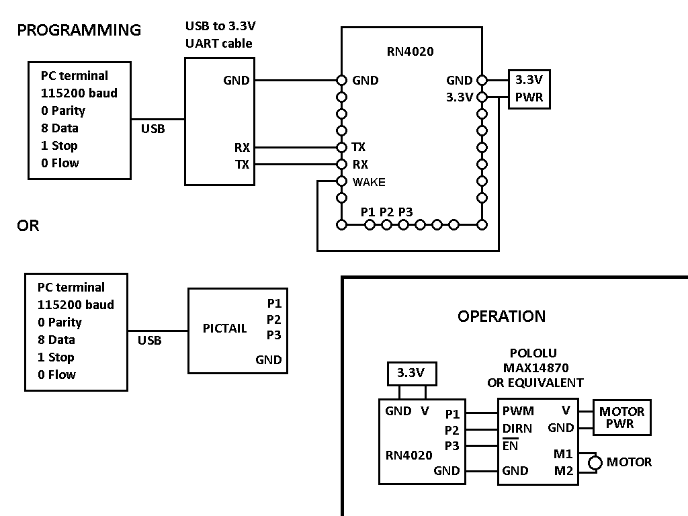
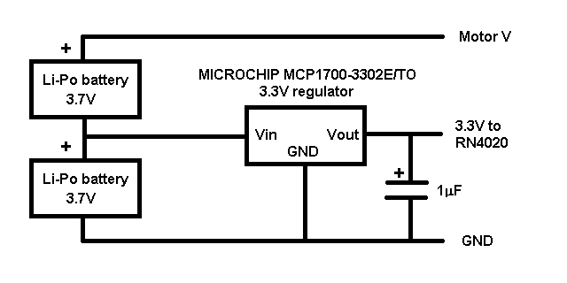

Motor speed control via Bluetooth/RN4020
========================================


This document shows how to use a Microchip RN4020 controlled by btlib functions
to implement remote control of a motor.

The associated files needed here are:

```
rn4020.c
rn4020.txt
btlib.c
btlib.h
```

The Microchip RN4020 is a Bluetooth LE server chip that has a PWM generator and four general purpose
input/output (GPIO) pins. It is available from [RS](https://uk.rs-online.com/web/p/bluetooth-modules/1656439) 

Here are the Microchip [user's guide](https://ww1.microchip.com/downloads/en/DeviceDoc/70005191B.pdf)
and [datasheet](https://ww1.microchip.com/downloads/en/DeviceDoc/Bluetooth-Low-Energy-Module-DS50002279C.pdf)

To program and monitor the RN4020 for development it must be connected to a PC running a serial terminal.
The simplest option for development is
Microchip's [PICTAIL](https://uk.rs-online.com/web/p/communication-wireless-development-tools/8282859)
device which is an
RN4020 on a carrier board and an inbuilt USB serial connection which also provides power - just
plug it into a PC USB port and it is ready to go. It appears as a COM port. The GPIO pins are
accessible via convenient headers.

An RN4020 chip needs surface mount capabilities, and a
USB to 3.3V UART serial cable for programming, such as
[FTDI USB-3.3V UART cable](https://cpc.farnell.com/ftdi/c232hd-ddhsp-0/cable-usb-uart-0-25a-3-3v-o-p/dp/SC14084)


The following diagram shows the connections for programming and motor operation.



I have used a [Pololu MAX14870](https://www.pololu.com/product/2961) motor driver board with a 
Maxim 14870 H-bridge chip, but any similar driver with PWM,
Enable and Direction inputs will work. In case it isn't obvious, the TX, RX and WAKE connections 
are not needed for normal operation - they are only for initial programming of the RN4020. The WAKE connection
is not needed for programming if the UART rate is first changed to 2400 baud - instructions below.
For development, the serial link and motor driver can be connected simultaneously.
The instructions below set up the RN4020 with two characteristics which are
simply registers on the chip that can be written to over the Bluetooth link.
The only commands that are sent to the LE device are connect, disconnect, and write a characteristic.
Writing a characteristic does not in itself perform any operation.
The RN4020 must be running a script code that translates the characteristic values into
PWM/GPIO outputs. When a characteristic is written to, it can be programmed to run an associated script code.
Once the script code is completed, the RN4020 does nothing more, and simply waits for another characteristic write.
To program the RN4020 you will need a serial terminal program running on the PC. These instructions are for Realterm.

In the Port tab: set Baud=115200. Port=COM port number - the USB connection should appear as a COM port.
Parity=None. Data Bits=8. Stop Bits=1. Hardware flow Control=None. Click Change button

In the Send tab: In the EOL box, tick the top +CR and leave the rest unticked.
The \n box Before/After should be unticked. So each command send is followed by a single carriage return.

Once set up, type commands in the text box to the left of the Send Numbers button. Then click Send ASCII.
To start, type d in the text box, then click Send ASCII, you should get the following response from the RN4020:

```
BTA=112233445566
Name=RN177C
Connected=no
. . . etc
```

BTA is its Bluetooth board address which you need for the rn4020.txt device information file read by
init_blue("rn4020.txt"), so make a note of it.
Now send the following commands (without the comments obviously):

```
sf,2           ; OPTIONAL factory reset if needed to clear existing settings
r,1            ; reboot to execute above instruction

ss,00000001    ; enable private characteristics 1
r,1            ; reboot to execute above instruction

sr,20002000    ; auto advert and server only
r,1            ; reboot

pz             ; zero private services
               ; set private service UUID
               ; choose any 16-byte number
ps,112233445566778899aabbccddeeff00
               ; set 2 characteristics read/write, no acknowledge
pc,112233445566778899aabbccddeeff01,06,08   ; 8 bytes - will be Control
pc,112233445566778899aabbccddeeff02,06,01   ; 1 byte - will be Stop
r,1            ; reboot to execute above commands

ls             ; print characteristics
```

The result should be:

```
112233445566778899AABBCCDDEEFF00
  112233445566778899AABBCCDDEEFF01,000E,06,08
  112233445566778899AABBCCDDEEFF02,0010,06,01
```

The important information here is the handles 000E and 0010 have been assigned to the two characteristics.
The RN4020 script and rn4020.txt info assume these handles and GPIO pin use:

```
Control = 000E
Stop = 0010
P1 = PWM
P2 = Direction
P3 = Enable hi=off lo=on
```

If different, you must modify the codes and rn4040.txt appropriately.

Now enter the script code from the terminal (again without the ;comments):

```

+   ; toggle echo on
wc  ; clear script
ww  ; start script input mode
    ; in the PC terminal set EOL = +CR and +LF so it
    ; sends CR/LF after each entry
    ; START SCRIPT
@PW_ON                 ; executed at power on
|O,06,04               ; GPIO pins enable/P3=hi dirn/P2=lo
[,1,00,10,FF,00,10,FF  ; PWM to P1 = off
%000E=?FUNC1           ; call FUNC1 when write to handle 000E 
%0010=?FUNC2           ; call FUNC2 when write to handle 0010 
?FUNC1                 ; executed when write to 000E - Control 
[,1,$PM1,$PM2,FF,$PM1,$PM2,FF   ; set PWM on P1
|O,06,$PM3            ; set Enable/Dirn GPIO pins
?FUNC2                ; executed when write to 0010 - Stop
|O,06,04               ; GPIO pins enable/P3=hi dirn/P2=lo
[,1,00,10,FF,00,10,FF  ; PWM to P1 = off


      ; END SCRIPT
      ; stop script input mode by sending ESC character (27)
      ; type 27 in text box and click Send Numbers
      ; in the PC terminal untick LF, to restore
      ; single CR send after each entry

+     ; toggle echo off
lw    ; print script to check that it is the same as
      ; between START SCRIPT and END SCRIPT


   ; TO CHANGE the baud rate to 2400
   ; making the WAKE connection unnecessary for programming:

sb,0    ; 2400 baud
r,1     ; reboot

```

Now set up the controlling C code (rn4020.c) on a Pi. It starts the motor, waits 4 seconds,
increases the speed, waits for another 4 seconds, then stops the motor and terminates.
Edit the rn4020.txt file to set the Pi and RN4020 addresses. Note that the characteristic
index needed by the btlib write_ctic() function is determined by the order of listing in this
file. So Control is ctic index 0 and Stop is 1.

```
DEVICE = Pi      TYPE=MESH NODE=1  ADDRESS = D0:E7:82:44:90:86
DEVICE = RN4020  TYPE=LE   NODE=2  ADDRESS = 11:22:33:44:55:66
  LECHAR=Control HANDLE=000E PERMIT=06 SIZE=8
  LECHAR=Stop    HANDLE=0010 PERMIT=06 SIZE=1   
```

Compile the rn4020.c file:

```

gcc rn4020.c btlib.c -o rn4020

Run via

sudo ./rn4020   (but see next instruction)
```

Without the RN4020 script running, the commands will write the characteristics, but there will
be no effect on the GPIO pins. For the motor control functions to work, the RN4020 script must be running.
Use the following wr command from the terminal before starting the C program rn4020:

```
wr     ; run script - nothing will appear on terminal in response
wp     ; stop script when finished
```

Or set up the RN4020 to run the script automatically on power up with:

```
sr,21002000    ; 1st 2=auto advert  1=run script automatically  2nd 2=server only
r,1            ; reboot

To cancel auto run:

sr,20002000    ; turn off auto script run
r,1            ; reboot
```

If you are using a Pictail, the LEDs indicate pin activity:

```
BLUE = Enable (ON=disabled OFF=enabled, motor running)
ORANGE = Direction
YELLOW = PWM signal
```

The btlib functions allow many devices to be connected and controlled simultaneously. The
program btferret may also be used to interact via its command line with
an RN4020 (connect, read services, write characteristics, etc.). It needs the information from
rn4020.txt in its device information file, devices.txt.

### Li-Po Battery Power Supply

