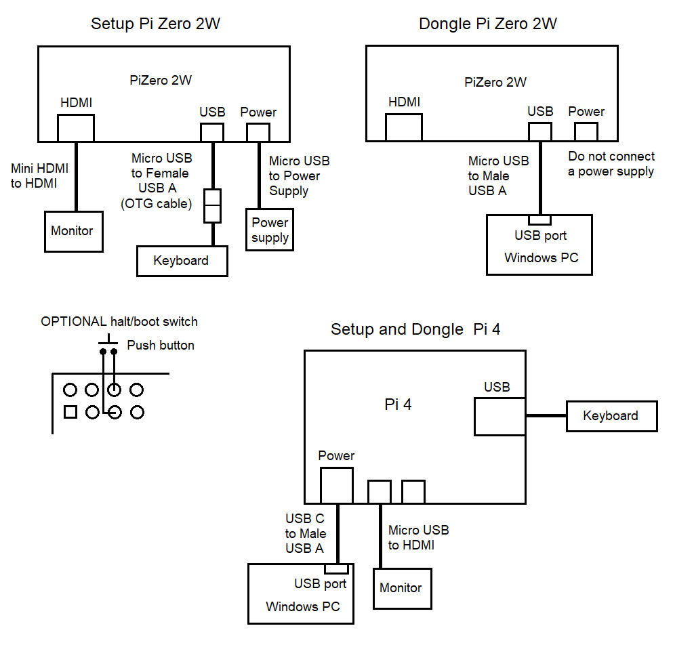

Pi Zero Dongle for Windows
==========================

*Version 21*

## Contents
- [1 Introduction](#1-introduction)
- [2 Setup](#2-setup)
    - [2.1 File list](#2-1-file-list) 
    - [2.2 Pi Zero Instructions](#2-2-pi-zero-instructions)
        - [2.2.1 Hardware](#2-2-1-hardware)      
        - [2.2.2 Connections](#2-2-2-connections)
        - [2.2.3 Procedure](#2-2-3-procedure)
    - [2.3 Windows Instructions](#2-3-windows-instructions)
        - [2.3.1 File list](#2-3-1-file-list)
        - [2.3.2 Procedure](#2-3-2-procedure)
        - [2.3.3 Manual procedure](#2-3-3-manual-procedure)        
- [3 Windows Code](#3-windows-code)
    - [3.1 Where to put your code](#3-1-where-to-put-your-code)    
    - [3.2 Screen prints](#3-2-screen-prints)
    - [3.3 Input functions](#3-3-input-functions)
          

## 1 Introduction

The btlib library, btferret and any C code written for Linux can be run from a Windows PC by using a
Raspberry PiZero 2W as a Bluetooth dongle for the PC. The PC then has direct access to Bluetooth at
the HCI level. Microsoft puts so many obstacles in the way of access
to the onboard Bluetooth that the dongle approach is easier in the end.

There are instructions for setting up the PiZero with a btfdongle.c program that communicates with
the PC. There is also a Windows program (shown below) that is compiled on a PC with Visual Studio. 
The Windows code includes the Linux btferret.c and has empty functions (in mycode.c) into
which you can insert your own code. Linux code can be simply pasted into
mycode.c, with minor changes for input and output described in section 3,
and no knowledge of Windows programming is needed. Linux inputs can be replaced with simple
functions that pop up a dialog window.


## 2 Setup

### 2-1 File list


```
In the github/windows folder

For the PiZero dongle
  btfdongle.c

For Windows
  BTferret.sin
  BTferret.vcxproj
  BTferret.vcxproj.filters
  btlibw.c
  btfw.c
  mycode.c
  btferretw.c
  btlib.h  
  btfw.rc
  devices.txt


NOTE in case you modify btferret/btlib for Linux and Windows
  btlibw.c is the Linux btlib.c with #define BTFWINDOWS uncommented
  btferretw.c is the Linux btferret.c with #define BTFWINDOWS uncommented
```


## 2-2 Pi Zero Instructions

These instructions also work for a Pi4, but you must be sure that the PC can supply enough
current via its USB port.

### 2-2-1 Hardware

The follwing items are needed:

```
1. Raspberry Pi Zero 2W
2. Micro SD card
3. Mini HDMI to HDMI cable
4. OTG cable (Micro USB to female USB A)
5. Micro USB to Male USB A cable
6. Power supply with Micro USB plug
```

### 2-2-2 Connections


A Pi Zero needs one set of connections to set up the dongle, and then a different arrangement for
normal use. A Pi4 can use a single setup for both functions. If fitted, the optional switch will halt
and power down on a first press, and reboot on a second.




### 2-2-3 Procedure

This procedure uses a PC to download the Pi operating system and btfdongle.c to
an SD card for the PiZero2W, and then modify the PiZero2W configuration to operate as a Bluetooth dongle.

1) Download the following file from github/windows to the PC. 

```
btfdongle.c
```

2) On the PC, download OS to an SD card. Raspberry Pi OS Lite 64 bit
(NOTE Lite, NOT desktop versions) from:

www.raspberrypi.com/software/

```
Download for Windows
Click on downloaded imager exe file to install and run
  Device = Raspberry Pi Zero 2W
  Operating system = Raspberry Pi OS (other) - Raspberry Pi OS Lite (64-bit)
  Storage = SD card
  Edit settings = No
```

3) Before removing the SD card from the PC, copy btfdongle.c to the SD card top level folder
(not the overlays folder).
The SD card might have been ejected, so re-insert it, copy the file, and eject.

4) Insert SD card in Pi Zero in setup configuration and turn on. Because there is no mouse,
use the tab key to move the focus between options on the setup screens, Set user name = pi which will
create a /home/pi/ folder, then login to pi.

```
Please enter new username:
pi
```

Enter a password twice (wait for long delay after second).

```
login: pi
```


5) Set up a root account by choosing a root password.

```
sudo passwd
```

6) Switch to root so you have permission for the actions that follow. 

```
su root
```

7) Move /boot/firmware/btfdongle.c to /home/pi/

```
cd /boot/firmware
mv btfdongle.c /home/pi/
```

8) In /home/pi/ compile btfdongle.c:

```
cd /home/pi
gcc btfdongle.c -o btfdongle
```

9) Run btfdongle to check that it is working OK:

```
./btfdongle
```

It should report "COM open fail" and exit because it is not set up as a dongle yet, but it does
show that it runs correctly.
          
10) Disable wifi and enable USB serial service by editing config.txt. The gpio-shutdown is for
the optional halt/boot switch.

```
nano /boot/firmware/config.txt

IN nano editor add after [all]

[all]
dtoverlay=dwc2
dtoverlay=disable-wifi
dtoverlay=gpio-shutdown


CTL-X to exit nano and save file
```

11) Enable USB serial service by editing cmdline.txt

```
nano /boot/firmware/cmdline.txt

IN nano DELETE console=serial0,115200
        ADD    modules-load=g_serial   to the end of the single line

EXISTING
console=serial0,115200 console=tty1  ....  rootwait

CHANGE TO
console=tty1 ... rootwait modules-load=g_serial

```

12) Enable headless boot to root by editing getty service.

```
nano /lib/systemd/system/getty@.service

IN nano editor change the [Service] ExecStart line by
inserting -a root in place of the existing entry

EXISTING might be
ExecStart=-/sbin/agetty -o '-p --\\u' --noclear -$TERM

CHANGE TO
ExecStart=-/sbin/agetty -a root --noclear -$TERM

```

When started, the device will boot up in root without prompting for a user name or password, so
can be used headless.

13) Enable auto start btfdongle on boot by editing bashrc

```
nano /root/.bashrc

IN nano add the following at the bottom

cd /home/pi
./btfdongle

```

14) Check that this all works by rebooting

```
reboot
```

Without any user input it should login as root, run btfdongle, and report "COM open" and "Bluetooth OK".
CTL-C to exit btfdongle.


15) Halt Pi Zero.

```
halt
```

Reconfigure the connections to the dongle configuration. The monitor can be left
connected to the PiZero to check what happens. Plug into PC. It should boot up, start btfdongle,
and report "COM open/Bluetooth OK". It is now waiting for commands from BTferret
running on the PC. Check on the PC via: right click Start/Device manager/Ports (COM & LPT) which should list
the dongle as a USB Serial Device (COM port). Note the number, but it may change every time the PC is started.

 
## 2-3 Windows Instructions

### 2-3-1 File list

DOWNLOAD from the github windows folder - see Procedure section for destination locations.

```
BTferret.sin
BTferret.vcxproj
BTferret.vcxproj.filters
btfw.c
btferretw.c
btlibw.c
mycode.c
btfw.rc
btlib.h
devices.txt

NOTE - if you intend to modify the Linux btferret.c or btlib.c
       and use it for Windows
  btferretw.c  is the Linux btferret.c with #define BTFWINDOWS uncommented
  btlibw.c  is the Linux btlib.c with #define BTFWINDOWS uncommented  
```

### 2-3-2 Procedure

These are instructions for compiling the Windows program BTferret using Visual Studio.

1) Create a folder called BTferret to hold the project. Visual Studio would put it at
the following location where xxxx is your user name, but you can put the BTferret folder anywhere.

```
C:\Users\xxxx\source\repos\BTferret
```

2) Copy the following files to the BTferret folder.

```
BTferret.sin
BTferret.vcxproj
BTferret.vcxproj.filters
btferretw.c
btfw.c
btfw.rc
btlib.h  
btlibw.c
mycode.c
```

3) Copy devices.txt to a working folder that you choose. When BTferret starts it will
prompt for the location of this devices file. Initially it will assume that it is in
your Documents folder, but you can put it anywhere.

```
Copy devices.txt to for example

C:\Users\xxxx\Documents\devices.txt

```

4) Start Visual Studio. Select "Open a project or solution", and select BTferret.sin in your project
folder. (NOTE - Visual Studio, NOT Visual Studio Code).

5) When the project has loaded select Build/Build solution. It should report: "Build: 1 succeeded..".
If it fails see the Mauual Procedure section below.

6) With the dongle in place, run via Debug/Start without debugging.
 
7) Select Dongle/Auto open. If it reports "Bluetooth OK" then BTferret.exe is working and communicating
with the dongle. Select Run/BTferret to run btferret which will prompt for the location of devices.txt,
or Run/Mycode 1 to demonstrate Windows input funtions. A shortcut can be created from the exe file
(by right clicking it in Explorer and drag the shortcut to the desktop): 

```
Location

C:\.....\BTferret\Release\BTferret.exe
```


### 2-3-3 Manual Procedure

The instructions above should work by reading the project settings from the BTferret.sin/vcxpoj files.
If not, this more difficult procedure builds the project and settings from scratch.

1) Start Visual Studio. Select "Create a new project".

2) Select "Empty Project".

3) On project setup screen.

```
Project Name = BTferret
Location (leave unchanged) = C:\Users\xxxx\source\repos\BTferret\  (xxxx is your user name)
Tick "Place solution and project in same directory"
```
4) Click Create and an empty project will be created.

5) File/Save BTferret and exit Visual Studio.

6) Copy the following files to the BTferret folder.

```
btlib.h 
btfw.c
btferretw.c
btlibw.c
mycode.c
btfw.rc
```

7) Copy devices.txt to a working folder that you choose. When BTferret starts it will
prompt for the location of this devices file. Initially it will assume that it is in
your Documents folder, but you can put it anywhere.

```
Copy devices.txt to for example

C:\Users\xxxx\Documents\devices.txt

```

8) Restart Visual Studio and select BTferret

9) Select Project/Add existing item to add the following files:

```
btlib.h
btfw.c
btferretw.c
btlibw.c
mycode.c
btfw.rc
```

10) The configuration must be Release/x86/WIN32.

```
Select Build/Configuration manager
   Active solution configuration = Release
   Active solution platforms = x86
   Project contexts = BTferret  Release  Win32  Tick Build  Untick Deploy
```


11) Various other settings:

```
Select Project/Properties - All configurations / Platform = WIN32
    
    Advanced
        Character set = Use Multi Byte Character Set
    C/C++
        Preprocessor
          Preprocessor Definition - select <edit> and add _CRT_SECURE_NO_WARNINGS
          so the edit window appears as follows: 
             WIN32
             _CRT_SECURE_NO_WARNINGS
             <different options>
    Linker
        System
          Subsystem = Windows(/SUBSYSTEM:WINDOWS)

```


12) Compile with Build/Build solution. It should report: "Build: 1 succeeded..".

13) With the dongle in place, run via Debug/Start without debugging.
 
14) Select Dongle/Auto open. If it reports "Bluetooth OK" then BTferret.exe is working and communicating
with the dongle. Select Run/BTferret to run btferret which will prompt for the location of devices.txt,
or Run/Mycode 1 to demonstrate Windows input funtions. A shortcut can be created from the exe file: 

```
Location

C:\Users\xxxx\source\repos\BTferret\Release\BTferret.exe
```

    
     
## 3 Windows code

Code written for Linux can be simply pasted into mycode.c with some minor changes for input and
output functions. No Windows programming knowledge is needed. Simple Windows screen print
and input functions are available from the btlib library as described below.

### 3-1 Where to put your code

Your code goes into mycode.c. There are ten functions that are called from the Run menu: mycode1(),
mycode2(),.... mycode10(). Mycode1 is programmed to demonstrate the Windows input/output
functions. Insert your code into one of these functions as below.

*** NOTE ***: Windows file names must use double backslash.

```
int mycode2()
  {  
  if(init_blue("C:\\Users\\myname\\Documents\\btferret\\devices.txt") == 0)
    return(0);
    
  // your code here  
    
  close_all();
  }
```
         

### 3-2 Screen prints

The C printf function will not work with Windows. The btlib library provides a print function. 
Use it as follows:

```
LINUX
 
  printf("Hello\n");
  printf("Result = %d\n",retval);
  
  
WINDOWS

  char buf[32];
  
  print("Hello\n");
  sprintf(buf,"Result = %d\n",retval);
  print(buf);
```

To make code fully portable, an equivalent print function could be
added to Linux code.

```
void print(char *s)
  {
  printf("%s",s);
  }
```

If you want to save the screen output to a file, use Edit/Save As which does the same thing as
the btlib output_file() function.

### 3-3 Input functions

The following functions are available from the btlib library. The Mycode1 function in mycode.c demonstates
all these functions. Documentation in the main btferret README.

```
These functions pop up a dialog window

input_integer - Input an integer
input_string - Input a string
input_filename - Input a file name, with a BROWSE button
input_select - Select an item from a drop-down list.
input_radio - Select one option from a radio button list
```


